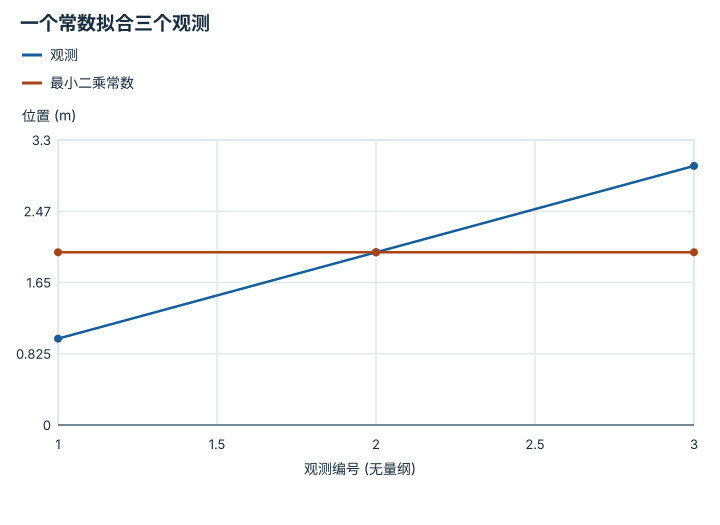

---
hide:
  - navigation
---

<!-- Generated by scripts/build_knowledge_atlas.py; edit knowledge/atlas/*.json. -->

<nav class="study-breadcrumb" aria-label="学习位置" markdown="1">
[知识目录](../../index.md) / [线性代数与最小二乘](../index.md)
</nav>

L1 · 本章第 7 / 8 节

# 最小二乘是在不能全满足时选择折中

**Least squares and residuals**

同一个静止目标被量出 1、2、3 m，不可能让一个预测同时等于三个读数。

先确认：这些前置知识我懂了吗？

投影、平方函数

[Python、NumPy 与张量形状](../../computing-python-numpy/index.md)

<section class="study-section " markdown="1">

## 1 · 原理拆开看

1. 设未知常数位置 c，观测 yi 的单位为 m；目标是最小化 Σ(c-yi)²。
2. 求导得到 2Σ(c-yi)=0，所以最优 c 为样本均值；残差和为零。
3. 一般形式 min||Ax-b||² 是把 b 投影到 A 的列空间；求解常用 QR 或 SVD，不必显式求逆。

</section>

<section class="study-section " markdown="1">

## 2 · 跟着例子算一遍

1. 教学输入 y=[1,2,3] m，模型只允许一个恒定位置。
2. c=(1+2+3)/3=2 m；残差 c-y=[1,0,-1] m。
3. 平方残差和为 2 m²；选 c=1 m 时为 5 m²，所以 2 m 是更好的平方损失折中。

</section>

<section class="study-section " markdown="1">

## 3 · 对照图，解释变化

<figure class="atlas-visual" tabindex="0" aria-label="一个常数拟合三个观测；窄屏可在图内横向滚动">
<picture>
<source media="(max-width: 600px)" srcset="../../../assets/knowledge-atlas/linear-least-squares-residual-mobile.svg">

</picture>
<figcaption>教学示意，非实测；连接观测点只是辅助阅读，不表示连续运动。</figcaption>
</figure>

- 每个观测到水平拟合线的竖向差就是残差。
- 图不能证明目标真的静止；若目标在运动，常数模型本身不合适。

查看作图数据，自己复算

图上数值可能为便于阅读而取近似值，以下保留作图输入。线段的含义以本图图注和读图说明为准，不应自行解释为实测连续轨迹。

| 曲线 | 观测编号 (无量纲) | 位置 (m) |
| --- | --- | --- |
| 观测 | 1 | 1 |
| 观测 | 2 | 2 |
| 观测 | 3 | 3 |
| 最小二乘常数 | 1 | 2 |
| 最小二乘常数 | 2 | 2 |
| 最小二乘常数 | 3 | 2 |

</section>

<section class="study-section study-misconception" markdown="1">

## 4 · 避开一个误区

**容易误以为：**最小二乘解让每条方程都精确成立。

**为什么不成立：**不一致观测通常没有共同精确解，优化只是最小化选定误差。

**正确理解：**同时报告估计值、残差及噪声假设，不能把最优称为真实值。

</section>

<section class="study-section study-check" markdown="1">

## 5 · 先独立回答

加入离群读数 100 m 后，普通均值会怎样？

我已作答，查看推理

变成 26.5 m，说明平方损失对大残差很敏感；需要先检查数据或考虑稳健损失，而非盲信最优解。

</section>

继续查阅原始资料

- [NumPy least-squares solver](https://numpy.org/doc/stable/reference/generated/numpy.linalg.lstsq.html)

<nav class="study-pagination" aria-label="相邻小节" markdown="1">

[← 秩是保留下来的方向，零空间是看不见的变化](../linear-rank-nullspace/index.md)

[SVD 揭示哪些方向会放大误差 →](../linear-svd-conditioning/index.md)

</nav>

[返回本章目录](../index.md) · [整章连续阅读](../complete/index.md)

本章最后需要提交什么？

推导并数值验证一个最小二乘解。

回到[原课程](../../../foundations/02-linear-algebra.md)完成实践。阅读位置或查看答案不计为通过验收。

