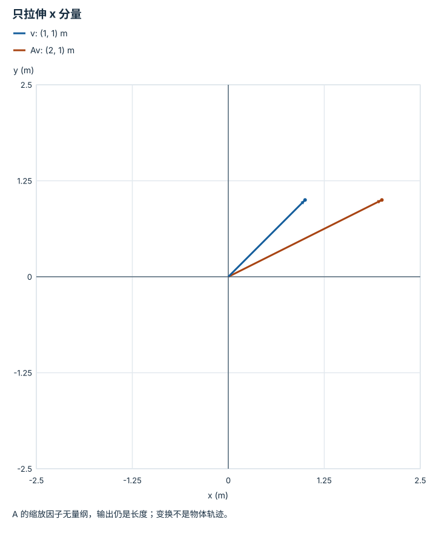

---
hide:
  - navigation
---

<!-- Generated by scripts/build_knowledge_atlas.py; edit knowledge/atlas/*.json. -->

<nav class="study-breadcrumb" aria-label="学习位置" markdown="1">
[知识目录](../../index.md) / [线性代数与最小二乘](../index.md)
</nav>

L1 · 本章第 5 / 8 节

# 矩阵的列告诉你基向量去了哪里

**Linear maps and basis vectors**

看懂矩阵不必背每个格子：先看它如何变换 x、y 两根单位轴。

先确认：这些前置知识我懂了吗？

矩阵乘法、基向量

[Python、NumPy 与张量形状](../../computing-python-numpy/index.md)

<section class="study-section " markdown="1">

## 1 · 原理拆开看

1. 二维向量 v=x e1+y e2；线性变换满足 A(v)=x A(e1)+y A(e2)。
2. A(e1) 和 A(e2) 恰好是矩阵两列，所以列向量决定全部输入的输出。
3. 一般线性变换可以缩放或剪切；只有额外满足正交与行列式条件的矩阵才是纯旋转。

</section>

<section class="study-section " markdown="1">

## 2 · 跟着例子算一遍

1. 教学 A=[[2,0],[0,1]] 无量纲，输入 v=(1,1) m。
2. 第一基方向放大 2 倍，第二基方向保持不变。
3. Av=(2,1) m；输入长度 √2 m，输出长度 √5 m，因此 A 不是旋转。

</section>

<section class="study-section " markdown="1">

## 3 · 对照图，解释变化

<figure class="atlas-visual" tabindex="0" aria-label="只拉伸 x 分量；窄屏可在图内横向滚动">
<picture>
<source media="(max-width: 600px)" srcset="../../../assets/knowledge-atlas/linear-map-basis-mobile.svg">

</picture>
<figcaption>教学示意，非实测；同一坐标系比较输入和输出。</figcaption>
</figure>

- 两个箭头末端 y 相同而 x 不同，说明只拉伸了第一轴。
- 图并未把坐标平移；仿射平移不能仅靠这个 2×2 线性矩阵表达。

查看作图数据，自己复算

图上数值可能为便于阅读而取近似值，以下保留作图输入。

| 向量 | x (m) | y (m) |
| --- | --- | --- |
| v | 1 | 1 |
| Av | 2 | 1 |

</section>

<section class="study-section study-misconception" markdown="1">

## 4 · 避开一个误区

**容易误以为：**所有 2×2 矩阵都能当作旋转矩阵。

**为什么不成立：**形状相同不保证长度、角度和方向性被保存。

**正确理解：**先检查矩阵作用，再验证正交性和行列式。

</section>

<section class="study-section study-check" markdown="1">

## 5 · 先独立回答

A(0,3) 是什么？

我已作答，查看推理

为 (0,3)，因为这个输入只有第二基方向分量；不能把整个向量都乘 2。

</section>

继续查阅原始资料

- [MIT 18.06: linear transformations](https://ocw.mit.edu/courses/18-06-linear-algebra-spring-2010/)

<nav class="study-pagination" aria-label="相邻小节" markdown="1">

[← 叉乘把力臂和力变成力矩](../linear-cross-torque/index.md)

[秩是保留下来的方向，零空间是看不见的变化 →](../linear-rank-nullspace/index.md)

</nav>

[返回本章目录](../index.md) · [整章连续阅读](../complete/index.md)

本章最后需要提交什么？

推导并数值验证一个最小二乘解。

回到[原课程](../../../foundations/02-linear-algebra.md)完成实践。阅读位置或查看答案不计为通过验收。

