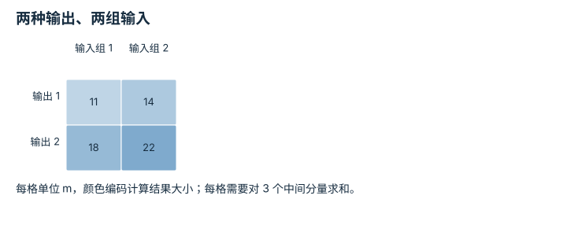

---
hide:
  - navigation
---

<!-- Generated by scripts/build_knowledge_atlas.py; edit knowledge/atlas/*.json. -->

<nav class="study-breadcrumb" aria-label="学习位置" markdown="1">
[知识目录](../../index.md) / [线性代数与最小二乘](../index.md)
</nav>

L1 · 本章第 2 / 8 节

# 矩阵乘法的内维为什么必须相同

**Matrix product and shape**

矩阵乘法不是相邻格子相乘，而是每一行对一个输入做加权组合。

先确认：这些前置知识我懂了吗？

向量分量、数组轴

[Python、NumPy 与张量形状](../../computing-python-numpy/index.md)

<section class="study-section " markdown="1">

## 1 · 原理拆开看

1. A 有 m 行 n 列，表示每个输出读取 n 个输入；B 有 n 行 k 列，表示 k 组输入。
2. 乘积 C 的每个 Cij 是 A 第 i 行与 B 第 j 列的点积；被求和的输入索引必须长度一致。
3. 因此 C 有 m 行 k 列；A 的权重无量纲时，输出保持 B 的物理单位。

</section>

<section class="study-section " markdown="1">

## 2 · 跟着例子算一遍

1. 教学 A=[[1,0,2],[0,1,3]]，B=[[1,2],[3,4],[5,6]] m。
2. 第一行结果为 [1×1+0×3+2×5, 1×2+0×4+2×6]=[11,14] m。
3. 第二行为 [18,22] m，输出 shape=(2,2)；逐元素乘法无法表达这项求和。

</section>

<section class="study-section " markdown="1">

## 3 · 对照图，解释变化

<figure class="atlas-visual" tabindex="0" aria-label="两种输出、两组输入；窄屏可在图内横向滚动">
<picture>
<source media="(max-width: 600px)" srcset="../../../assets/knowledge-atlas/linear-matrix-shape-mobile.svg">

</picture>
<figcaption>教学示意，非实测；图为 AB 而不是 A。</figcaption>
</figure>

- 横向换列是在换输入组，纵向换行是在换输出定义。
- 较大的数值不表示更优，它只是给定权重组合的结果。

查看作图数据，自己复算

图上数值可能为便于阅读而取近似值，以下保留作图输入。

| 行 / 列 | 输入组 1 | 输入组 2 |
| --- | --- | --- |
| 输出 1 | 11 | 14 |
| 输出 2 | 18 | 22 |

</section>

<section class="study-section study-misconception" markdown="1">

## 4 · 避开一个误区

**容易误以为：**A×B 和 B×A 只是写法不同。

**为什么不成立：**两种顺序的形状和组合含义不同；本例 AB 为 2×2，BA 为 3×3。

**正确理解：**先写输入输出维度，再解释乘法方向，使用 @ 做矩阵乘法。

</section>

<section class="study-section study-check" markdown="1">

## 5 · 先独立回答

A 为 2×3，输入向量为长度 2，能否直接计算 Ax？

我已作答，查看推理

不能；A 需要 3 个输入分量。不能为了不报错就随意补零，需先核对变量语义。

</section>

继续查阅原始资料

- [NumPy matmul](https://numpy.org/doc/stable/reference/generated/numpy.matmul.html)

<nav class="study-pagination" aria-label="相邻小节" markdown="1">

[← 向量把方向与大小放在一起](../linear-vector-magnitude/index.md)

[点乘读出沿指定方向的分量 →](../linear-dot-projection/index.md)

</nav>

[返回本章目录](../index.md) · [整章连续阅读](../complete/index.md)

本章最后需要提交什么？

推导并数值验证一个最小二乘解。

回到[原课程](../../../foundations/02-linear-algebra.md)完成实践。阅读位置或查看答案不计为通过验收。

