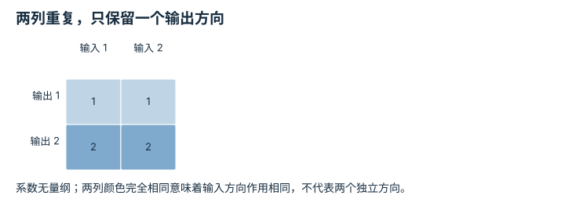

---
hide:
  - navigation
---

<!-- Generated by scripts/build_knowledge_atlas.py; edit knowledge/atlas/*.json. -->

<nav class="study-breadcrumb" aria-label="学习位置" markdown="1">
[知识目录](../../index.md) / [线性代数与最小二乘](../index.md)
</nav>

L1 · 本章第 6 / 8 节

# 秩是保留下来的方向，零空间是看不见的变化

**Rank and null space**

多个关节可以相互抵消，使末端不动；零空间就是这类输入变化的集合。

先确认：这些前置知识我懂了吗？

线性变换、方程组

[Python、NumPy 与张量形状](../../computing-python-numpy/index.md)

<section class="study-section " markdown="1">

## 1 · 原理拆开看

1. 矩阵 A 的列空间包含所有可能输出；秩是其中独立方向的数量。
2. 满足 Az=0 的输入构成零空间；加入这些 z 不改变原输出。
3. 非零零空间意味着从输出反推输入不唯一；输出不在列空间中时则根本无精确解。

</section>

<section class="study-section " markdown="1">

## 2 · 跟着例子算一遍

1. 教学 A=[[1,1],[2,2]]，输入 x=(3,0)，所有量无量纲。
2. 两列相同，所以 rank=1；Ax=(3,6)。
3. z=(-1,1) 满足 Az=0；x+z=(2,1) 仍映射为 (3,6)，但目标 (3,5) 不可精确达到。

</section>

<section class="study-section " markdown="1">

## 3 · 对照图，解释变化

<figure class="atlas-visual" tabindex="0" aria-label="两列重复，只保留一个输出方向；窄屏可在图内横向滚动">
<picture>
<source media="(max-width: 600px)" srcset="../../../assets/knowledge-atlas/linear-rank-nullspace-mobile.svg">

</picture>
<figcaption>教学示意，非实测；显示 A 的全部系数。</figcaption>
</figure>

- 第二行始终是第一行的两倍，输出被限制在 y2=2y1。
- 秩的结论针对给定矩阵，非线性机器人在不同位形可能有不同秩。

查看作图数据，自己复算

图上数值可能为便于阅读而取近似值，以下保留作图输入。

| 行 / 列 | 输入 1 | 输入 2 |
| --- | --- | --- |
| 输出 1 | 1 | 1 |
| 输出 2 | 2 | 2 |

</section>

<section class="study-section study-misconception" markdown="1">

## 4 · 避开一个误区

**容易误以为：**有两个输出格子就能独立控制两个方向。

**为什么不成立：**本例第二输出始终等于第一输出两倍，并不是独立自由度。

**正确理解：**检查独立方向与可达子空间，而非只数矩阵行数。

</section>

<section class="study-section study-check" markdown="1">

## 5 · 先独立回答

x=(0,3) 会得到不同输出吗？

我已作答，查看推理

不会，仍为 (3,6)；因为此模型只观察 x1+x2，无法区分总和相同的输入。

</section>

继续查阅原始资料

- [MIT 18.06: column space and nullspace](https://ocw.mit.edu/courses/18-06-linear-algebra-spring-2010/)

<nav class="study-pagination" aria-label="相邻小节" markdown="1">

[← 矩阵的列告诉你基向量去了哪里](../linear-map-basis/index.md)

[最小二乘是在不能全满足时选择折中 →](../linear-least-squares-residual/index.md)

</nav>

[返回本章目录](../index.md) · [整章连续阅读](../complete/index.md)

本章最后需要提交什么？

推导并数值验证一个最小二乘解。

回到[原课程](../../../foundations/02-linear-algebra.md)完成实践。阅读位置或查看答案不计为通过验收。

