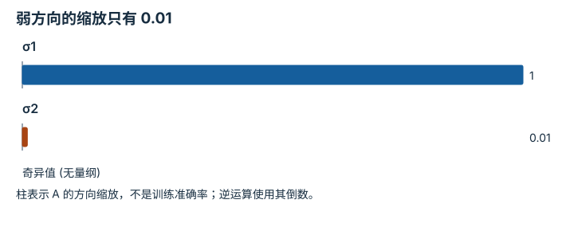

---
hide:
  - navigation
---

<!-- Generated by scripts/build_knowledge_atlas.py; edit knowledge/atlas/*.json. -->

<nav class="study-breadcrumb" aria-label="学习位置" markdown="1">
[知识目录](../../index.md) / [线性代数与最小二乘](../index.md)
</nav>

L1 · 本章第 8 / 8 节

# SVD 揭示哪些方向会放大误差

**Singular values and conditioning**

一个输出方向被矩阵压得很小，反向求输入时就必须大幅放大该方向，也会放大测量误差。

先确认：这些前置知识我懂了吗？

矩阵作用、线性方程

[Python、NumPy 与张量形状](../../computing-python-numpy/index.md)

<section class="study-section " markdown="1">

## 1 · 原理拆开看

1. SVD 写作 A=UΣVᵀ：先换输入正交基，再沿独立方向缩放，再换输出基。
2. 非零奇异值 σ 表示各方向缩放；最小 σ 很小时，反解要除以很小的数。
3. 满秩矩阵的 2-范数条件数是 σmax/σmin；它描述敏感性，不直接等于某一次误差。

</section>

<section class="study-section " markdown="1">

## 2 · 跟着例子算一遍

1. 教学 A=diag(1,0.01)，b=(1,0.01)，量均无量纲，解 x=(1,1)。
2. 只把 b2 改成 0.011，解变成 x=(1,1.1)：0.001 的输出扰动造成 0.1 的输入变化。
3. 奇异值为 1 与 0.01，条件数为 100；A 可逆但病态。

</section>

<section class="study-section " markdown="1">

## 3 · 对照图，解释变化

<figure class="atlas-visual" tabindex="0" aria-label="弱方向的缩放只有 0.01；窄屏可在图内横向滚动">
<picture>
<source media="(max-width: 600px)" srcset="../../../assets/knowledge-atlas/linear-svd-conditioning-mobile.svg">

</picture>
<figcaption>教学示意，非实测；线性纵轴保留 100 倍差距。</figcaption>
</figure>

- 第二根柱几乎贴近零，意味着反解特别敏感，而不是这一方向完全不存在。
- 条件数取决于变量缩放；混用不同单位时应先合理无量纲化。

查看作图数据，自己复算

图上数值可能为便于阅读而取近似值，以下保留作图输入。

| 项目 | 奇异值 (无量纲) |
| --- | --- |
| σ1 | 1 |
| σ2 | 0.01 |

</section>

<section class="study-section study-misconception" markdown="1">

## 4 · 避开一个误区

**容易误以为：**只要矩阵可逆，求解就可靠。

**为什么不成立：**可逆只排除精确零奇异值，不排除接近零的方向。

**正确理解：**检查尺度和奇异值，必要时用正则化并说明引入的偏差。

</section>

<section class="study-section study-check" markdown="1">

## 5 · 先独立回答

若第二奇异值严格变成 0，会发生什么？

我已作答，查看推理

第二输出恒为零；非零第二目标不可精确满足，零目标则无法唯一确定第二输入。

</section>

继续查阅原始资料

- [NumPy SVD](https://numpy.org/doc/stable/reference/generated/numpy.linalg.svd.html)

<nav class="study-pagination" aria-label="相邻小节" markdown="1">

[← 最小二乘是在不能全满足时选择折中](../linear-least-squares-residual/index.md)

[回原课程动手验证 →](../../../foundations/02-linear-algebra.md)

</nav>

[返回本章目录](../index.md) · [整章连续阅读](../complete/index.md)

本章最后需要提交什么？

推导并数值验证一个最小二乘解。

回到[原课程](../../../foundations/02-linear-algebra.md)完成实践。阅读位置或查看答案不计为通过验收。

