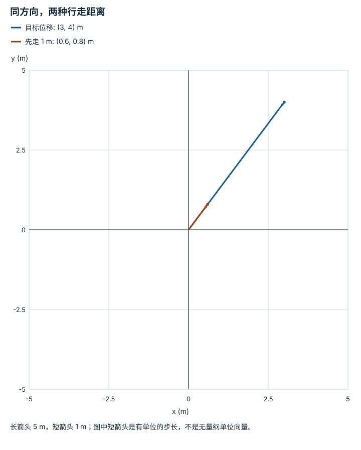

---
hide:
  - navigation
---

<!-- Generated by scripts/build_knowledge_atlas.py; edit knowledge/atlas/*.json. -->

<nav class="study-breadcrumb" aria-label="学习位置" markdown="1">
[知识目录](../../index.md) / [线性代数与最小二乘](../index.md)
</nav>

L1 · 本章第 1 / 8 节

# 向量把方向与大小放在一起

**Vectors and norms**

目标离机器人多远，与朝哪个方向走，是同一个位移向量的两种信息。

先确认：这些前置知识我懂了吗？

勾股定理、坐标轴

[Python、NumPy 与张量形状](../../computing-python-numpy/index.md)

<section class="study-section " markdown="1">

## 1 · 原理拆开看

1. 在固定正交坐标系中，位移 d=(dx,dy)，分量单位均为 m。
2. 欧氏范数 ||d||=√(dx²+dy²) 给出长度；非零 d 除以长度得到无量纲单位方向。
3. 再乘希望走的距离 s，得到长度为 s 的位移；零向量没有唯一方向，需要单独处理。

</section>

<section class="study-section " markdown="1">

## 2 · 跟着例子算一遍

1. 教学目标位移 d=(3,4) m。
2. 长度为 √(9+16)=5 m，单位方向为 (0.6,0.8)。
3. 沿目标方向走 1 m，应执行位移 (0.6,0.8) m，而不是直接走完整个 d。

</section>

<section class="study-section " markdown="1">

## 3 · 对照图，解释变化

<figure class="atlas-visual" tabindex="0" aria-label="同方向，两种行走距离；窄屏可在图内横向滚动">
<picture>
<source media="(max-width: 600px)" srcset="../../../assets/knowledge-atlas/linear-vector-magnitude-mobile.svg">

</picture>
<figcaption>教学示意，非实测；两箭头均从同一原点出发。</figcaption>
</figure>

- 两箭头共线说明方向相同，长度比 5:1 说明步长不同。
- 只知道位移不能判断途中是否有障碍物。

查看作图数据，自己复算

图上数值可能为便于阅读而取近似值，以下保留作图输入。

| 向量 | x (m) | y (m) |
| --- | --- | --- |
| 目标位移 | 3 | 4 |
| 先走 1 m | 0.6 | 0.8 |

</section>

<section class="study-section study-misconception" markdown="1">

## 4 · 避开一个误区

**容易误以为：**把每个分量分别除以自己的绝对值就能归一化。

**为什么不成立：**那会得到 (1,1)，长度为 √2 且方向也改变。

**正确理解：**所有分量除以同一个向量范数，并处理近零长度。

</section>

<section class="study-section study-check" markdown="1">

## 5 · 先独立回答

位移改成 (-3,4) m，长度与方向如何改变？

我已作答，查看推理

长度仍为 5 m，单位方向变成 (-0.6,0.8)；负号表示朝 x 负方向，不是负距离。

</section>

继续查阅原始资料

- [MIT 18.06 Linear Algebra](https://ocw.mit.edu/courses/18-06-linear-algebra-spring-2010/)

<nav class="study-pagination" aria-label="相邻小节" markdown="1">

[← 本章学习顺序](../index.md)

[矩阵乘法的内维为什么必须相同 →](../linear-matrix-shape/index.md)

</nav>

[返回本章目录](../index.md) · [整章连续阅读](../complete/index.md)

本章最后需要提交什么？

推导并数值验证一个最小二乘解。

回到[原课程](../../../foundations/02-linear-algebra.md)完成实践。阅读位置或查看答案不计为通过验收。

