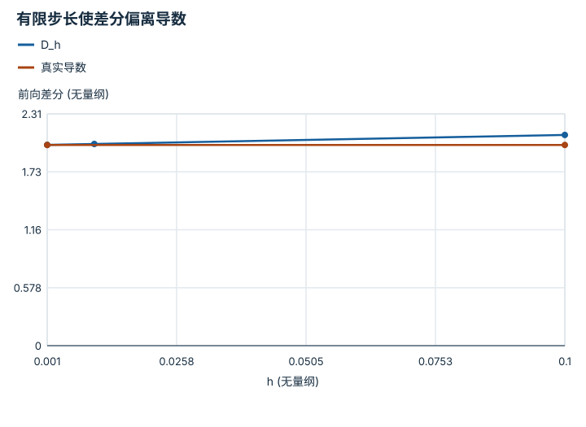
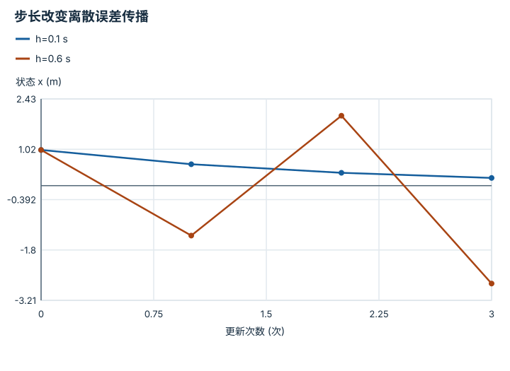
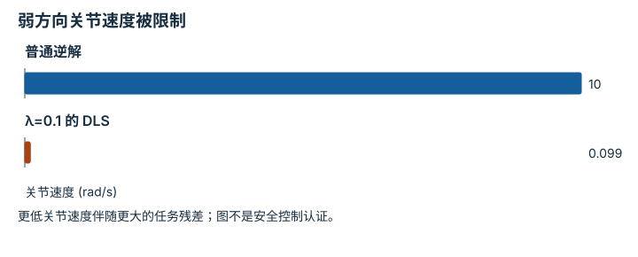

# 数值稳定性与离散化：逐点细解

<!-- Generated by scripts/build_knowledge_atlas.py; edit knowledge/atlas/*.json. -->

[全部知识点](../index.md) · [返回原课程](../../foundations/07-fk-jacobian-ik.md)

Numerical stability and discretization · 本页拆成 **4 个小知识点**。

先阅读直觉和原理，再独立完成算例、自测；图是解释工具，不是已掌握或真机验证的证明。

## 前置知识

[线性代数与最小二乘](../math-linear-algebra/index.md) → [目标、约束与优化](../math-optimization/index.md)

## 改一个参数试试看

比较远离奇异与接近奇异位形的 Jacobian；图不代替数值误差测试。

[打开对应交互实验](../../learning-lab-cn.md#kinematics)。滑块在文档站运行，GitHub 文件预览提供静态推导；不连接机器人。

## 本页知识点

1. [数学等价的运算顺序，浮点结果可能不同](#numerical-cancellation)
2. [差分步长要平衡截断与舍入](#numerical-finite-difference-step)
3. [连续稳定不保证离散更新稳定](#numerical-euler-stability)
4. [阻尼逆解如何压住弱方向的速度](#numerical-damped-inverse)

## 1. 数学等价的运算顺序，浮点结果可能不同

**Floating-point cancellation**

**需要先懂：**浮点类型、代数运算

### 一句话直觉

把很小的修正加到很大的坐标上，修正可能小到无法被该精度表示。

### 原理拆开看

1. 浮点数使用有限有效位，数值越大，相邻可表示数的绝对间隔通常也越大。
2. 在 IEEE 754 float64 的 10¹⁶ 附近，间隔约为 2，因此加 1 可能舍入回原值。
3. 先做大数相减再加小数，与先把小数加入大数，可能留下不同舍入误差；代数结合律不再逐位成立。

### 手算或追踪一个例子

1. 教学比较 float64 的 (10¹⁶+1)-10¹⁶ 与 (10¹⁶-10¹⁶)+1。
2. 第一种先把 10¹⁶+1 舍入为 10¹⁶，最后结果为 0。
3. 第二种先相减得到 0，再加 1 得到 1；实数运算下二者本应相等。

### 用图理解

<figure class="atlas-visual" tabindex="0" aria-label="两种顺序留下不同结果；窄屏可在图内横向滚动">
<picture>
<source media="(max-width: 600px)" srcset="../../assets/knowledge-atlas/numerical-cancellation-mobile.svg">

</picture>
<figcaption>教学示意，非实测；对应 IEEE 754 float64 示例。</figcaption>
</figure>

- 零结果不是证明修正为零，而是它在第一种顺序中被舍入丢失。
- 换成不同精度或数值尺度，具体结果可能改变。

查看作图数据，自己复算

图上数值可能为便于阅读而取近似值，以下保留作图输入。

| 项目 | 结果 (无量纲) |
| --- | --- |
| 先加小数再相减 | 0 |
| 先相减再加小数 | 1 |

### 容易混淆的地方

**常见误解：**机器计算只会有完全随机的小误差。

**为什么不成立：**舍入由精度与数值尺度决定，可系统性吞掉小变化。

**正确理解：**采用适当精度、局部坐标和稳定公式，并用尺度合理的误差检查。

### 自测

把全部中间变量改名，能否解决这个问题？

展开答案与推理

不能；问题在数值表示与运算顺序。应改变尺度、算法或精度，而不是变量名称。

**原始资料：**[Python floating-point arithmetic](https://docs.python.org/3/tutorial/floatingpoint.html)

## 2. 差分步长要平衡截断与舍入

**Finite differences**

**需要先懂：**导数、浮点误差

### 一句话直觉

用两个邻近位置估计 Jacobian 很方便，但点太远不够局部，太近又会相减丢精度。

### 原理拆开看

1. 前向差分 D_h=[f(x+h)-f(x)]/h 以割线近似切线，h 必须与 x 同单位。
2. 对 f(x)=x²、x=1 的无量纲示例，精确代数给出 D_h=2+h，截断误差为 h。
3. 减小 h 可降低截断误差，但浮点计算两个相近函数值的相减会放大舍入影响，因此不能无限减小。

### 手算或追踪一个例子

1. 教学输入 x=1，真实导数为 2，分别取 h=0.1、0.01、0.001。
2. 对应差分为 2.1、2.01、2.001。
3. 误差依次为 0.1、0.01、0.001；这是忽略舍入时的趋势，不保证任意小 h 都更准。

### 用图理解

<figure class="atlas-visual" tabindex="0" aria-label="有限步长使差分偏离导数；窄屏可在图内横向滚动">
<picture>
<source media="(max-width: 600px)" srcset="../../assets/knowledge-atlas/numerical-finite-difference-step-mobile.svg">

</picture>
<figcaption>教学示意，非实测；本二次函数的 D_h=2+h 在精确算术中成立。</figcaption>
</figure>

- 差分曲线与水平线的竖向距离就是截断误差。
- 图没有画极小步长区间，不能据此否认舍入误差。

查看作图数据，自己复算

图上数值可能为便于阅读而取近似值，以下保留作图输入。线段的含义以本图图注和读图说明为准，不应自行解释为实测连续轨迹。

| 曲线 | h (无量纲) | 前向差分 (无量纲) |
| --- | --- | --- |
| D_h | 0.001 | 2.001 |
| D_h | 0.01 | 2.01 |
| D_h | 0.1 | 2.1 |
| 真实导数 | 0.001 | 2 |
| 真实导数 | 0.1 | 2 |

### 容易混淆的地方

**常见误解：**h 越接近零，数值导数一定越准确。

**为什么不成立：**分子中的消减误差会被 1/h 放大。

**正确理解：**扫描几个数量级，检查误差是否先降后升，并与解析或自动微分结果交叉验证。

### 自测

角度输入用 rad 的函数，差分 h=1 是否可以按 1° 理解？

展开答案与推理

不可以，h=1 表示 1 rad；1° 应先转换为 π/180 rad，导数单位也随输入单位决定。

**原始资料：**[SciPy numerical differentiation](https://docs.scipy.org/doc/scipy/reference/differentiate.html)

## 3. 连续稳定不保证离散更新稳定

**Explicit Euler stability**

**需要先懂：**指数衰减、离散周期

### 一句话直觉

现实模型会平稳回到零，仿真却越摆越大，可能是时间步不适合，而不是物理模型必然失稳。

### 原理拆开看

1. 设连续系统 dx/dt=-4x，x 单位 m，系数 4 的单位为 s⁻¹，连续解随时间衰减。
2. 显式 Euler 用当前斜率推进 h 秒，得到 x下一步=(1-4h)x当前。
3. 离散稳定要求 |1-4h|<1，即 0<h<0.5 s；这比连续稳定多了步长限制。

### 手算或追踪一个例子

1. 教学 x0=1 m；h=0.1 s 时每步乘 0.6，前三步为 0.6、0.36、0.216 m。
2. h=0.6 s 时每步乘 -1.4，前三步为 -1.4、1.96、-2.744 m。
3. 第二组符号交替且绝对值增长，属于离散数值发散，不是连续方程的真实衰减。

### 用图理解

<figure class="atlas-visual" tabindex="0" aria-label="步长改变离散误差传播；窄屏可在图内横向滚动">
<picture>
<source media="(max-width: 600px)" srcset="../../assets/knowledge-atlas/numerical-euler-stability-mobile.svg">

</picture>
<figcaption>教学示意，非实测；连线仅连接更新序号，不代表相同物理时间。</figcaption>
</figure>

- 第二条曲线每次翻转且幅度增加；负值本身不是乱码，而是离散动态。
- 横轴是更新次数，两条曲线走过的真实时长不同，不能比较等时刻精度。

查看作图数据，自己复算

图上数值可能为便于阅读而取近似值，以下保留作图输入。线段的含义以本图图注和读图说明为准，不应自行解释为实测连续轨迹。

| 曲线 | 更新次数 (次) | 状态 x (m) |
| --- | --- | --- |
| h=0.1 s | 0 | 1 |
| h=0.1 s | 1 | 0.6 |
| h=0.1 s | 2 | 0.36 |
| h=0.1 s | 3 | 0.216 |
| h=0.6 s | 0 | 1 |
| h=0.6 s | 1 | -1.4 |
| h=0.6 s | 2 | 1.96 |
| h=0.6 s | 3 | -2.744 |

### 容易混淆的地方

**常见误解：**只要微分方程稳定，任意仿真步长都稳定。

**为什么不成立：**积分器建立了另一个离散系统，其稳定域取决于算法与步长。

**正确理解：**同时检查连续模型、离散更新和步长收敛，不能只看短时间没有爆炸。

### 自测

h=0.5 s 是否渐近稳定？

展开答案与推理

不是；乘数为 -1，状态以相同幅度来回翻转，不趋近零。

**原始资料：**[MIT: numerical computation](https://ocw.mit.edu/courses/18-330-introduction-to-numerical-analysis-spring-2012/)

## 4. 阻尼逆解如何压住弱方向的速度

**Damped least-squares inverse**

**需要先懂：**SVD 与病态、正则化

### 一句话直觉

末端希望移动一点点，关节却被要求转得很快，往往因为 Jacobian 的某个方向非常弱。

### 原理拆开看

1. 对位置 Jacobian J，速度关系 v=J q̇；本例 J 的单位为 m/rad。
2. 阻尼解在奇异值方向用 σ/(σ²+λ²) 代替 1/σ，λ 与 σ 单位相同。
3. 弱方向不再无限放大，但实际末端速度会偏离请求；阻尼不能创造缺失的运动方向。

### 手算或追踪一个例子

1. 教学 J=diag(1,0.01) m/rad，请求 v=(0.1,0.1) m/s。
2. 普通逆解给 q̇=(0.1,10) rad/s；取 λ=0.1 m/rad，阻尼解约为 (0.09901,0.09901) rad/s。
3. 实际 v≈(0.09901,0.0009901) m/s；第二方向速度被显著牺牲，需报告残差。

### 用图理解

<figure class="atlas-visual" tabindex="0" aria-label="弱方向关节速度被限制；窄屏可在图内横向滚动">
<picture>
<source media="(max-width: 600px)" srcset="../../assets/knowledge-atlas/numerical-damped-inverse-mobile.svg">

</picture>
<figcaption>教学示意，非实测；仅比较第二个关节方向。</figcaption>
</figure>

- 阻尼把 10 rad/s 降到约 0.099 rad/s，没有保证请求末端速度仍被实现。
- 完整任务还需碰撞、加速度和力矩检查，不能只盯这一根柱。

查看作图数据，自己复算

图上数值可能为便于阅读而取近似值，以下保留作图输入。

| 项目 | 关节速度 (rad/s) |
| --- | --- |
| 普通逆解 | 10 |
| λ=0.1 的 DLS | 0.09901 |

### 容易混淆的地方

**常见误解：**DLS 既能保持所有任务速度，又能任意限制关节速度。

**为什么不成立：**在弱方向，这两个要求可能冲突，阻尼是在做带偏差的折中。

**正确理解：**监控请求与实际速度、关节限制和阻尼值，并允许重规划目标。

### 自测

若 σ=0，该方向的阻尼增益是多少？

展开答案与推理

λ>0 时为 0；输出被压掉，说明此局部方向无法靠逆解恢复。

**原始资料：**[Modern Robotics: numerical inverse kinematics](https://modernrobotics.northwestern.edu/nu-gm-book-resource/6-2-numerical-inverse-kinematics-part-1-of-2/)

## 从理解走向证据

本节点原有验收要求：比较两种步长或阻尼，并解释误差变化。

完成图解自测后，回到[原课程](../../foundations/07-fk-jacobian-ik.md)运行对应示例并保留证据；浏览页面和查看答案不会自动获得课程晋级。
