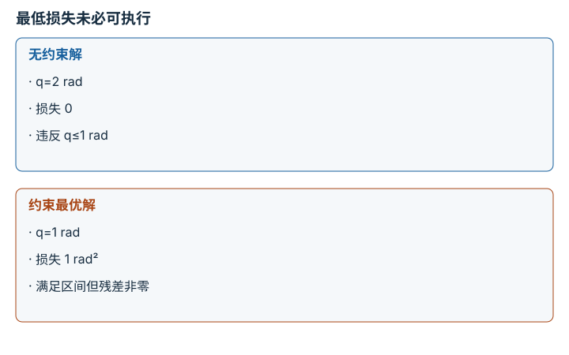

---
search:
  exclude: true
---

# 目标、约束与优化：逐点细解

<!-- Generated by scripts/build_knowledge_atlas.py; edit knowledge/atlas/*.json. -->

[按小节学习](../index.md) · [全部知识点](../../index.md) · [返回原课程](../../../foundations/11-probability-and-optimization.md)

Objectives, constraints, and optimization · 本页拆成 **4 个小知识点**。

先阅读直觉和原理，再独立完成算例、自测；图是解释工具，不是已掌握或真机验证的证明。

## 前置知识

[线性代数与最小二乘](../../math-linear-algebra/index.md)

## 本页知识点

1. [梯度给方向，步长决定走多远](#optimization-gradient-step)
2. [可行域改变最优解，而不是事后备注](#optimization-hard-constraints)
3. [正则化用偏差换取受控的解](#optimization-regularization-tradeoff)
4. [求解器停止不等于任务成功](#optimization-termination-evidence)

## 1. 梯度给方向，步长决定走多远

**Gradient descent**

**需要先懂：**函数斜率、平方损失

### 一句话直觉

知道哪边下坡还不够：一步跨过山谷，可能比原地更差。

### 原理拆开看

1. 用无量纲变量 x 和损失 f(x)=0.5(x-3)²；梯度 f′=x-3 表示局部增长最快方向。
2. 梯度下降执行 x新=x旧-αf′，α 为本例无量纲步长。
3. 此二次函数的误差满足 e新=(1-α)e旧；只有 |1-α|<1 才会收敛到 3。

### 手算或追踪一个例子

1. 教学 x0=0，α=0.5，初始梯度 -3。
2. 第一次更新为 0-0.5×(-3)=1.5，第二次为 2.25。
3. 第三次为 2.625；误差每次减半，不是每次减少固定距离。

### 用图理解

<figure class="atlas-visual" tabindex="0" aria-label="误差每次缩小一半；窄屏可在图内横向滚动">
<picture>
<source media="(max-width: 600px)" srcset="../../../assets/knowledge-atlas/optimization-gradient-step-mobile.svg">

</picture>
<figcaption>教学示意，非实测；连线只连接离散迭代点。</figcaption>
</figure>

- 曲线逐步接近 3，而每次移动距离递减。
- 这是一维凸二次函数的精确推导，不保证神经网络损失全局收敛。

查看作图数据，自己复算

图上数值可能为便于阅读而取近似值，以下保留作图输入。线段的含义以本图图注和读图说明为准，不应自行解释为实测连续轨迹。

| 曲线 | 迭代次数 (次) | x (无量纲) |
| --- | --- | --- |
| α=0.5 | 0 | 0 |
| α=0.5 | 1 | 1.5 |
| α=0.5 | 2 | 2.25 |
| α=0.5 | 3 | 2.625 |
| 最优值 | 0 | 3 |
| 最优值 | 3 | 3 |

### 容易混淆的地方

**常见误解：**梯度越大就应无条件走越大一步。

**为什么不成立：**梯度尺度、曲率和步长共同决定更新；步长过大会震荡或发散。

**正确理解：**明确损失尺度，监控更新前后目标值，并用合适步长规则。

### 自测

α=2 时从 0 出发会怎样？

展开答案与推理

0→6→0→6，误差系数为 -1，持续振荡而不收敛；不是只要 α 为正就稳定。

**原始资料：**[Boyd and Vandenberghe: Convex Optimization](https://web.stanford.edu/~boyd/cvxbook/)

## 2. 可行域改变最优解，而不是事后备注

**Constrained optimization**

**需要先懂：**平方损失、区间

### 一句话直觉

目标要求关节转到 2 rad，硬件只允许 1 rad；优化不能让几何限制消失。

### 原理拆开看

1. 目标损失 f(q)=(q-2)²，q 单位 rad；硬约束规定 q∈[-1,1] rad。
2. 无约束最优 q=2 不属于可行域，不能作为可执行答案。
3. 在这个一维凸问题中，可行点越接近 2 损失越小，因此约束最优位于边界 q=1。

### 手算或追踪一个例子

1. 教学目标 2 rad，允许区间 [-1,1] rad。
2. q=0 时损失 4 rad²；q=1 时损失 1 rad²。
3. 可行最优为 1 rad，但仍有 1 rad 跟踪残差；不能把优化结束写成到达目标。

### 用图理解

<figure class="atlas-visual" tabindex="0" aria-label="最低损失未必可执行；窄屏可在图内横向滚动">
<picture>
<source media="(max-width: 600px)" srcset="../../../assets/knowledge-atlas/optimization-hard-constraints-mobile.svg">

</picture>
<figcaption>教学示意，非实测；损失单位 rad²。</figcaption>
</figure>

- 右侧不是数值求解失败，而是目标与限制共同决定的最优折中。
- 只有单个关节角约束，尚未包含碰撞、速度和力矩限制。

### 容易混淆的地方

**常见误解：**加大迭代次数就能到达约束外目标。

**为什么不成立：**迭代只在模型允许的集合中寻找解，不能扩大物理范围。

**正确理解：**分别报告目标是否可达、约束是否满足、残差是否达标。

### 自测

再加硬约束 q≥1.5 rad，会发生什么？

展开答案与推理

与 q≤1 冲突，可行域为空；应报告不可行，不能随意返回某个折中值假装满足硬约束。

**原始资料：**[Boyd and Vandenberghe: Convex Optimization](https://web.stanford.edu/~boyd/cvxbook/)

## 3. 正则化用偏差换取受控的解

**Regularization**

**需要先懂：**最小二乘、条件数

### 一句话直觉

弱观测方向要求很大的输入才能精确拟合，正则项会主动放弃部分拟合，避免过大解。

### 原理拆开看

1. 设无量纲模型 y=0.1x，目标 y=1；损失为 (0.1x-1)²+λx²。
2. 对 x 求导并设零，得到 x=0.1/(0.01+λ)，λ≥0。
3. λ 越大，解幅度越小，但输出越偏离目标；正则化不是无代价地恢复丢失信息。

### 手算或追踪一个例子

1. 教学无正则 λ=0 时 x=10，可精确得到 y=1。
2. λ=0.01 时 x=5，输出 y=0.5；λ=0.09 时 x=1，输出 y=0.1。
3. 输入缩小的同时拟合偏差扩大，必须按任务需求选择权衡。

### 用图理解

<figure class="atlas-visual" tabindex="0" aria-label="正则权重改变解幅度；窄屏可在图内横向滚动">
<picture>
<source media="(max-width: 600px)" srcset="../../../assets/knowledge-atlas/optimization-regularization-tradeoff-mobile.svg">

</picture>
<figcaption>教学示意，非实测；三值由同一闭式解计算。</figcaption>
</figure>

- 第一到第三根柱递减，对应对大解的惩罚增强。
- 判断效果还需读取正文中的输出 1、0.5、0.1，不能只看柱高。

查看作图数据，自己复算

图上数值可能为便于阅读而取近似值，以下保留作图输入。

| 项目 | 最优 x (无量纲) |
| --- | --- |
| λ=0 | 10 |
| λ=0.01 | 5 |
| λ=0.09 | 1 |

### 容易混淆的地方

**常见误解：**正则化越强，解就越准确。

**为什么不成立：**它抑制大参数，却可能使任务误差增加。

**正确理解：**同时看解幅度、残差和验证数据表现，并报告 λ 与变量尺度。

### 自测

把模型输入单位缩放后，可否直接沿用同一 λ？

展开答案与推理

不能默认沿用；数据项和惩罚项的相对尺度改变了，需要重新无量纲化或调整权重。

**原始资料：**[Boyd and Vandenberghe: regularized least squares](https://web.stanford.edu/~boyd/cvxbook/)

## 4. 求解器停止不等于任务成功

**Stationarity and termination criteria**

**需要先懂：**梯度、约束与残差

### 一句话直觉

梯度很小可能因为在谷底，也可能站在山顶；返回 success 必须结合问题定义阅读。

### 原理拆开看

1. 终止条件可能检查梯度、步长、目标变化或迭代预算，它们回答不同问题。
2. 对非凸 f(x)=(x²-1)²，驻点满足 f′=4x(x²-1)=0，但驻点不一定是极小点。
3. 最终还需验证约束可行性、任务残差与错误状态；数值收敛只是一层证据。

### 手算或追踪一个例子

1. 教学从 x=0 出发，此时梯度为 0，损失为 1。
2. 若只检查梯度阈值，算法可能立即停止。
3. 检查 x=±1 得到损失 0，说明 x=0 不是最小解；小步长或小梯度不足以证明全局最优。

### 用图理解

<figure class="atlas-visual" tabindex="0" aria-label="零梯度也可能位于峰顶；窄屏可在图内横向滚动">
<picture>
<source media="(max-width: 600px)" srcset="../../../assets/knowledge-atlas/optimization-termination-evidence-mobile.svg">

</picture>
<figcaption>教学示意，非实测；稀疏点连线只是函数形状示意。</figcaption>
</figure>

- 中心 x=0 两侧都有更小值，虽然该点梯度恰好为零。
- 图仅覆盖一维函数，不能代替高维优化的系统诊断。

查看作图数据，自己复算

图上数值可能为便于阅读而取近似值，以下保留作图输入。线段的含义以本图图注和读图说明为准，不应自行解释为实测连续轨迹。

| 曲线 | x (无量纲) | 损失 (无量纲) |
| --- | --- | --- |
| (x²-1)² | -1.5 | 1.5625 |
| (x²-1)² | -1 | 0 |
| (x²-1)² | -0.5 | 0.5625 |
| (x²-1)² | 0 | 1 |
| (x²-1)² | 0.5 | 0.5625 |
| (x²-1)² | 1 | 0 |
| (x²-1)² | 1.5 | 1.5625 |

### 容易混淆的地方

**常见误解：**求解器 success=True 就代表机器人到达目标。

**为什么不成立：**状态码描述数值停止规则，不包含全部任务与安全条件。

**正确理解：**把停止原因、最优性条件、可行性和任务成功分别记录。

### 自测

若停在关节限位且梯度不为零，一定是失败吗？

展开答案与推理

不一定；约束最优可以位于边界，需检查可行方向和约束最优性，而非套无约束梯度等零条件。

**原始资料：**[SciPy OptimizeResult termination fields](https://docs.scipy.org/doc/scipy/reference/generated/scipy.optimize.OptimizeResult.html)

## 从理解走向证据

本节点原有验收要求：写出一个约束目标，并诊断不可行或病态问题。

完成图解自测后，回到[原课程](../../../foundations/11-probability-and-optimization.md)运行对应示例并保留证据；浏览页面和查看答案不会自动获得课程晋级。
