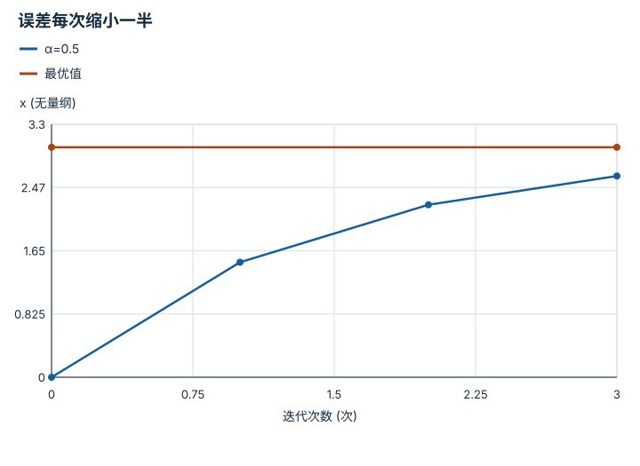

---
hide:
  - navigation
---

<!-- Generated by scripts/build_knowledge_atlas.py; edit knowledge/atlas/*.json. -->

<nav class="study-breadcrumb" aria-label="学习位置" markdown="1">
[知识目录](../../index.md) / [目标、约束与优化](../index.md)
</nav>

L1 · 本章第 1 / 4 节

# 梯度给方向，步长决定走多远

**Gradient descent**

知道哪边下坡还不够：一步跨过山谷，可能比原地更差。

先确认：这些前置知识我懂了吗？

函数斜率、平方损失

[线性代数与最小二乘](../../math-linear-algebra/index.md)

<section class="study-section " markdown="1">

## 1 · 原理拆开看

1. 用无量纲变量 x 和损失 f(x)=0.5(x-3)²；梯度 f′=x-3 表示局部增长最快方向。
2. 梯度下降执行 x新=x旧-αf′，α 为本例无量纲步长。
3. 此二次函数的误差满足 e新=(1-α)e旧；只有 |1-α|<1 才会收敛到 3。

</section>

<section class="study-section " markdown="1">

## 2 · 跟着例子算一遍

1. 教学 x0=0，α=0.5，初始梯度 -3。
2. 第一次更新为 0-0.5×(-3)=1.5，第二次为 2.25。
3. 第三次为 2.625；误差每次减半，不是每次减少固定距离。

</section>

<section class="study-section " markdown="1">

## 3 · 对照图，解释变化

<figure class="atlas-visual" tabindex="0" aria-label="误差每次缩小一半；窄屏可在图内横向滚动">
<picture>
<source media="(max-width: 600px)" srcset="../../../assets/knowledge-atlas/optimization-gradient-step-mobile.svg">

</picture>
<figcaption>教学示意，非实测；连线只连接离散迭代点。</figcaption>
</figure>

- 曲线逐步接近 3，而每次移动距离递减。
- 这是一维凸二次函数的精确推导，不保证神经网络损失全局收敛。

查看作图数据，自己复算

图上数值可能为便于阅读而取近似值，以下保留作图输入。线段的含义以本图图注和读图说明为准，不应自行解释为实测连续轨迹。

| 曲线 | 迭代次数 (次) | x (无量纲) |
| --- | --- | --- |
| α=0.5 | 0 | 0 |
| α=0.5 | 1 | 1.5 |
| α=0.5 | 2 | 2.25 |
| α=0.5 | 3 | 2.625 |
| 最优值 | 0 | 3 |
| 最优值 | 3 | 3 |

</section>

<section class="study-section study-misconception" markdown="1">

## 4 · 避开一个误区

**容易误以为：**梯度越大就应无条件走越大一步。

**为什么不成立：**梯度尺度、曲率和步长共同决定更新；步长过大会震荡或发散。

**正确理解：**明确损失尺度，监控更新前后目标值，并用合适步长规则。

</section>

<section class="study-section study-check" markdown="1">

## 5 · 先独立回答

α=2 时从 0 出发会怎样？

我已作答，查看推理

0→6→0→6，误差系数为 -1，持续振荡而不收敛；不是只要 α 为正就稳定。

</section>

继续查阅原始资料

- [Boyd and Vandenberghe: Convex Optimization](https://web.stanford.edu/~boyd/cvxbook/)

<nav class="study-pagination" aria-label="相邻小节" markdown="1">

[← 本章学习顺序](../index.md)

[可行域改变最优解，而不是事后备注 →](../optimization-hard-constraints/index.md)

</nav>

[返回本章目录](../index.md) · [整章连续阅读](../complete/index.md)

本章最后需要提交什么？

写出一个约束目标，并诊断不可行或病态问题。

回到[原课程](../../../foundations/11-probability-and-optimization.md)完成实践。阅读位置或查看答案不计为通过验收。

