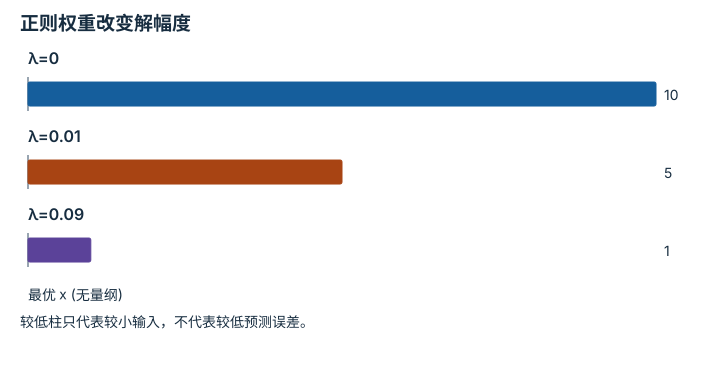

---
hide:
  - navigation
---

<!-- Generated by scripts/build_knowledge_atlas.py; edit knowledge/atlas/*.json. -->

<nav class="study-breadcrumb" aria-label="学习位置" markdown="1">
[知识目录](../../index.md) / [目标、约束与优化](../index.md)
</nav>

L1 · 本章第 3 / 4 节

# 正则化用偏差换取受控的解

**Regularization**

弱观测方向要求很大的输入才能精确拟合，正则项会主动放弃部分拟合，避免过大解。

先确认：这些前置知识我懂了吗？

最小二乘、条件数

[线性代数与最小二乘](../../math-linear-algebra/index.md)

<section class="study-section " markdown="1">

## 1 · 原理拆开看

1. 设无量纲模型 y=0.1x，目标 y=1；损失为 (0.1x-1)²+λx²。
2. 对 x 求导并设零，得到 x=0.1/(0.01+λ)，λ≥0。
3. λ 越大，解幅度越小，但输出越偏离目标；正则化不是无代价地恢复丢失信息。

</section>

<section class="study-section " markdown="1">

## 2 · 跟着例子算一遍

1. 教学无正则 λ=0 时 x=10，可精确得到 y=1。
2. λ=0.01 时 x=5，输出 y=0.5；λ=0.09 时 x=1，输出 y=0.1。
3. 输入缩小的同时拟合偏差扩大，必须按任务需求选择权衡。

</section>

<section class="study-section " markdown="1">

## 3 · 对照图，解释变化

<figure class="atlas-visual" tabindex="0" aria-label="正则权重改变解幅度；窄屏可在图内横向滚动">
<picture>
<source media="(max-width: 600px)" srcset="../../../assets/knowledge-atlas/optimization-regularization-tradeoff-mobile.svg">

</picture>
<figcaption>教学示意，非实测；三值由同一闭式解计算。</figcaption>
</figure>

- 第一到第三根柱递减，对应对大解的惩罚增强。
- 判断效果还需读取正文中的输出 1、0.5、0.1，不能只看柱高。

查看作图数据，自己复算

图上数值可能为便于阅读而取近似值，以下保留作图输入。

| 项目 | 最优 x (无量纲) |
| --- | --- |
| λ=0 | 10 |
| λ=0.01 | 5 |
| λ=0.09 | 1 |

</section>

<section class="study-section study-misconception" markdown="1">

## 4 · 避开一个误区

**容易误以为：**正则化越强，解就越准确。

**为什么不成立：**它抑制大参数，却可能使任务误差增加。

**正确理解：**同时看解幅度、残差和验证数据表现，并报告 λ 与变量尺度。

</section>

<section class="study-section study-check" markdown="1">

## 5 · 先独立回答

把模型输入单位缩放后，可否直接沿用同一 λ？

我已作答，查看推理

不能默认沿用；数据项和惩罚项的相对尺度改变了，需要重新无量纲化或调整权重。

</section>

继续查阅原始资料

- [Boyd and Vandenberghe: regularized least squares](https://web.stanford.edu/~boyd/cvxbook/)

<nav class="study-pagination" aria-label="相邻小节" markdown="1">

[← 可行域改变最优解，而不是事后备注](../optimization-hard-constraints/index.md)

[求解器停止不等于任务成功 →](../optimization-termination-evidence/index.md)

</nav>

[返回本章目录](../index.md) · [整章连续阅读](../complete/index.md)

本章最后需要提交什么？

写出一个约束目标，并诊断不可行或病态问题。

回到[原课程](../../../foundations/11-probability-and-optimization.md)完成实践。阅读位置或查看答案不计为通过验收。

