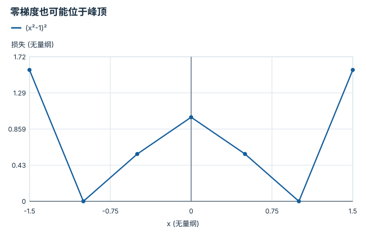

---
hide:
  - navigation
---

<!-- Generated by scripts/build_knowledge_atlas.py; edit knowledge/atlas/*.json. -->

<nav class="study-breadcrumb" aria-label="学习位置" markdown="1">
[知识目录](../../index.md) / [目标、约束与优化](../index.md)
</nav>

L1 · 本章第 4 / 4 节

# 求解器停止不等于任务成功

**Stationarity and termination criteria**

梯度很小可能因为在谷底，也可能站在山顶；返回 success 必须结合问题定义阅读。

先确认：这些前置知识我懂了吗？

梯度、约束与残差

[线性代数与最小二乘](../../math-linear-algebra/index.md)

<section class="study-section " markdown="1">

## 1 · 原理拆开看

1. 终止条件可能检查梯度、步长、目标变化或迭代预算，它们回答不同问题。
2. 对非凸 f(x)=(x²-1)²，驻点满足 f′=4x(x²-1)=0，但驻点不一定是极小点。
3. 最终还需验证约束可行性、任务残差与错误状态；数值收敛只是一层证据。

</section>

<section class="study-section " markdown="1">

## 2 · 跟着例子算一遍

1. 教学从 x=0 出发，此时梯度为 0，损失为 1。
2. 若只检查梯度阈值，算法可能立即停止。
3. 检查 x=±1 得到损失 0，说明 x=0 不是最小解；小步长或小梯度不足以证明全局最优。

</section>

<section class="study-section " markdown="1">

## 3 · 对照图，解释变化

<figure class="atlas-visual" tabindex="0" aria-label="零梯度也可能位于峰顶；窄屏可在图内横向滚动">
<picture>
<source media="(max-width: 600px)" srcset="../../../assets/knowledge-atlas/optimization-termination-evidence-mobile.svg">

</picture>
<figcaption>教学示意，非实测；稀疏点连线只是函数形状示意。</figcaption>
</figure>

- 中心 x=0 两侧都有更小值，虽然该点梯度恰好为零。
- 图仅覆盖一维函数，不能代替高维优化的系统诊断。

查看作图数据，自己复算

图上数值可能为便于阅读而取近似值，以下保留作图输入。线段的含义以本图图注和读图说明为准，不应自行解释为实测连续轨迹。

| 曲线 | x (无量纲) | 损失 (无量纲) |
| --- | --- | --- |
| (x²-1)² | -1.5 | 1.5625 |
| (x²-1)² | -1 | 0 |
| (x²-1)² | -0.5 | 0.5625 |
| (x²-1)² | 0 | 1 |
| (x²-1)² | 0.5 | 0.5625 |
| (x²-1)² | 1 | 0 |
| (x²-1)² | 1.5 | 1.5625 |

</section>

<section class="study-section study-misconception" markdown="1">

## 4 · 避开一个误区

**容易误以为：**求解器 success=True 就代表机器人到达目标。

**为什么不成立：**状态码描述数值停止规则，不包含全部任务与安全条件。

**正确理解：**把停止原因、最优性条件、可行性和任务成功分别记录。

</section>

<section class="study-section study-check" markdown="1">

## 5 · 先独立回答

若停在关节限位且梯度不为零，一定是失败吗？

我已作答，查看推理

不一定；约束最优可以位于边界，需检查可行方向和约束最优性，而非套无约束梯度等零条件。

</section>

继续查阅原始资料

- [SciPy OptimizeResult termination fields](https://docs.scipy.org/doc/scipy/reference/generated/scipy.optimize.OptimizeResult.html)

<nav class="study-pagination" aria-label="相邻小节" markdown="1">

[← 正则化用偏差换取受控的解](../optimization-regularization-tradeoff/index.md)

[回原课程动手验证 →](../../../foundations/11-probability-and-optimization.md)

</nav>

[返回本章目录](../index.md) · [整章连续阅读](../complete/index.md)

本章最后需要提交什么？

写出一个约束目标，并诊断不可行或病态问题。

回到[原课程](../../../foundations/11-probability-and-optimization.md)完成实践。阅读位置或查看答案不计为通过验收。

