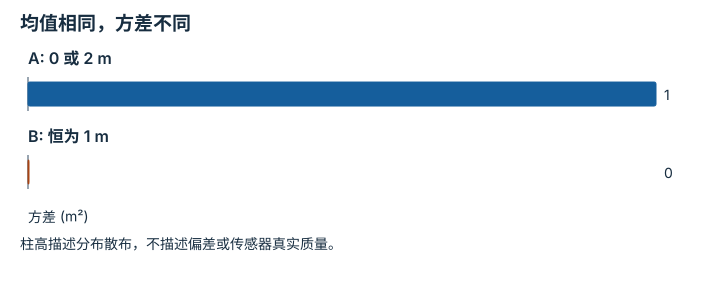
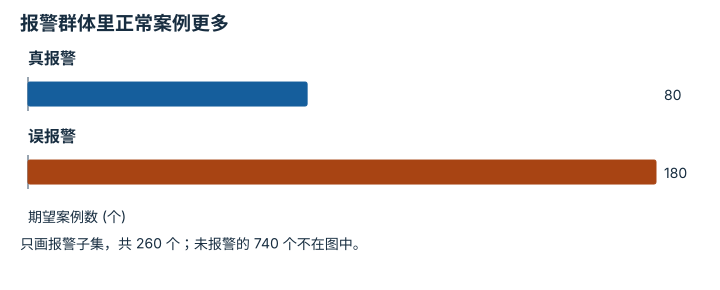
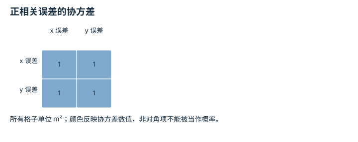
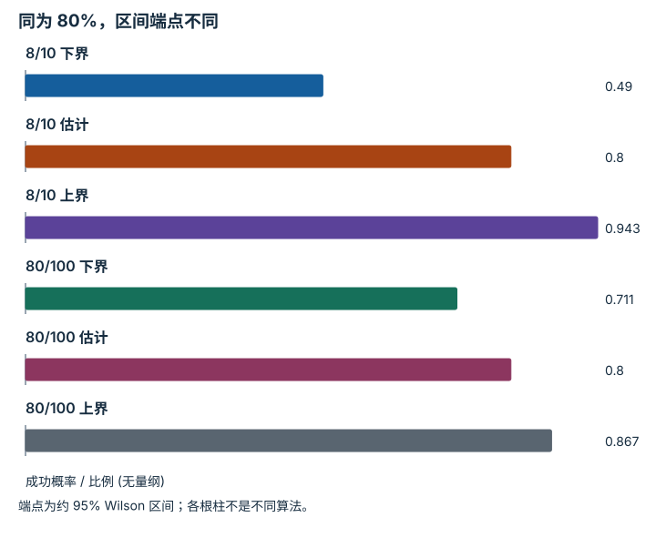

---
search:
  exclude: true
---

# 概率、估计与不确定性：逐点细解

<!-- Generated by scripts/build_knowledge_atlas.py; edit knowledge/atlas/*.json. -->

[按小节学习](../index.md) · [全部知识点](../../index.md) · [返回原课程](../../../foundations/11-probability-and-optimization.md)

Probability, estimation, and uncertainty · 本页拆成 **4 个小知识点**。

先阅读直觉和原理，再独立完成算例、自测；图是解释工具，不是已掌握或真机验证的证明。

## 前置知识

[线性代数与最小二乘](../../math-linear-algebra/index.md)

## 改一个参数试试看

保持观察成功率不变、增大回合数，先预测区间宽度。

[打开对应交互实验](../../../learning-lab-cn.md#evaluation)。滑块在文档站运行，GitHub 文件预览提供静态推导；不连接机器人。

## 本页知识点

1. [均值说明中心，方差说明散布](#probability-mean-variance)
2. [报警之后的概率取决于基础发生率](#probability-bayes-base-rate)
3. [协方差告诉你两个误差是否一起变化](#probability-covariance-direction)
4. [成功率区间为什么必须看分母](#probability-confidence-denominator)

## 1. 均值说明中心，方差说明散布

**Random variables, expectation and variance**

**需要先懂：**加权平均、平方

### 一句话直觉

两个传感器的平均读数相同，并不代表它们一样稳定。

### 原理拆开看

1. 随机变量 X 表示尚未观察到的测量结果；观察后得到的是一个具体数值 x。
2. 对离散分布，均值是 Σp(x)x，概率非负且总和为 1。
3. 方差是 Σp(x)(x-均值)²，单位是原单位的平方；标准差开根号后才回到原单位。

### 手算或追踪一个例子

1. 教学传感器 A 等概率返回 0 或 2 m；B 总返回 1 m。
2. 两者均值都为 1 m；A 方差为 0.5×1²+0.5×1²=1 m²。
3. B 方差为 0；相同均值不意味着相同噪声，也不意味着两者都接近真实目标。

### 用图理解

<figure class="atlas-visual" tabindex="0" aria-label="均值相同，方差不同；窄屏可在图内横向滚动">
<picture>
<source media="(max-width: 600px)" srcset="../../../assets/knowledge-atlas/probability-mean-variance-mobile.svg">

</picture>
<figcaption>教学示意，非实测；两个分布由题目明确指定。</figcaption>
</figure>

- B 的零方差只意味着本模型输出不变，不保证校准正确。
- A 的标准差是 1 m，不是 1 m²；图刻度显示的是方差。

查看作图数据，自己复算

图上数值可能为便于阅读而取近似值，以下保留作图输入。

| 项目 | 方差 (m²) |
| --- | --- |
| A: 0 或 2 m | 1 |
| B: 恒为 1 m | 0 |

### 容易混淆的地方

**常见误解：**均值是一条必定会实际出现的读数。

**为什么不成立：**A 从不返回 1 m，但均值仍为 1 m。

**正确理解：**把分布的统计量与单次观测区分，并注明方差和标准差单位。

### 自测

若单位从 m 改成 cm，A 的方差是多少？

展开答案与推理

方差乘 100²，变成 10000 cm²；标准差则从 1 m 变为 100 cm。

**原始资料：**[NIST: measures of scale](https://www.itl.nist.gov/div898/handbook/eda/section3/eda356.htm)

## 2. 报警之后的概率取决于基础发生率

**Conditional probability and Bayes rule**

**需要先懂：**概率与比例

### 一句话直觉

传感器对故障很敏感，不代表每次报警都真的有故障；正常情况也可能贡献大量误报。

### 原理拆开看

1. 设故障先验 P(F)=0.1，报警条件概率 P(A|F)=0.8，正常时误报 P(A|非F)=0.2。
2. 联合概率来自先验乘条件概率：故障且报警为 0.08，正常且报警为 0.18。
3. 观察到报警后，只在报警群体里重新归一化，P(F|A)=0.08/(0.08+0.18)。

### 手算或追踪一个例子

1. 教学使用 1000 个假想案例，其中 100 故障、900 正常。
2. 按给定概率期望得到 80 个真报警、180 个误报警，共 260 个报警。
3. 报警后故障概率约 80/260=30.8%，不是 80%；这些计数为模型期望，不是实测样本。

### 用图理解

<figure class="atlas-visual" tabindex="0" aria-label="报警群体里正常案例更多；窄屏可在图内横向滚动">
<picture>
<source media="(max-width: 600px)" srcset="../../../assets/knowledge-atlas/probability-bayes-base-rate-mobile.svg">

</picture>
<figcaption>教学示意，非实测；1000 个假想案例的期望计数。</figcaption>
</figure>

- 后验的分母是两根柱之和，不是所有 1000 个案例。
- 结论依赖假设的先验与误报率，换分布后需重新估计。

查看作图数据，自己复算

图上数值可能为便于阅读而取近似值，以下保留作图输入。

| 项目 | 期望案例数 (个) |
| --- | --- |
| 真报警 | 80 |
| 误报警 | 180 |

### 容易混淆的地方

**常见误解：**P(A|F) 就是 P(F|A)。

**为什么不成立：**前者以故障群体为分母，后者以报警群体为分母。

**正确理解：**先写清条件事件，再用先验和误报共同计算后验。

### 自测

若故障先验下降到 0.01，其余不变，报警会更可靠吗？

展开答案与推理

反而下降：0.008/(0.008+0.198)≈3.9%；稀少故障更容易被正常案例的误报淹没。

**原始资料：**[MIT: Introduction to Probability](https://ocw.mit.edu/courses/6-041sc-probabilistic-systems-analysis-and-applied-probability-fall-2013/)

## 3. 协方差告诉你两个误差是否一起变化

**Covariance and correlated errors**

**需要先懂：**方差、矩阵

### 一句话直觉

相机定位误差可能沿一条斜线一起漂移，只看 x、y 各自标准差会漏掉这种结构。

### 原理拆开看

1. 对二维误差 e，先减去其均值，避免把固定偏差当成波动。
2. 协方差矩阵的对角项是各轴方差，非对角项是两个中心化误差乘积的期望。
3. 正协方差表示同向变化，负协方差表示反向变化；零协方差一般不等于独立。

### 手算或追踪一个例子

1. 教学误差等概率为 (-1,-1) m 与 (1,1) m，均值为 (0,0)。
2. x²、y²、xy 每次都为 1 m²，所以协方差为 [[1,1],[1,1]] m²。
3. x-y 恒为 0，说明差分方向没有波动；x+y 却在 -2 与 2 m 间变化。

### 用图理解

<figure class="atlas-visual" tabindex="0" aria-label="正相关误差的协方差；窄屏可在图内横向滚动">
<picture>
<source media="(max-width: 600px)" srcset="../../../assets/knowledge-atlas/probability-covariance-direction-mobile.svg">

</picture>
<figcaption>教学示意，非实测；使用完整已知分布而非样本估计。</figcaption>
</figure>

- 非对角项与方差同样大，对应此例完全同向的误差变化。
- 矩阵描述二阶统计量，不能单独确定任意分布的全部形状。

查看作图数据，自己复算

图上数值可能为便于阅读而取近似值，以下保留作图输入。

| 行 / 列 | x 误差 | y 误差 |
| --- | --- | --- |
| x 误差 | 1 | 1 |
| y 误差 | 1 | 1 |

### 容易混淆的地方

**常见误解：**知道两个方差就能描述联合误差。

**为什么不成立：**同样的对角项还可能对应独立变化或反向变化。

**正确理解：**保存协方差的非对角项，并检查坐标变换后的不确定性。

### 自测

若误差改成 (-1,1) 与 (1,-1) m，哪几格改变？

展开答案与推理

两条对角线仍是 1，两个非对角项变为 -1；此时 x+y 恒为 0。

**原始资料：**[NumPy covariance](https://numpy.org/doc/stable/reference/generated/numpy.cov.html)

## 4. 成功率区间为什么必须看分母

**Binomial confidence intervals**

**需要先懂：**二元结果、样本比例

### 一句话直觉

8/10 和 80/100 都写成 80%，却提供不同强度的抽样证据。

### 原理拆开看

1. 假设试验相互独立且成功概率相同；估计量 p̂=k/n 只是一次样本的比例。
2. Wilson 区间在这些假设下把样本数量纳入不确定性；95% 描述长期重复构造的覆盖性质。
3. 增加独立样本通常缩小区间，但不能修复测试泄漏、场景缺失或相关试验。

### 手算或追踪一个例子

1. 教学比较 k=8,n=10 与 k=80,n=100，两者 p̂=0.8。
2. 使用 z=1.96 的双侧 Wilson 计算，区间约为 [0.490,0.943] 与 [0.711,0.867]。
3. 第二个区间更窄；它并不说明跨场景性能更好，因为输入只包含成功数与试验数。

### 用图理解

<figure class="atlas-visual" tabindex="0" aria-label="同为 80%，区间端点不同；窄屏可在图内横向滚动">
<picture>
<source media="(max-width: 600px)" srcset="../../../assets/knowledge-atlas/probability-confidence-denominator-mobile.svg">

</picture>
<figcaption>教学示意，非实测；柱值为给定计数推导的比例。</figcaption>
</figure>

- 两个点估计柱一样高，但第二组上下界更靠近估计。
- 图无法检查独立性；重复同一片段不能自动当成新增独立试验。

查看作图数据，自己复算

图上数值可能为便于阅读而取近似值，以下保留作图输入。

| 项目 | 成功概率 / 比例 (无量纲) |
| --- | --- |
| 8/10 下界 | 0.49 |
| 8/10 估计 | 0.8 |
| 8/10 上界 | 0.943 |
| 80/100 下界 | 0.711 |
| 80/100 估计 | 0.8 |
| 80/100 上界 | 0.867 |

### 容易混淆的地方

**常见误解：**这个已算出的区间有 95% 概率包含固定真实参数。

**为什么不成立：**频率学解释把参数视为固定、把抽样得到的区间视为随机。

**正确理解：**报告区间方法、分母和抽样假设，不把覆盖率读成该固定参数的后验概率。

### 自测

10/10 全成功能否宣布真实成功率为 100%？

展开答案与推理

不能；同样的 Wilson 区间下界约为 0.722，上界为 1，小样本仍与较低成功概率相容。

**原始资料：**[NIST: confidence intervals for proportions](https://www.itl.nist.gov/div898/handbook/prc/section2/prc241.htm)

## 从理解走向证据

本节点原有验收要求：计算一个估计量，并检验其不确定性是否校准。

完成图解自测后，回到[原课程](../../../foundations/11-probability-and-optimization.md)运行对应示例并保留证据；浏览页面和查看答案不会自动获得课程晋级。
