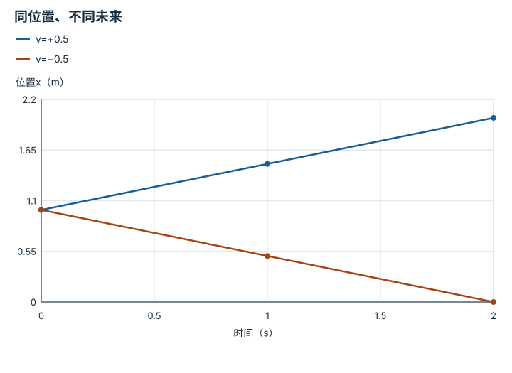
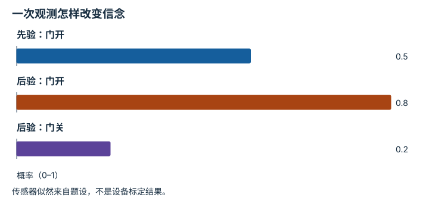
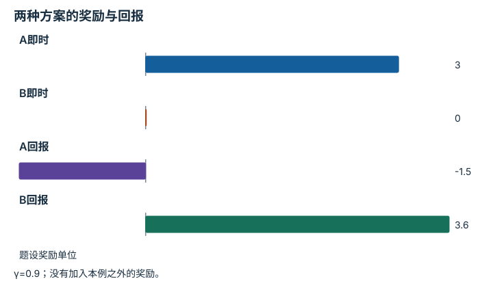
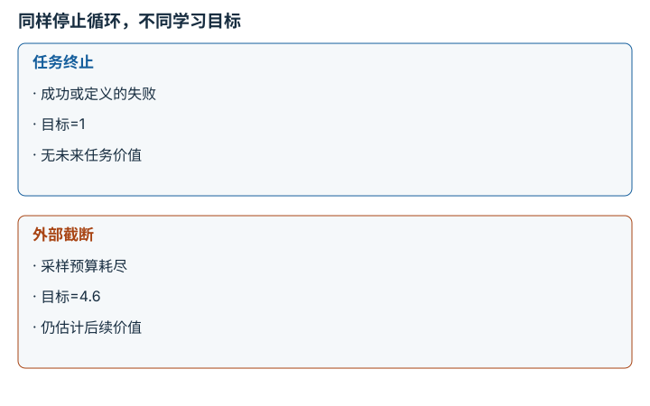

# MDP、POMDP、奖励与信念：逐点细解

<!-- Generated by scripts/build_knowledge_atlas.py; edit knowledge/atlas/*.json. -->

[全部知识点](../index.md) · [返回原课程](../../06-rl-fundamentals-for-vla.md)

MDP, POMDP, reward, and belief · 本页拆成 **4 个小知识点**。

先阅读直觉和原理，再独立完成算例、自测；图是解释工具，不是已掌握或真机验证的证明。

## 前置知识

[概率、估计与不确定性](../math-probability-statistics/index.md)

## 本页知识点

1. [状态必须保留预测下一步需要的信息](#mdp-state-sufficiency)
2. [信念是对隐藏状态的概率，而不是猜测标签](#pomdp-belief-update)
3. [即时奖励与长期回报可能给出相反选择](#mdp-reward-return)
4. [结束任务与结束采样不是同一件事](#mdp-termination-truncation)

## 1. 状态必须保留预测下一步需要的信息

**Markov state**

**需要先懂：**位置与速度

### 一句话直觉

一张位置照片无法区分正在向左还是向右运动的物体。

### 原理拆开看

1. Markov状态s需要使下一步分布在给定s和动作后不再依赖更早历史。
2. 对匀速一维物体，只记录位置x会丢掉速度v；补充v才能预测下一时刻位置。
3. 状态是否足够取决于任务动力学；接触、执行器内部状态或延迟也可能需要加入。

### 手算或追踪一个例子

1. 教学例：两物体当前都在x=1 m，速度分别+0.5和−0.5 m/s，采样间隔1 s。
2. 按x下一步=x+vΔt，下一步位置分别为1.5和0.5 m。
3. 相同x却有两个不同下一步，说明仅用位置不是这个模型的充分状态。

### 用图理解

<figure class="atlas-visual" tabindex="0" aria-label="同位置、不同未来；窄屏可在图内横向滚动">
<picture>
<source media="(max-width: 600px)" srcset="../../assets/knowledge-atlas/mdp-state-sufficiency-mobile.svg">

</picture>
<figcaption>教学匀速轨迹；连线由本例匀速假设给出。</figcaption>
</figure>

- 两条线在t=0重合，说明位置观测无法区分状态。
- 匀速模型不含加速度；实际状态设计需根据动力学重新判断。

查看作图数据，自己复算

图上数值可能为便于阅读而取近似值，以下保留作图输入。线段的含义以本图图注和读图说明为准，不应自行解释为实测连续轨迹。

| 曲线 | 时间（s） | 位置x（m） |
| --- | --- | --- |
| v=+0.5 | 0 | 1 |
| v=+0.5 | 1 | 1.5 |
| v=+0.5 | 2 | 2 |
| v=−0.5 | 0 | 1 |
| v=−0.5 | 1 | 0.5 |
| v=−0.5 | 2 | 0 |

### 容易混淆的地方

**常见误解：**状态就是传感器能看到的所有数。

**为什么不成立：**传感器可能漏测决定未来的变量，也可能包含无关信息。

**正确理解：**用能否预测状态演化检查状态设计。

### 自测

把最近两帧位置加入输入有什么帮助？

展开答案与推理

可通过位移除以时间估计速度，但噪声、遮挡和非匀速仍会留下不确定性。

**原始资料：**[LaValle：Planning Algorithms](https://www.lavalle.pl/planning/)

## 2. 信念是对隐藏状态的概率，而不是猜测标签

**Belief update**

**需要先懂：**条件概率、归一化

### 一句话直觉

传感器不可靠时，机器人应该保留多个可能解释。

### 原理拆开看

1. 令隐藏状态为门开或门关，belief记录两者概率，概率总和为1。
2. 观察到传感器报告后，用先验概率乘对应似然，再除以总和进行Bayes更新。
3. 行动可能改变状态；完整POMDP先通过转移预测，再用观测修正，不能只做静态分类。

### 手算或追踪一个例子

1. 教学例：门开先验0.5；传感器报告开，在门开时概率0.8，在门关时概率0.2。
2. 未归一化权重为0.5×0.8=0.4和0.5×0.2=0.1。
3. 后验门开概率0.4/(0.4+0.1)=0.8，仍保留0.2门关可能。

### 用图理解

<figure class="atlas-visual" tabindex="0" aria-label="一次观测怎样改变信念；窄屏可在图内横向滚动">
<picture>
<source media="(max-width: 600px)" srcset="../../assets/knowledge-atlas/pomdp-belief-update-mobile.svg">

</picture>
<figcaption>教学Bayes更新。</figcaption>
</figure>

- 后验两种门状态仍都有质量，不要只看最高柱。
- 概率可信度依赖传感器似然是否正确，图本身不校准模型。

查看作图数据，自己复算

图上数值可能为便于阅读而取近似值，以下保留作图输入。

| 项目 | 概率（0–1） |
| --- | --- |
| 先验：门开 | 0.5 |
| 后验：门开 | 0.8 |
| 后验：门关 | 0.2 |

### 容易混淆的地方

**常见误解：**传感器说开，状态就更新为开。

**为什么不成立：**报告并不排除传感器误差。

**正确理解：**更新概率，并按行动风险决定是否需要再观察。

### 自测

在同一不变门状态下再收到独立的开报告，后验是多少？

展开答案与推理

0.8×0.8/(0.8×0.8+0.2×0.2)=16/17≈0.941；重复同一帧不满足独立新证据假设。

**原始资料：**[LaValle：Planning Algorithms](https://www.lavalle.pl/planning/)

## 3. 即时奖励与长期回报可能给出相反选择

**Reward and return**

**需要先懂：**加权求和

### 一句话直觉

为了眼前少走一步而抓坏物体，可能让整个任务失败。

### 原理拆开看

1. 奖励r评价一次转移，折扣回报G把未来奖励按γ逐步衰减后相加。
2. γ在0到1之间；较小γ更重视近期，奖励单位和代价权重必须一致。
3. 奖励只是设计的代理目标，仍需独立任务成功与损伤指标检查。

### 手算或追踪一个例子

1. 教学例：两步任务，γ=0.9；方案A奖励[3,−5]，方案B奖励[0,4]。
2. A回报3+0.9×(−5)=−1.5；B回报0+0.9×4=3.6。
3. 虽然A第一步分数更高，按给定长期目标应选B。

### 用图理解

<figure class="atlas-visual" tabindex="0" aria-label="两种方案的奖励与回报；窄屏可在图内横向滚动">
<picture>
<source media="(max-width: 600px)" srcset="../../assets/knowledge-atlas/mdp-reward-return-mobile.svg">

</picture>
<figcaption>教学折扣计算。</figcaption>
</figure>

- 先比较即时两柱，再比较回报两柱，排序发生反转。
- 柱高不能代表真实机器人安全性，奖励未覆盖的风险仍存在。

查看作图数据，自己复算

图上数值可能为便于阅读而取近似值，以下保留作图输入。

| 项目 | 题设奖励单位 |
| --- | --- |
| A即时 | 3 |
| B即时 | 0 |
| A回报 | -1.5 |
| B回报 | 3.6 |

### 容易混淆的地方

**常见误解：**每一步选择即时奖励最高的动作就最优。

**为什么不成立：**动作会改变后续状态与机会。

**正确理解：**比较长期后果，并审查奖励与任务定义是否一致。

### 自测

γ=0时这个例子会选谁？

展开答案与推理

选A，因为只看第一步3对0；这不是证明A真实更好，而是目标改变了。

**原始资料：**[LaValle：Planning Algorithms](https://www.lavalle.pl/planning/)

## 4. 结束任务与结束采样不是同一件事

**Termination versus truncation**

**需要先懂：**价值函数、折扣回报

### 一句话直觉

日志都写done，会把真正终止和外部超时混在一起。

### 原理拆开看

1. terminated表示任务MDP定义的终止；truncated表示外部采样限制截断，区分取决于任务定义。
2. 价值目标在真正终止时不再bootstrap未来价值；外部截断通常仍使用最后状态的价值。
3. 若任务本身是有限时域，剩余时间应纳入状态，并把期限结束按该任务定义处理。

### 手算或追踪一个例子

1. 教学例：一步奖励1、γ=0.9、下一状态价值估计4。
2. 若成功后terminated，目标为1；若只是外部录制达到时限，目标为1+0.9×4=4.6。
3. 把二者都当终止会把截断样本目标从4.6误写成1。

### 用图理解

<figure class="atlas-visual" tabindex="0" aria-label="同样停止循环，不同学习目标；窄屏可在图内横向滚动">
<picture>
<source media="(max-width: 600px)" srcset="../../assets/knowledge-atlas/mdp-termination-truncation-mobile.svg">

</picture>
<figcaption>教学两种结束原因。</figcaption>
</figure>

- 比较的是结束原因及bootstrap规则，不是成功对失败的简单分类。
- 不同环境的时间限制语义可能不同，不能只按字段名称猜。

### 容易混淆的地方

**常见误解：**所有超时都应该bootstrap。

**为什么不成立：**若期限就是任务定义的一部分，它可能是真正终止。

**正确理解：**先读环境任务定义，再解释两个结束标志。

### 自测

机器人摔倒结束与采样器存满1000帧结束如何区分？

展开答案与推理

前者通常是任务失败终止，后者是外部截断；仍需核对该环境的明确协议。

**原始资料：**[Gymnasium：Handling Time Limits](https://gymnasium.farama.org/v0.26.3/tutorials/handling_time_limits/)

## 从理解走向证据

本节点原有验收要求：写出任务模型，并指出一个部分可观测来源。

完成图解自测后，回到[原课程](../../06-rl-fundamentals-for-vla.md)运行对应示例并保留证据；浏览页面和查看答案不会自动获得课程晋级。
