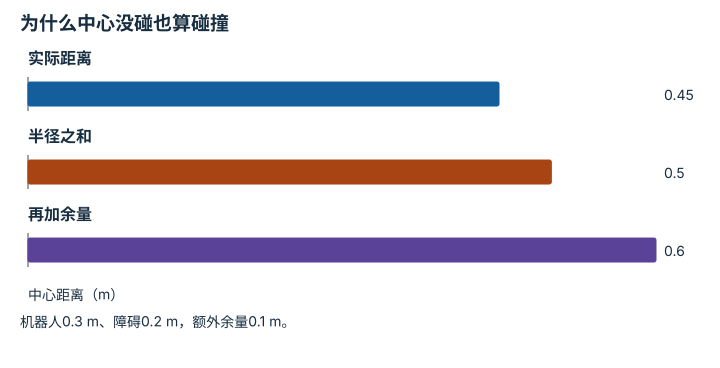

---
hide:
  - navigation
---

<!-- Generated by scripts/build_knowledge_atlas.py; edit knowledge/atlas/*.json. -->

<nav class="study-breadcrumb" aria-label="学习位置" markdown="1">
[知识目录](../../index.md) / [运动规划与轨迹优化](../index.md)
</nav>

L3 · 本章第 2 / 4 节

# 机器人有体积，障碍要在构型空间检查

**Configuration-space collision**

只让机器人中心不碰墙，车身仍可能刮过去。

先确认：这些前置知识我懂了吗？

距离、机器人几何

[正运动学、Jacobian 与 IK](../../robot-kinematics/index.md) · [目标、约束与优化](../../math-optimization/index.md) · [接触、摩擦与抓取稳定性](../../robot-contact-friction/index.md)

<section class="study-section " markdown="1">

## 1 · 原理拆开看

1. 构型q描述机器人自由度，碰撞检查回答整个几何体在q下是否相交。
2. 圆形平面机器人可把自身半径加到障碍半径上，将有体积碰撞化为中心点距离检查。
3. 非圆形或关节机器人需考虑姿态和各连杆，不能套用一个半径完成所有检查。

</section>

<section class="study-section " markdown="1">

## 2 · 跟着例子算一遍

1. 教学例：机器人半径0.3 m，圆障碍半径0.2 m，中心间距0.45 m。
2. 最小无接触中心间距为0.3+0.2=0.5 m。
3. 0.45<0.5，尽管两个中心不重合，仍发生几何重叠0.05 m。

</section>

<section class="study-section " markdown="1">

## 3 · 对照图，解释变化

<figure class="atlas-visual" tabindex="0" aria-label="为什么中心没碰也算碰撞；窄屏可在图内横向滚动">
<picture>
<source media="(max-width: 600px)" srcset="../../../assets/knowledge-atlas/planning-configuration-obstacles-mobile.svg">

</picture>
<figcaption>教学圆形几何距离。</figcaption>
</figure>

- 实际距离柱低于半径和，表示两个圆发生重叠。
- 柱状图不是地图；非圆轮廓与旋转碰撞不能靠本图判断。

查看作图数据，自己复算

图上数值可能为便于阅读而取近似值，以下保留作图输入。

| 项目 | 中心距离（m） |
| --- | --- |
| 实际距离 | 0.45 |
| 半径之和 | 0.5 |
| 再加余量 | 0.6 |

</section>

<section class="study-section study-misconception" markdown="1">

## 4 · 避开一个误区

**容易误以为：**中心点未落进原始障碍区域就安全。

**为什么不成立：**原始障碍没有计入机器人自身尺寸。

**正确理解：**检查膨胀后的障碍或完整几何碰撞。

</section>

<section class="study-section study-check" markdown="1">

## 5 · 先独立回答

再留0.1 m几何余量，中心距离至少多少？

我已作答，查看推理

0.6 m；这只是题设静态几何余量，没有覆盖定位误差或制动距离。

</section>

继续查阅原始资料

- [MIT Manipulation：Motion Planning](https://manipulation.mit.edu/trajectories.html)
- [Nav2：Inflation Layer Parameters](https://docs.nav2.org/jazzy/configuration_and_development/configuration_guide/core_servers/costmap_2d/costmap_plugins/inflation/)

<nav class="study-pagination" aria-label="相邻小节" markdown="1">

[← 路径规定去哪，轨迹还规定何时到](../planning-path-timing/index.md)

[软代价不能代替硬约束 →](../planning-cost-constraints/index.md)

</nav>

[返回本章目录](../index.md) · [整章连续阅读](../complete/index.md)

本章最后需要提交什么？

生成可行候选，并用独立约束验证。

回到[原课程](../../../04-optimization-methods.md)完成实践。阅读位置或查看答案不计为通过验收。

