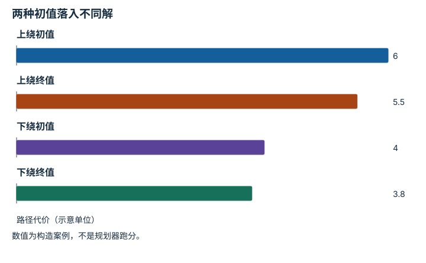

---
hide:
  - navigation
---

<!-- Generated by scripts/build_knowledge_atlas.py; edit knowledge/atlas/*.json. -->

<nav class="study-breadcrumb" aria-label="学习位置" markdown="1">
[知识目录](../../index.md) / [运动规划与轨迹优化](../index.md)
</nav>

L3 · 本章第 4 / 4 节

# 局部优化与全局搜索解决不同困难

**Local minima and initialization**

沿局部坡度改进，可能找不到需要先绕远的通道。

先确认：这些前置知识我懂了吗？

梯度、障碍

[正运动学、Jacobian 与 IK](../../robot-kinematics/index.md) · [目标、约束与优化](../../math-optimization/index.md) · [接触、摩擦与抓取稳定性](../../robot-contact-friction/index.md)

<section class="study-section " markdown="1">

## 1 · 原理拆开看

1. 局部轨迹优化从一条初始轨迹出发，利用附近梯度改善目标并满足约束。
2. 障碍会把可行路径分成不同绕行类别，局部调整可能被当前类别困住。
3. 用搜索或采样生成不同初值，再优化与验证，有助于探索不同通道，但有限尝试不是完整性证明。

</section>

<section class="study-section " markdown="1">

## 2 · 跟着例子算一遍

1. 教学例：起点S到终点G，中间有障碍；候选上绕初值代价6，下绕代价4。
2. 上绕局部优化收敛到5.5，下绕收敛到3.8；两个结果各自在本通道附近停止。
3. 只运行上绕不能宣称全局最优；比较两个可行解会选择3.8，但仍未排除其他通道。

</section>

<section class="study-section " markdown="1">

## 3 · 对照图，解释变化

<figure class="atlas-visual" tabindex="0" aria-label="两种初值落入不同解；窄屏可在图内横向滚动">
<picture>
<source media="(max-width: 600px)" srcset="../../../assets/knowledge-atlas/planning-local-minima-mobile.svg">

</picture>
<figcaption>教学代价变化，代价单位由题设定义。</figcaption>
</figure>

- 每条通道都改善了，但不同终值说明初值影响结果。
- 柱子不展示障碍具体形状，也不提供全局最优证据。

查看作图数据，自己复算

图上数值可能为便于阅读而取近似值，以下保留作图输入。

| 项目 | 路径代价（示意单位） |
| --- | --- |
| 上绕初值 | 6 |
| 上绕终值 | 5.5 |
| 下绕初值 | 4 |
| 下绕终值 | 3.8 |

</section>

<section class="study-section study-misconception" markdown="1">

## 4 · 避开一个误区

**容易误以为：**优化收敛意味着找到了全局最优。

**为什么不成立：**收敛可只满足局部停止条件。

**正确理解：**报告初值、可行性、停止条件及多初值比较。

</section>

<section class="study-section study-check" markdown="1">

## 5 · 先独立回答

再试100个随机初值能证明全局最优吗？

我已作答，查看推理

一般不能；它增加搜索覆盖，但没有穷尽或下界证明。

</section>

继续查阅原始资料

- [MIT Manipulation：Motion Planning](https://manipulation.mit.edu/trajectories.html)
- [LaValle：Planning Algorithms](https://www.lavalle.pl/planning/)

<nav class="study-pagination" aria-label="相邻小节" markdown="1">

[← 软代价不能代替硬约束](../planning-cost-constraints/index.md)

[回原课程动手验证 →](../../../04-optimization-methods.md)

</nav>

[返回本章目录](../index.md) · [整章连续阅读](../complete/index.md)

本章最后需要提交什么？

生成可行候选，并用独立约束验证。

回到[原课程](../../../04-optimization-methods.md)完成实践。阅读位置或查看答案不计为通过验收。

