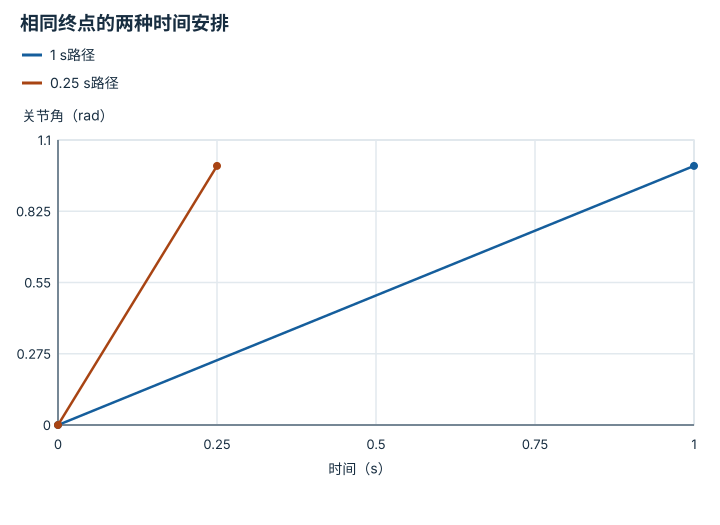

---
hide:
  - navigation
---

<!-- Generated by scripts/build_knowledge_atlas.py; edit knowledge/atlas/*.json. -->

<nav class="study-breadcrumb" aria-label="学习位置" markdown="1">
[知识目录](../../index.md) / [运动规划与轨迹优化](../index.md)
</nav>

L3 · 本章第 1 / 4 节

# 路径规定去哪，轨迹还规定何时到

**Path versus trajectory**

几何上可以绕过去，不代表电机能按要求时间赶过去。

先确认：这些前置知识我懂了吗？

速度、时间

[正运动学、Jacobian 与 IK](../../robot-kinematics/index.md) · [目标、约束与优化](../../math-optimization/index.md) · [接触、摩擦与抓取稳定性](../../robot-contact-friction/index.md)

<section class="study-section " markdown="1">

## 1 · 原理拆开看

1. 路径q(s)用无量纲进度s描述几何位置，不包含执行速度。
2. 给定时间参数s(t)后得到轨迹q(t)，可进一步求速度和加速度。
3. 轨迹必须分别检查位置、速度、加速度及动力学限制；无碰撞路径只是其中一步。

</section>

<section class="study-section " markdown="1">

## 2 · 跟着例子算一遍

1. 教学例：单关节路径从0到1 rad，用恒速段执行，忽略起停过渡。
2. 用1 s走完平均速度1 rad/s；用0.25 s走完则为4 rad/s。
3. 若速度上限2 rad/s，第一种通过恒速检查，第二种不通过；两者几何路径完全相同。

</section>

<section class="study-section " markdown="1">

## 3 · 对照图，解释变化

<figure class="atlas-visual" tabindex="0" aria-label="相同终点的两种时间安排；窄屏可在图内横向滚动">
<picture>
<source media="(max-width: 600px)" srcset="../../../assets/knowledge-atlas/planning-path-timing-mobile.svg">

</picture>
<figcaption>教学恒速段，起停瞬间尚未建模。</figcaption>
</figure>

- 斜率表示速度，陡线触犯题设速度上限。
- 两条直线都省略起停加速度，不能当可执行硬件轨迹。

查看作图数据，自己复算

图上数值可能为便于阅读而取近似值，以下保留作图输入。线段的含义以本图图注和读图说明为准，不应自行解释为实测连续轨迹。

| 曲线 | 时间（s） | 关节角（rad） |
| --- | --- | --- |
| 1 s路径 | 0 | 0 |
| 1 s路径 | 1 | 1 |
| 0.25 s路径 | 0 | 0 |
| 0.25 s路径 | 0.25 | 1 |

</section>

<section class="study-section study-misconception" markdown="1">

## 4 · 避开一个误区

**容易误以为：**规划器找到无碰撞路径，就可以直接执行。

**为什么不成立：**缺少时间参数和加速度约束，起停也可能不可实现。

**正确理解：**对路径做时间参数化并验证完整轨迹。

</section>

<section class="study-section study-check" markdown="1">

## 5 · 先独立回答

1 s版本是否已证明加速度可行？

我已作答，查看推理

没有；瞬间从静止切到恒速会产生理想无限加速度，必须加入有限起停段。

</section>

继续查阅原始资料

- [MIT Manipulation：Motion Planning](https://manipulation.mit.edu/trajectories.html)

<nav class="study-pagination" aria-label="相邻小节" markdown="1">

[← 本章学习顺序](../index.md)

[机器人有体积，障碍要在构型空间检查 →](../planning-configuration-obstacles/index.md)

</nav>

[返回本章目录](../index.md) · [整章连续阅读](../complete/index.md)

本章最后需要提交什么？

生成可行候选，并用独立约束验证。

回到[原课程](../../../04-optimization-methods.md)完成实践。阅读位置或查看答案不计为通过验收。

