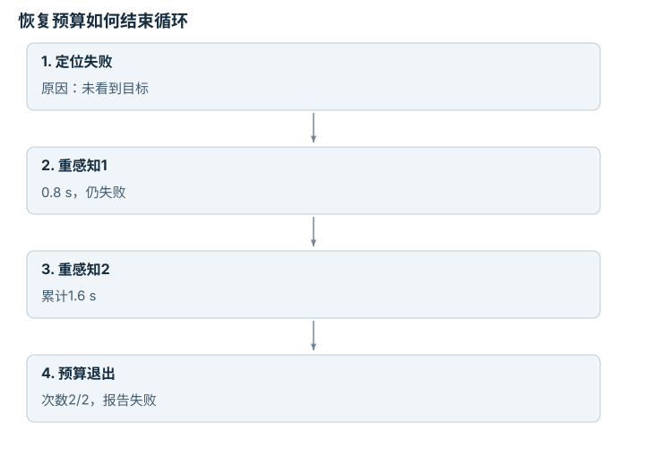

# 具身推理、监控与恢复：逐点细解

<!-- Generated by scripts/build_knowledge_atlas.py; edit knowledge/atlas/*.json. -->

[全部知识点](../index.md) · [返回原课程](../../pipelines/06-embodied-reasoning.md)

Embodied reasoning, monitoring, and recovery · 本页拆成 **4 个小知识点**。

先阅读直觉和原理，再独立完成算例、自测；图是解释工具，不是已掌握或真机验证的证明。

## 前置知识

[任务与运动组合](../planning-task-and-motion/index.md) → [滤波、融合与状态估计](../system-state-estimation/index.md) → [频率、看门狗、状态机与安全](../system-realtime-safety/index.md)

## 本页知识点

1. [计划应引用带时间戳的当前证据](#recovery-state-grounding)
2. [成功监控需要持续条件，避免瞬间抖动](#recovery-monitor-hysteresis)
3. [恢复要有预算和退出状态](#recovery-bounded-retries)
4. [先找到首次失效环节，再选择恢复](#recovery-causal-diagnosis)

## 1. 计划应引用带时间戳的当前证据

**Grounded state and freshness**

**需要先懂：**时间戳、观测

### 一句话直觉

一分钟前看见杯子在桌角，不足以决定现在往那里伸手。

### 原理拆开看

1. 为每个状态事实保留来源、观测时刻与有效条件，未知不应写成肯定事实。
2. 当前时刻减观测时刻得到信息年龄，超过任务允许范围时需重新感知。
3. 允许年龄取决于环境动态和动作风险，不能把一个阈值推广到所有机器人。

### 手算或追踪一个例子

1. 教学例：当前时钟10 s，杯子位置来自7 s图像，题设允许年龄0.5 s。
2. 信息年龄10−7=3 s，超过阈值2.5 s。
3. 本轮先重新观察；旧坐标可作为搜索提示，但不能直接充当新动作的可靠目标。

### 用图理解

<figure class="atlas-visual" tabindex="0" aria-label="观测年龄与命令时刻；窄屏可在图内横向滚动">
<picture>
<source media="(max-width: 600px)" srcset="../../assets/knowledge-atlas/recovery-state-grounding-mobile.svg">

</picture>
<figcaption>教学过期状态例子。</figcaption>
</figure>

- 当前决策位于有效窗口之外，应先获取新证据。
- 时间戳新鲜不保证测量准确，校准和遮挡仍需检查。

查看作图数据，自己复算

图上数值可能为便于阅读而取近似值，以下保留作图输入。

| 事件 | 开始 (s) | 结束 (s) |
| --- | --- | --- |
| 杯子观测 | 7 | 7.05 |
| 允许使用窗口 | 7 | 7.5 |
| 当前决策 | 10 | 10.05 |

### 容易混淆的地方

**常见误解：**计划文本中出现了物体名称，就代表它已被定位。

**为什么不成立：**语义提及没有给出当前几何证据。

**正确理解：**每个将触发动作的事实都需可追溯的观测或推断。

### 自测

静止桌子的几何也必须每0.5 s重新测量吗？

展开答案与推理

不一定；阈值需根据事实稳定性与任务风险设计，本例阈值只针对会被移动的杯子。

**原始资料：**[SayCan 作者项目](https://say-can.github.io/) · [Nav2：Collision Monitor Node](https://docs.nav2.org/rolling/configuration_and_development/configuration_guide/core_servers/collision_monitor/configuring_collision_monitor_node/)

## 2. 成功监控需要持续条件，避免瞬间抖动

**Persistence and hysteresis**

**需要先懂：**阈值、采样

### 一句话直觉

一个传感器瞬间过阈值，不应该立刻把任务判成成功。

### 原理拆开看

1. 定义成功检测量与阈值，区分任务事实和传感器代理信号。
2. 要求条件连续维持若干采样，能抑制单帧噪声；它同时增加确认延迟。
3. 退出阈值可与进入阈值不同形成hysteresis，避免状态在边界来回切换。

### 手算或追踪一个例子

1. 教学例：10 Hz高度采样[0.08,0.11,0.09,0.12,0.13,0.14] m。
2. 要求高度>0.1 m连续3帧；第2帧单次越界后第3帧复位计数。
3. 到第6帧才确认连续3帧通过；仍需检查是否真在夹爪中而非被抛起。

### 用图理解

<figure class="atlas-visual" tabindex="0" aria-label="单次越界不等于持续通过；窄屏可在图内横向滚动">
<picture>
<source media="(max-width: 600px)" srcset="../../assets/knowledge-atlas/recovery-monitor-hysteresis-mobile.svg">

</picture>
<figcaption>教学离散采样，连线仅辅助阅读。</figcaption>
</figure>

- 第2帧超过阈值但随后跌回，不能满足持续条件。
- 连线不能证明帧间始终高于阈值，严格要求需更高频观测。

查看作图数据，自己复算

图上数值可能为便于阅读而取近似值，以下保留作图输入。线段的含义以本图图注和读图说明为准，不应自行解释为实测连续轨迹。

| 曲线 | 采样序号（帧） | 物体高度（m） |
| --- | --- | --- |
| 高度 | 1 | 0.08 |
| 高度 | 2 | 0.11 |
| 高度 | 3 | 0.09 |
| 高度 | 4 | 0.12 |
| 高度 | 5 | 0.13 |
| 高度 | 6 | 0.14 |
| 阈值 | 1 | 0.1 |
| 阈值 | 6 | 0.1 |

### 容易混淆的地方

**常见误解：**检测量有一次超过阈值就足够成功。

**为什么不成立：**噪声或短暂运动能满足单帧条件。

**正确理解：**事先定义持续时间和多信号验证。

### 自测

连续3帧在10 Hz下是否覆盖0.3 s首尾间隔？

展开答案与推理

首帧到第三帧相隔0.2 s；若要求持续0.3 s，应按时间戳而不是含糊的帧数定义。

**原始资料：**[MIT Manipulation：Bin Picking](https://manipulation.mit.edu/clutter.html)

## 3. 恢复要有预算和退出状态

**Bounded recovery**

**需要先懂：**状态机、错误分类

### 一句话直觉

不停重试可能只是重复失败，也可能让风险持续累积。

### 原理拆开看

1. 根据失败原因选择恢复动作，例如重感知适用于遮挡，不适用于已经撞限位。
2. 给重试次数、总时间和动作范围设明确预算；恢复前仍重新检查约束。
3. 预算耗尽进入可解释的停止或人工接管状态，不能假装任务成功。

### 手算或追踪一个例子

1. 教学例：允许最多2次重新感知，每次预算1 s，总恢复预算3 s。
2. 两次感知各用0.8 s仍未定位，消耗1.6 s；次数已达2。
3. 即使还剩1.4 s时间，也应退出自动重试，因为次数门已触发。

### 用图理解

<figure class="atlas-visual" tabindex="0" aria-label="恢复预算如何结束循环；窄屏可在图内横向滚动">
<picture>
<source media="(max-width: 600px)" srcset="../../assets/knowledge-atlas/recovery-bounded-retries-mobile.svg">

</picture>
<figcaption>教学计数与停止逻辑。</figcaption>
</figure>

- 退出由次数上限触发，而不是等待总时间全部耗完。
- 预算设置只是软件合同，不等价于硬件风险分析。

### 容易混淆的地方

**常见误解：**只要总时间没到，就可以无限重试。

**为什么不成立：**次数、时间、风险是并列约束，任一耗尽都可能要求退出。

**正确理解：**把恢复预算与最终失败原因写进日志。

### 自测

用户稍后重新启动，旧重试计数可自动清零继续吗？

展开答案与推理

只有新任务或明确复位流程定义允许时才行；不要无条件清除未处理的故障状态。

**原始资料：**[Nav2：Collision Monitor Node](https://docs.nav2.org/rolling/configuration_and_development/configuration_guide/core_servers/collision_monitor/configuring_collision_monitor_node/) · [SayCan 作者项目](https://say-can.github.io/)

## 4. 先找到首次失效环节，再选择恢复

**Failure localization**

**需要先懂：**日志、因果顺序

### 一句话直觉

“放置失败”可能是抓取时就没拿住，不能只修最后一个动作。

### 原理拆开看

1. 按感知、接近、持有、搬运、放置记录可验证状态与时间顺序。
2. 从后向前找最早违反必要条件的阶段，区分根因候选与后续连锁症状。
3. 一次日志只能提出原因假设，需用受控重放或单因素干预验证。

### 手算或追踪一个例子

1. 教学例：五阶段标志为[1,1,0,0,0]，分别表示定位、接近、持有、搬运、放置通过与否。
2. 首次必要条件失效是持有阶段，后两项失败不能单独归因于搬运或放置控制。
3. 下一轮应检查抓取接触与持有检测，而不是首先扩大放置目标容差。

### 用图理解

<figure class="atlas-visual" tabindex="0" aria-label="阶段结果定位首次失效；窄屏可在图内横向滚动">
<picture>
<source media="(max-width: 600px)" srcset="../../assets/knowledge-atlas/recovery-causal-diagnosis-mobile.svg">

</picture>
<figcaption>教学二值阶段证据。</figcaption>
</figure>

- 第三柱首次从1变0，是优先调查位置。
- 图描述顺序证据，不凭它独立证明物理因果。

查看作图数据，自己复算

图上数值可能为便于阅读而取近似值，以下保留作图输入。

| 项目 | 阶段通过（1/0） |
| --- | --- |
| 定位 | 1 |
| 接近 | 1 |
| 持有 | 0 |
| 搬运 | 0 |
| 放置 | 0 |

### 容易混淆的地方

**常见误解：**最后看到的失败就是根因。

**为什么不成立：**上游失败会使下游不可能成功。

**正确理解：**按必要条件链追踪首次失效，并保留其他候选原因。

### 自测

持有检测器本身坏了，能直接认定物体没拿住吗？

展开答案与推理

不能；要用视频、夹爪状态或独立传感器交叉核验检测器。

**原始资料：**[MIT Manipulation：Bin Picking](https://manipulation.mit.edu/clutter.html) · [PDDLStream 原论文](https://arxiv.org/abs/1802.08705)

## 从理解走向证据

本节点原有验收要求：注入执行失败，并测量检测、重规划与恢复。

完成图解自测后，回到[原课程](../../pipelines/06-embodied-reasoning.md)运行对应示例并保留证据；浏览页面和查看答案不会自动获得课程晋级。
