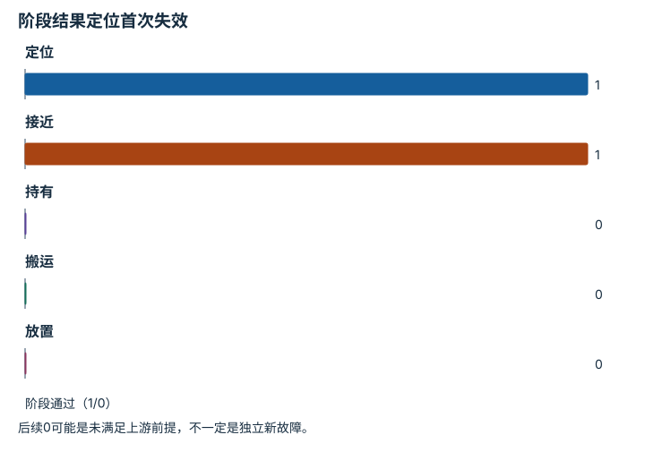

---
hide:
  - navigation
---

<!-- Generated by scripts/build_knowledge_atlas.py; edit knowledge/atlas/*.json. -->

<nav class="study-breadcrumb" aria-label="学习位置" markdown="1">
[知识目录](../../index.md) / [具身推理、监控与恢复](../index.md)
</nav>

L4 · 本章第 4 / 4 节

# 先找到首次失效环节，再选择恢复

**Failure localization**

“放置失败”可能是抓取时就没拿住，不能只修最后一个动作。

先确认：这些前置知识我懂了吗？

日志、因果顺序

[任务与运动组合](../../planning-task-and-motion/index.md) · [滤波、融合与状态估计](../../system-state-estimation/index.md) · [频率、看门狗、状态机与安全](../../system-realtime-safety/index.md)

<section class="study-section " markdown="1">

## 1 · 原理拆开看

1. 按感知、接近、持有、搬运、放置记录可验证状态与时间顺序。
2. 从后向前找最早违反必要条件的阶段，区分根因候选与后续连锁症状。
3. 一次日志只能提出原因假设，需用受控重放或单因素干预验证。

</section>

<section class="study-section " markdown="1">

## 2 · 跟着例子算一遍

1. 教学例：五阶段标志为[1,1,0,0,0]，分别表示定位、接近、持有、搬运、放置通过与否。
2. 首次必要条件失效是持有阶段，后两项失败不能单独归因于搬运或放置控制。
3. 下一轮应检查抓取接触与持有检测，而不是首先扩大放置目标容差。

</section>

<section class="study-section " markdown="1">

## 3 · 对照图，解释变化

<figure class="atlas-visual" tabindex="0" aria-label="阶段结果定位首次失效；窄屏可在图内横向滚动">
<picture>
<source media="(max-width: 600px)" srcset="../../../assets/knowledge-atlas/recovery-causal-diagnosis-mobile.svg">

</picture>
<figcaption>教学二值阶段证据。</figcaption>
</figure>

- 第三柱首次从1变0，是优先调查位置。
- 图描述顺序证据，不凭它独立证明物理因果。

查看作图数据，自己复算

图上数值可能为便于阅读而取近似值，以下保留作图输入。

| 项目 | 阶段通过（1/0） |
| --- | --- |
| 定位 | 1 |
| 接近 | 1 |
| 持有 | 0 |
| 搬运 | 0 |
| 放置 | 0 |

</section>

<section class="study-section study-misconception" markdown="1">

## 4 · 避开一个误区

**容易误以为：**最后看到的失败就是根因。

**为什么不成立：**上游失败会使下游不可能成功。

**正确理解：**按必要条件链追踪首次失效，并保留其他候选原因。

</section>

<section class="study-section study-check" markdown="1">

## 5 · 先独立回答

持有检测器本身坏了，能直接认定物体没拿住吗？

我已作答，查看推理

不能；要用视频、夹爪状态或独立传感器交叉核验检测器。

</section>

继续查阅原始资料

- [MIT Manipulation：Bin Picking](https://manipulation.mit.edu/clutter.html)
- [PDDLStream 原论文](https://arxiv.org/abs/1802.08705)

<nav class="study-pagination" aria-label="相邻小节" markdown="1">

[← 恢复要有预算和退出状态](../recovery-bounded-retries/index.md)

[回原课程动手验证 →](../../../pipelines/06-embodied-reasoning.md)

</nav>

[返回本章目录](../index.md) · [整章连续阅读](../complete/index.md)

本章最后需要提交什么？

注入执行失败，并测量检测、重规划与恢复。

回到[原课程](../../../pipelines/06-embodied-reasoning.md)完成实践。阅读位置或查看答案不计为通过验收。

