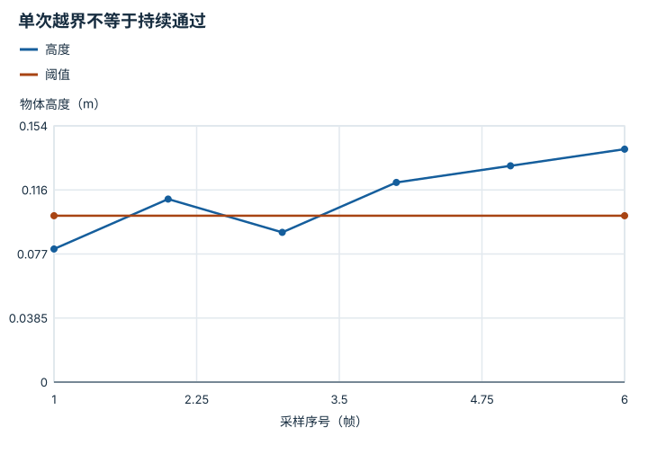

---
hide:
  - navigation
---

<!-- Generated by scripts/build_knowledge_atlas.py; edit knowledge/atlas/*.json. -->

<nav class="study-breadcrumb" aria-label="学习位置" markdown="1">
[知识目录](../../index.md) / [具身推理、监控与恢复](../index.md)
</nav>

L4 · 本章第 2 / 4 节

# 成功监控需要持续条件，避免瞬间抖动

**Persistence and hysteresis**

一个传感器瞬间过阈值，不应该立刻把任务判成成功。

先确认：这些前置知识我懂了吗？

阈值、采样

[任务与运动组合](../../planning-task-and-motion/index.md) · [滤波、融合与状态估计](../../system-state-estimation/index.md) · [频率、看门狗、状态机与安全](../../system-realtime-safety/index.md)

<section class="study-section " markdown="1">

## 1 · 原理拆开看

1. 定义成功检测量与阈值，区分任务事实和传感器代理信号。
2. 要求条件连续维持若干采样，能抑制单帧噪声；它同时增加确认延迟。
3. 退出阈值可与进入阈值不同形成hysteresis，避免状态在边界来回切换。

</section>

<section class="study-section " markdown="1">

## 2 · 跟着例子算一遍

1. 教学例：10 Hz高度采样[0.08,0.11,0.09,0.12,0.13,0.14] m。
2. 要求高度>0.1 m连续3帧；第2帧单次越界后第3帧复位计数。
3. 到第6帧才确认连续3帧通过；仍需检查是否真在夹爪中而非被抛起。

</section>

<section class="study-section " markdown="1">

## 3 · 对照图，解释变化

<figure class="atlas-visual" tabindex="0" aria-label="单次越界不等于持续通过；窄屏可在图内横向滚动">
<picture>
<source media="(max-width: 600px)" srcset="../../../assets/knowledge-atlas/recovery-monitor-hysteresis-mobile.svg">

</picture>
<figcaption>教学离散采样，连线仅辅助阅读。</figcaption>
</figure>

- 第2帧超过阈值但随后跌回，不能满足持续条件。
- 连线不能证明帧间始终高于阈值，严格要求需更高频观测。

查看作图数据，自己复算

图上数值可能为便于阅读而取近似值，以下保留作图输入。线段的含义以本图图注和读图说明为准，不应自行解释为实测连续轨迹。

| 曲线 | 采样序号（帧） | 物体高度（m） |
| --- | --- | --- |
| 高度 | 1 | 0.08 |
| 高度 | 2 | 0.11 |
| 高度 | 3 | 0.09 |
| 高度 | 4 | 0.12 |
| 高度 | 5 | 0.13 |
| 高度 | 6 | 0.14 |
| 阈值 | 1 | 0.1 |
| 阈值 | 6 | 0.1 |

</section>

<section class="study-section study-misconception" markdown="1">

## 4 · 避开一个误区

**容易误以为：**检测量有一次超过阈值就足够成功。

**为什么不成立：**噪声或短暂运动能满足单帧条件。

**正确理解：**事先定义持续时间和多信号验证。

</section>

<section class="study-section study-check" markdown="1">

## 5 · 先独立回答

连续3帧在10 Hz下是否覆盖0.3 s首尾间隔？

我已作答，查看推理

首帧到第三帧相隔0.2 s；若要求持续0.3 s，应按时间戳而不是含糊的帧数定义。

</section>

继续查阅原始资料

- [MIT Manipulation：Bin Picking](https://manipulation.mit.edu/clutter.html)

<nav class="study-pagination" aria-label="相邻小节" markdown="1">

[← 计划应引用带时间戳的当前证据](../recovery-state-grounding/index.md)

[恢复要有预算和退出状态 →](../recovery-bounded-retries/index.md)

</nav>

[返回本章目录](../index.md) · [整章连续阅读](../complete/index.md)

本章最后需要提交什么？

注入执行失败，并测量检测、重规划与恢复。

回到[原课程](../../../pipelines/06-embodied-reasoning.md)完成实践。阅读位置或查看答案不计为通过验收。

