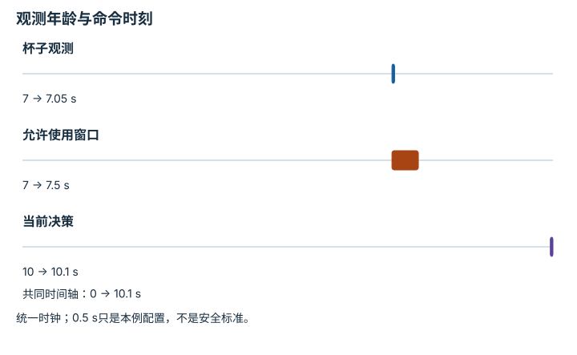

---
hide:
  - navigation
---

<!-- Generated by scripts/build_knowledge_atlas.py; edit knowledge/atlas/*.json. -->

<nav class="study-breadcrumb" aria-label="学习位置" markdown="1">
[知识目录](../../index.md) / [具身推理、监控与恢复](../index.md)
</nav>

L4 · 本章第 1 / 4 节

# 计划应引用带时间戳的当前证据

**Grounded state and freshness**

一分钟前看见杯子在桌角，不足以决定现在往那里伸手。

先确认：这些前置知识我懂了吗？

时间戳、观测

[任务与运动组合](../../planning-task-and-motion/index.md) · [滤波、融合与状态估计](../../system-state-estimation/index.md) · [频率、看门狗、状态机与安全](../../system-realtime-safety/index.md)

<section class="study-section " markdown="1">

## 1 · 原理拆开看

1. 为每个状态事实保留来源、观测时刻与有效条件，未知不应写成肯定事实。
2. 当前时刻减观测时刻得到信息年龄，超过任务允许范围时需重新感知。
3. 允许年龄取决于环境动态和动作风险，不能把一个阈值推广到所有机器人。

</section>

<section class="study-section " markdown="1">

## 2 · 跟着例子算一遍

1. 教学例：当前时钟10 s，杯子位置来自7 s图像，题设允许年龄0.5 s。
2. 信息年龄10−7=3 s，超过阈值2.5 s。
3. 本轮先重新观察；旧坐标可作为搜索提示，但不能直接充当新动作的可靠目标。

</section>

<section class="study-section " markdown="1">

## 3 · 对照图，解释变化

<figure class="atlas-visual" tabindex="0" aria-label="观测年龄与命令时刻；窄屏可在图内横向滚动">
<picture>
<source media="(max-width: 600px)" srcset="../../../assets/knowledge-atlas/recovery-state-grounding-mobile.svg">

</picture>
<figcaption>教学过期状态例子。</figcaption>
</figure>

- 当前决策位于有效窗口之外，应先获取新证据。
- 时间戳新鲜不保证测量准确，校准和遮挡仍需检查。

查看作图数据，自己复算

图上数值可能为便于阅读而取近似值，以下保留作图输入。

| 事件 | 开始 (s) | 结束 (s) |
| --- | --- | --- |
| 杯子观测 | 7 | 7.05 |
| 允许使用窗口 | 7 | 7.5 |
| 当前决策 | 10 | 10.05 |

</section>

<section class="study-section study-misconception" markdown="1">

## 4 · 避开一个误区

**容易误以为：**计划文本中出现了物体名称，就代表它已被定位。

**为什么不成立：**语义提及没有给出当前几何证据。

**正确理解：**每个将触发动作的事实都需可追溯的观测或推断。

</section>

<section class="study-section study-check" markdown="1">

## 5 · 先独立回答

静止桌子的几何也必须每0.5 s重新测量吗？

我已作答，查看推理

不一定；阈值需根据事实稳定性与任务风险设计，本例阈值只针对会被移动的杯子。

</section>

继续查阅原始资料

- [SayCan 作者项目](https://say-can.github.io/)
- [Nav2：Collision Monitor Node](https://docs.nav2.org/rolling/configuration_and_development/configuration_guide/core_servers/collision_monitor/configuring_collision_monitor_node/)

<nav class="study-pagination" aria-label="相邻小节" markdown="1">

[← 本章学习顺序](../index.md)

[成功监控需要持续条件，避免瞬间抖动 →](../recovery-monitor-hysteresis/index.md)

</nav>

[返回本章目录](../index.md) · [整章连续阅读](../complete/index.md)

本章最后需要提交什么？

注入执行失败，并测量检测、重规划与恢复。

回到[原课程](../../../pipelines/06-embodied-reasoning.md)完成实践。阅读位置或查看答案不计为通过验收。

