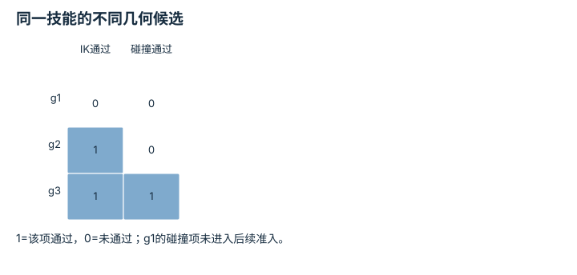
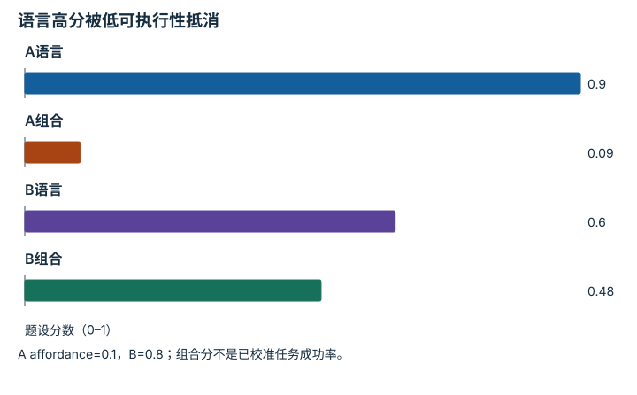
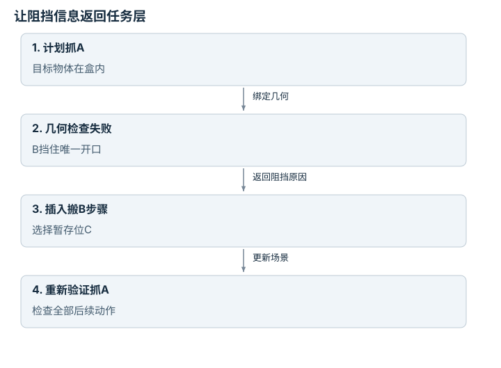

# 任务与运动组合：逐点细解

<!-- Generated by scripts/build_knowledge_atlas.py; edit knowledge/atlas/*.json. -->

[全部知识点](../index.md) · [返回原课程](../../27-embodied-reasoning-and-planning.md)

Task and motion composition · 本页拆成 **4 个小知识点**。

先阅读直觉和原理，再独立完成算例、自测；图是解释工具，不是已掌握或真机验证的证明。

## 前置知识

[运动规划与轨迹优化](../planning-motion-trajectory/index.md) → [接口、配置与测试](../computing-software-contracts/index.md)

## 本页知识点

1. [技能先检查前置条件，再验证实际效果](#tamp-precondition-effect)
2. [符号计划必须绑定真实抓取位姿](#tamp-geometric-binding)
3. [有用的技能还必须在当前状态可做](#tamp-affordance-ranking)
4. [几何阻挡会迫使任务顺序改变](#tamp-blocker-reordering)

## 1. 技能先检查前置条件，再验证实际效果

**Preconditions and effects**

**需要先懂：**布尔逻辑、任务状态

### 一句话直觉

“抓取成功”不是执行了抓取函数，而是物体状态真的发生了所需变化。

### 原理拆开看

1. 符号技能用前置条件说明何时可尝试，例如手空且物体可达。
2. 执行模型写出期望效果，例如手不再空且物体被持有，但效果仍是假设。
3. 执行后用传感器验证效果，只有证据支持时才更新任务状态。

### 手算或追踪一个例子

1. 教学例：pick前置条件为hand_empty=1、reachable=1；当前两者都为1。
2. 技能发出后夹爪闭合，但物体高度仍为0，持有检测为0。
3. 前置条件通过不等于执行成功；不能把holding直接设为1，应进入失败分支。

### 用图理解

<figure class="atlas-visual" tabindex="0" aria-label="技能合同的三个门；窄屏可在图内横向滚动">
<picture>
<source media="(max-width: 600px)" srcset="../../assets/knowledge-atlas/tamp-precondition-effect-mobile.svg">

</picture>
<figcaption>教学抓取状态更新。</figcaption>
</figure>

- 最后一格依赖效果检测，而不是只依赖执行调用结束。
- 符号合同不包含完整接触动力学，需要低层验证。

### 容易混淆的地方

**常见误解：**调用技能返回完成就可以把期望效果写入状态。

**为什么不成立：**完成可能仅表示动作时长结束，没有检测真实效果。

**正确理解：**区分命令完成和任务效果已验证。

### 自测

若reachable未知，应该把它当作true吗？

展开答案与推理

不能；需补几何检查或显式处理未知，否则把不确定性伪装成可执行性。

**原始资料：**[PDDLStream 原论文](https://arxiv.org/abs/1802.08705)

## 2. 符号计划必须绑定真实抓取位姿

**Geometric grounding**

**需要先懂：**位姿、碰撞

### 一句话直觉

一句“从左边拿杯子”还缺少机器人能到达的具体位置和姿态。

### 原理拆开看

1. 任务层提出离散步骤，几何层为每个步骤生成抓取位姿、放置位姿和运动轨迹。
2. IK、碰撞与可见性检查为候选参数提供可行性证据。
3. 若所有当前候选失败，应生成新几何候选或改变任务顺序，而不是把语言计划视为已解决。

### 手算或追踪一个例子

1. 教学例：同一抓取步骤生成三个候选g1、g2、g3。
2. g1无IK解；g2有IK但碰撞；g3有IK且碰撞检查通过。
3. 只有g3可进入下一层时序与控制验证；三个文本描述同为抓取，几何结论却不同。

### 用图理解

<figure class="atlas-visual" tabindex="0" aria-label="同一技能的不同几何候选；窄屏可在图内横向滚动">
<picture>
<source media="(max-width: 600px)" srcset="../../assets/knowledge-atlas/tamp-geometric-binding-mobile.svg">

</picture>
<figcaption>教学二值可行性筛选。</figcaption>
</figure>

- 先看IK再看碰撞，g2说明IK成功并不充分。
- 通过这两列仍不证明动态或硬件安全。

查看作图数据，自己复算

图上数值可能为便于阅读而取近似值，以下保留作图输入。

| 行 / 列 | IK通过 | 碰撞通过 |
| --- | --- | --- |
| g1 | 0 | 0 |
| g2 | 1 | 0 |
| g3 | 1 | 1 |

### 容易混淆的地方

**常见误解：**语言步骤合理，就表示机器人能执行。

**为什么不成立：**语言省略了连续几何约束。

**正确理解：**要求每个符号步骤附带可检查的连续参数。

### 自测

g3只在起止姿态无碰撞，足够吗？

展开答案与推理

不够；中间轨迹及携带物体后的几何也必须检查。

**原始资料：**[PDDLStream 原论文](https://arxiv.org/abs/1802.08705) · [MIT Manipulation：Motion Planning](https://manipulation.mit.edu/trajectories.html)

## 3. 有用的技能还必须在当前状态可做

**Affordance-weighted skill selection**

**需要先懂：**概率、技能

### 一句话直觉

最符合语言的动作，可能恰好是当前机器人做不到的动作。

### 原理拆开看

1. 将任务语义相关性与当前状态下技能可执行性分开评分。
2. SayCan式组合将两类分数相乘用于候选排序；校准条件与具体实现需要另外检查。
3. 执行后重新读取当前状态，原先可做的技能可能因环境改变而不可做。

### 手算或追踪一个例子

1. 教学例：技能A语言分0.9、可执行性0.1，B分别为0.6、0.8。
2. 组合分A=0.09，B=0.48，因此在该打分规则下选B。
3. 这只是排序示例，0.48不能未经校准就称为整条任务成功概率。

### 用图理解

<figure class="atlas-visual" tabindex="0" aria-label="语言高分被低可执行性抵消；窄屏可在图内横向滚动">
<picture>
<source media="(max-width: 600px)" srcset="../../assets/knowledge-atlas/tamp-affordance-ranking-mobile.svg">

</picture>
<figcaption>教学SayCan式候选评分。</figcaption>
</figure>

- A语言分更高，组合分却更低，排序反转来自当前可执行性。
- 柱状图没有证明分数校准，也没有考虑完整长程依赖。

查看作图数据，自己复算

图上数值可能为便于阅读而取近似值，以下保留作图输入。

| 项目 | 题设分数（0–1） |
| --- | --- |
| A语言 | 0.9 |
| A组合 | 0.09 |
| B语言 | 0.6 |
| B组合 | 0.48 |

### 容易混淆的地方

**常见误解：**语言模型给出的最高分就是最可执行动作。

**为什么不成立：**语言相关性不包含当前几何和技能能力的全部信息。

**正确理解：**同时检查任务价值与本体可执行性。

### 自测

两个分数高度相关时，相乘还等于联合概率吗？

展开答案与推理

不能一般这样解释；需要明确概率语义与条件独立等假设，否则只当组合评分。

**原始资料：**[SayCan 作者项目](https://say-can.github.io/)

## 4. 几何阻挡会迫使任务顺序改变

**Task-motion coupling**

**需要先懂：**前置条件、几何可达

### 一句话直觉

有时不是机械臂规划得不够聪明，而是必须先搬开挡路物体。

### 原理拆开看

1. 连续几何检查发现当前目标无可行接近路径，会向任务层返回阻挡信息。
2. 任务层加入清理障碍或改变抓取方式的离散步骤，再重新绑定几何参数。
3. 新放置位置也必须避免破坏后续动作，否则只是把阻挡搬到另一处。

### 手算或追踪一个例子

1. 教学例：目标A在盒内，物体B挡住唯一开口；直接抓A的可行标志为0。
2. 选择空位C，将B放到C后重新检查，抓A可行标志变成1。
3. 计划由抓A变成搬B到C→抓A；是否真的可行仍由两段轨迹验证。

### 用图理解

<figure class="atlas-visual" tabindex="0" aria-label="让阻挡信息返回任务层；窄屏可在图内横向滚动">
<picture>
<source media="(max-width: 600px)" srcset="../../assets/knowledge-atlas/tamp-blocker-reordering-mobile.svg">

</picture>
<figcaption>教学任务与几何的双向依赖。</figcaption>
</figure>

- 新增步骤由具体阻挡原因触发，不是无条件多做动作。
- 图省略了C的连续参数，必须在真实任务中补足。

### 容易混淆的地方

**常见误解：**任务规划完成后，运动规划只负责执行顺序。

**为什么不成立：**几何失败可能说明任务顺序本身必须改变。

**正确理解：**允许几何约束反馈到任务搜索。

### 自测

如果C挡住了放置A的目标区域，搬B到C是有效恢复吗？

展开答案与推理

不是完整方案；应检查后续步骤，另选不会破坏目标的暂存位。

**原始资料：**[PDDLStream 原论文](https://arxiv.org/abs/1802.08705)

## 从理解走向证据

本节点原有验收要求：执行一条类型化计划，并保留前置条件与失败事件。

完成图解自测后，回到[原课程](../../27-embodied-reasoning-and-planning.md)运行对应示例并保留证据；浏览页面和查看答案不会自动获得课程晋级。
