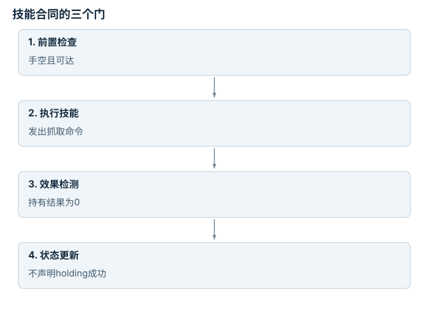

---
hide:
  - navigation
---

<!-- Generated by scripts/build_knowledge_atlas.py; edit knowledge/atlas/*.json. -->

<nav class="study-breadcrumb" aria-label="学习位置" markdown="1">
[知识目录](../../index.md) / [任务与运动组合](../index.md)
</nav>

L4 · 本章第 1 / 4 节

# 技能先检查前置条件，再验证实际效果

**Preconditions and effects**

“抓取成功”不是执行了抓取函数，而是物体状态真的发生了所需变化。

先确认：这些前置知识我懂了吗？

布尔逻辑、任务状态

[运动规划与轨迹优化](../../planning-motion-trajectory/index.md) · [接口、配置与测试](../../computing-software-contracts/index.md)

<section class="study-section " markdown="1">

## 1 · 原理拆开看

1. 符号技能用前置条件说明何时可尝试，例如手空且物体可达。
2. 执行模型写出期望效果，例如手不再空且物体被持有，但效果仍是假设。
3. 执行后用传感器验证效果，只有证据支持时才更新任务状态。

</section>

<section class="study-section " markdown="1">

## 2 · 跟着例子算一遍

1. 教学例：pick前置条件为hand_empty=1、reachable=1；当前两者都为1。
2. 技能发出后夹爪闭合，但物体高度仍为0，持有检测为0。
3. 前置条件通过不等于执行成功；不能把holding直接设为1，应进入失败分支。

</section>

<section class="study-section " markdown="1">

## 3 · 对照图，解释变化

<figure class="atlas-visual" tabindex="0" aria-label="技能合同的三个门；窄屏可在图内横向滚动">
<picture>
<source media="(max-width: 600px)" srcset="../../../assets/knowledge-atlas/tamp-precondition-effect-mobile.svg">

</picture>
<figcaption>教学抓取状态更新。</figcaption>
</figure>

- 最后一格依赖效果检测，而不是只依赖执行调用结束。
- 符号合同不包含完整接触动力学，需要低层验证。

</section>

<section class="study-section study-misconception" markdown="1">

## 4 · 避开一个误区

**容易误以为：**调用技能返回完成就可以把期望效果写入状态。

**为什么不成立：**完成可能仅表示动作时长结束，没有检测真实效果。

**正确理解：**区分命令完成和任务效果已验证。

</section>

<section class="study-section study-check" markdown="1">

## 5 · 先独立回答

若reachable未知，应该把它当作true吗？

我已作答，查看推理

不能；需补几何检查或显式处理未知，否则把不确定性伪装成可执行性。

</section>

继续查阅原始资料

- [PDDLStream 原论文](https://arxiv.org/abs/1802.08705)

<nav class="study-pagination" aria-label="相邻小节" markdown="1">

[← 本章学习顺序](../index.md)

[符号计划必须绑定真实抓取位姿 →](../tamp-geometric-binding/index.md)

</nav>

[返回本章目录](../index.md) · [整章连续阅读](../complete/index.md)

本章最后需要提交什么？

执行一条类型化计划，并保留前置条件与失败事件。

回到[原课程](../../../27-embodied-reasoning-and-planning.md)完成实践。阅读位置或查看答案不计为通过验收。

