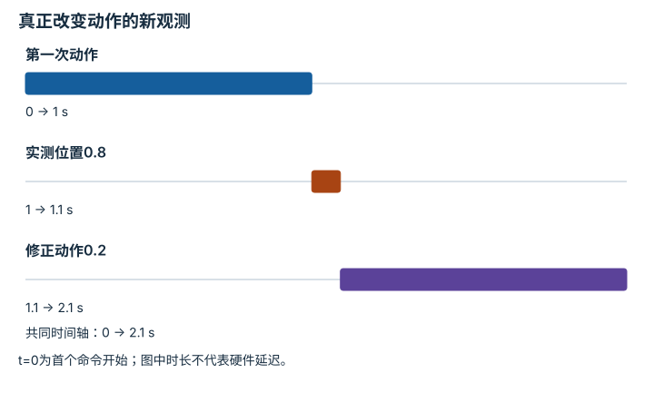
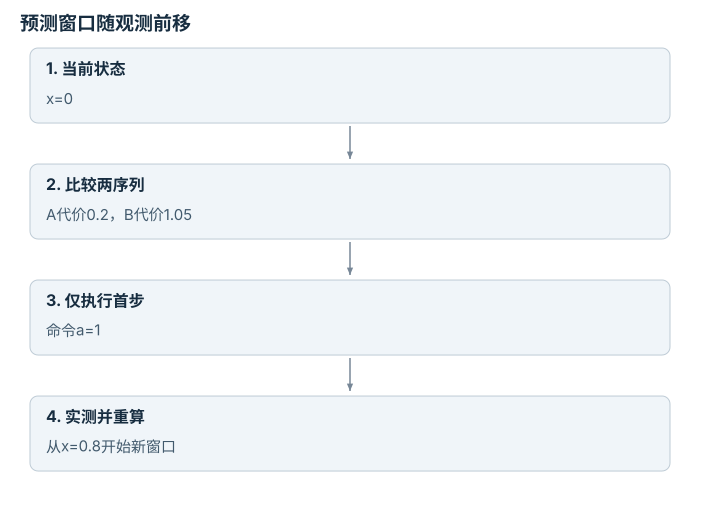

---
search:
  exclude: true
---

# 世界模型与预测 rollout：逐点细解

<!-- Generated by scripts/build_knowledge_atlas.py; edit knowledge/atlas/*.json. -->

[按小节学习](../index.md) · [全部知识点](../../index.md) · [返回原课程](../../../15-world-model-zero-to-one.md)

World models and predictive rollouts · 本页拆成 **8 个小知识点**。

先阅读直觉和原理，再独立完成算例、自测；图是解释工具，不是已掌握或真机验证的证明。

## 前置知识

[MDP、POMDP、奖励与信念](../../planning-mdp-pomdp/index.md) → [神经网络与优化循环](../../learning-neural-networks/index.md) → [数据质量、覆盖与无泄漏切分](../../data-quality-splits/index.md)

## 本页知识点

1. [预测状态要保留与动作后果有关的信息](#world-state-representation)
2. [没有动作条件，就不能可靠比较行动后果](#world-action-conditioning)
3. [一步误差很小，也可能多步漂移](#world-one-step-rollout)
4. [开放预测与真实闭环评测回答不同问题](#world-open-closed-evaluation)
5. [区分环境随机性与模型不知道](#world-uncertainty-types)
6. [优化器会利用模型的错误](#world-model-exploitation)
7. [MPC只执行当前一步，再用新状态重算](#world-mpc)
8. [世界模型与WAM先看输入输出合同](#world-wam-contract)

## 1. 预测状态要保留与动作后果有关的信息

**Predictive state representation**

**需要先懂：**状态、观测

### 一句话直觉

压缩图像不是目的，压缩后仍能推断动作会造成什么变化才有用。

### 原理拆开看

1. 编码器把观测o压成潜变量z，降低后续预测的维度。
2. 若z丢掉速度或接触状态，同一z可能对应不同未来，转移模型只能平均或表示不确定性。
3. 用下游预测和控制任务检查表征；重建图像清晰不等于保留所有决策信息。

### 手算或追踪一个例子

1. 教学例：两个画面都显示小球位置x=0 m，历史估计速度分别+1和−1 m/s。
2. 只存z=x时，1 s后的候选位置为+1和−1，均值预测为0 m。
3. 增加速度后z=[x,v]，匀速模型能分别预测+1和−1 m；均值0并非任何真实分支。

### 用图理解

<figure class="atlas-visual" tabindex="0" aria-label="位置编码与动力状态编码；窄屏可在图内横向滚动">
<picture>
<source media="(max-width: 600px)" srcset="../../../assets/knowledge-atlas/world-state-representation-mobile.svg">

</picture>
<figcaption>教学信息丢失比较。</figcaption>
</figure>

- 差别在于状态是否区分分支，而不是向量越长越好。
- 这个例子不证明某个神经编码器实际学到了速度。

### 容易混淆的地方

**常见误解：**重建损失小，状态表征就一定适合控制。

**为什么不成立：**视觉上不显眼的速度或接触差异也可能决定下一动作。

**正确理解：**评估表征对状态预测和任务决策的充分性。

### 自测

仅增加潜变量维度能保证保留速度吗？

展开答案与推理

不能；输入历史和训练目标也必须提供速度相关的信息与学习压力。

**原始资料：**[Ha 与 Schmidhuber：World Models](https://worldmodels.github.io/) · [DreamerV3 作者项目](https://danijar.com/project/dreamerv3/)

## 2. 没有动作条件，就不能可靠比较行动后果

**Action-conditioned prediction**

**需要先懂：**条件概率、位移

### 一句话直觉

只会续播常见视频的模型，未必能回答“如果我改成向左推会怎样”。

### 原理拆开看

1. 转移模型输入当前状态z与候选动作a，输出下一状态分布。
2. 固定z只改变a，才能比较模型给不同动作预测的后果；训练数据还需覆盖相关动作。
3. 观测中的相关性不是已验证的干预规律，分布外动作仍需真实环境检验。

### 手算或追踪一个例子

1. 教学例：一维滑块x=0，理想转移x下一步=x+a，a单位m。
2. 候选a为−0.1、0、+0.1，对应预测位置−0.1、0、+0.1 m。
3. 若模型三次都输出+0.1，它可能忽略动作条件，不能据此做候选动作筛选。

### 用图理解

<figure class="atlas-visual" tabindex="0" aria-label="固定状态，改变动作；窄屏可在图内横向滚动">
<picture>
<source media="(max-width: 600px)" srcset="../../../assets/knowledge-atlas/world-action-conditioning-mobile.svg">

</picture>
<figcaption>教学理想滑块，直线来自x下一步=x+a。</figcaption>
</figure>

- 倾斜线表示动作改变会改变预测，水平线在此测试中不响应动作。
- 线形只对题设转移成立，接触任务可能分段或不连续。

查看作图数据，自己复算

图上数值可能为便于阅读而取近似值，以下保留作图输入。线段的含义以本图图注和读图说明为准，不应自行解释为实测连续轨迹。

| 曲线 | 候选动作a（m） | 下一位置（m） |
| --- | --- | --- |
| 正确条件响应 | -0.1 | -0.1 |
| 正确条件响应 | 0 | 0 |
| 正确条件响应 | 0.1 | 0.1 |
| 忽略动作的例子 | -0.1 | 0.1 |
| 忽略动作的例子 | 0 | 0.1 |
| 忽略动作的例子 | 0.1 | 0.1 |

### 容易混淆的地方

**常见误解：**视频预测得像，就能当任意动作模拟器。

**为什么不成立：**逼真外观没有证明动作条件真正控制预测。

**正确理解：**做固定观测、改变动作的对照测试。

### 自测

同一观测下两个相反动作预测相同，是否一定是bug？

展开答案与推理

不一定；卡死或动作幅度过小也可能后果相同，要先选已知可区分后果的测试状态。

**原始资料：**[Ha 与 Schmidhuber：World Models](https://worldmodels.github.io/)

## 3. 一步误差很小，也可能多步漂移

**One-step error versus rollout error**

**需要先懂：**递推、误差

### 一句话直觉

每次预测都偏一点，反复把预测当输入会把偏差带进未来。

### 原理拆开看

1. 单步评测每次输入真实状态，测的是局部转移误差。
2. 开放多步rollout把上一预测送回模型，误差同时来自本步预测与错误输入。
3. 应按预测步数报告误差曲线，而不只报告一个单步平均数。

### 手算或追踪一个例子

1. 教学例：真实系统每步x增加1，模型每步增加1.1，初始x=0。
2. 真实三步为1、2、3，模型为1.1、2.2、3.3。
3. 单步局部偏差0.1，第三步累计偏差0.3；本例线性累计并非所有系统的上界。

### 用图理解

<figure class="atlas-visual" tabindex="0" aria-label="误差随rollout长度增长；窄屏可在图内横向滚动">
<picture>
<source media="(max-width: 600px)" srcset="../../../assets/knowledge-atlas/world-one-step-rollout-mobile.svg">

</picture>
<figcaption>教学恒定偏差递推，不是模型实测。</figcaption>
</figure>

- 开放预测的误差曲线增长，逐步真实输入把历史误差重置。
- 真实系统误差不一定平滑；这里连线只对应教学递推。

查看作图数据，自己复算

图上数值可能为便于阅读而取近似值，以下保留作图输入。线段的含义以本图图注和读图说明为准，不应自行解释为实测连续轨迹。

| 曲线 | 预测步数（步） | 位置误差（m） |
| --- | --- | --- |
| 开放rollout误差 | 0 | 0 |
| 开放rollout误差 | 1 | 0.1 |
| 开放rollout误差 | 2 | 0.2 |
| 开放rollout误差 | 3 | 0.3 |
| 逐步真实输入误差 | 1 | 0.1 |
| 逐步真实输入误差 | 2 | 0.1 |
| 逐步真实输入误差 | 3 | 0.1 |

### 容易混淆的地方

**常见误解：**单步误差1厘米，十步误差也约1厘米。

**为什么不成立：**预测被反馈为下一步输入，误差会传播。

**正确理解：**独立检查多步长度与稳定区域。

### 自测

误差一定按步数线性增长吗？

展开答案与推理

不是；转移动力学可能放大或压缩误差，接触切换还可能产生突变。

**原始资料：**[Ha 与 Schmidhuber：World Models](https://worldmodels.github.io/) · [DreamerV3 作者项目](https://danijar.com/project/dreamerv3/)

## 4. 开放预测与真实闭环评测回答不同问题

**Open-loop and closed-loop evaluation**

**需要先懂：**rollout、反馈

### 一句话直觉

离线预测未来很准确，不代表策略真的能纠正自己的执行误差。

### 原理拆开看

1. 开放预测评测固定起点和动作序列，比较未来预测与记录轨迹。
2. 闭环执行在每次新观测后重新决策，改变了后续访问的状态与动作。
3. 必须分别记录预测误差、环境中的任务结果和反馈频率；预测回放不能替代闭环证据。

### 手算或追踪一个例子

1. 教学例：目标1 m，初始0；一次命令希望移动1 m，但执行器只达到命令的80%。
2. 开放执行一次停在0.8 m，误差0.2 m；闭环重观测后再命令0.2 m，实际增加0.16 m。
3. 闭环到0.96 m，误差0.04 m；改善来自真实反馈，不是第一次预测变得更准。

### 用图理解

<figure class="atlas-visual" tabindex="0" aria-label="真正改变动作的新观测；窄屏可在图内横向滚动">
<picture>
<source media="(max-width: 600px)" srcset="../../../assets/knowledge-atlas/world-open-closed-evaluation-mobile.svg">

</picture>
<figcaption>教学顺序，时长仅为流程示意。</figcaption>
</figure>

- 中间必须有来自环境的新信息，才能把执行偏差纳入下一动作。
- 时间线展示信息流，不证明某个系统已经实时运行。

查看作图数据，自己复算

图上数值可能为便于阅读而取近似值，以下保留作图输入。

| 事件 | 开始 (s) | 结束 (s) |
| --- | --- | --- |
| 第一次动作 | 0 | 1 |
| 实测位置0.8 | 1 | 1.1 |
| 修正动作0.2 | 1.1 | 2.1 |

### 容易混淆的地方

**常见误解：**播放预测视频就是闭环运行。

**为什么不成立：**播放过程中没有新环境观测影响动作。

**正确理解：**标注观测来自真实环境还是模型自身，并记录重新决策时刻。

### 自测

第二次所谓观测仍来自世界模型，算真实环境闭环吗？

展开答案与推理

不算；只是模型内部闭环或想象rollout，尚未检验真实执行偏差。

**原始资料：**[DreamerV3 作者项目](https://danijar.com/project/dreamerv3/) · [Ha 与 Schmidhuber：World Models](https://worldmodels.github.io/)

## 5. 区分环境随机性与模型不知道

**Aleatoric and epistemic uncertainty**

**需要先懂：**均值、方差

### 一句话直觉

有些不确定性来自掷硬币般的环境，有些来自模型没见过这种情况。

### 原理拆开看

1. 随机性不确定性来自在相同已知条件下结果仍变化；更完整状态有时能解释其中一部分。
2. 模型不确定性来自数据有限和模型选择，多个训练模型的分歧可作为代理。
3. 分歧不是自动校准的风险概率；要在留出数据上检查覆盖与失败关联。

### 手算或追踪一个例子

1. 教学例：三个预测器给下一位置[0.9,1.0,1.1] m，均值1 m。
2. 按本例总体方差定义，方差=(0.01+0+0.01)/3≈0.00667 m²，标准差≈0.0816 m。
3. 若另一状态三者都给1 m，它们可能一致正确，也可能共享同一偏差；零分歧不等于零风险。

### 用图理解

<figure class="atlas-visual" tabindex="0" aria-label="三个预测器的分歧；窄屏可在图内横向滚动">
<picture>
<source media="(max-width: 600px)" srcset="../../../assets/knowledge-atlas/world-uncertainty-types-mobile.svg">

</picture>
<figcaption>教学集成输出，不是置信区间。</figcaption>
</figure>

- 柱间距离显示模型之间的差异，而非环境重复试验的随机波动。
- 没有真实标签时，无法从分歧直接判断绝对预测误差。

查看作图数据，自己复算

图上数值可能为便于阅读而取近似值，以下保留作图输入。

| 项目 | 下一位置（m） |
| --- | --- |
| 预测器1 | 0.9 |
| 预测器2 | 1 |
| 预测器3 | 1.1 |

### 容易混淆的地方

**常见误解：**模型集成意见一致，就没有不确定性。

**为什么不成立：**模型可能训练于相同缺失数据并犯相同错误。

**正确理解：**把集成分歧当代理，并结合分布检测与留出校准。

### 自测

增加同一时刻100份相同图像能消除模型不确定性吗？

展开答案与推理

通常不能；复制没有提供新的状态、动作或独立结果信息。

**原始资料：**[Ha 与 Schmidhuber：World Models](https://worldmodels.github.io/) · [Kendall 与 Gal：What Uncertainties Do We Need in Bayesian Deep Learning for Computer Vision?](https://arxiv.org/abs/1703.04977) · [Lakshminarayanan 等：Simple and Scalable Predictive Uncertainty Estimation using Deep Ensembles](https://arxiv.org/abs/1612.01474)

## 6. 优化器会利用模型的错误

**Model exploitation**

**需要先懂：**奖励、优化

### 一句话直觉

规划越努力，有时越会找到模拟器里虚假的捷径。

### 原理拆开看

1. 规划器优化的是预测回报，不是尚未观测到的真实回报。
2. 若某些分布外动作被模型过度乐观估值，搜索可能主动选择这些模型弱点。
3. 限制候选域、惩罚不确定性并在环境中验证，可降低风险但不能保证模型无漏洞。

### 手算或追踪一个例子

1. 教学例：A在模型中得8分、环境中得7分；B在模型中得12分、环境中得−3分。
2. 按模型最大值会选B；它的预测偏差为12−(−3)=15分。
3. 环境结果表明B不是进步；必须保留这种反例，用于模型与规划器联合诊断。

### 用图理解

<figure class="atlas-visual" tabindex="0" aria-label="预测最优不等于环境最优；窄屏可在图内横向滚动">
<picture>
<source media="(max-width: 600px)" srcset="../../../assets/knowledge-atlas/world-model-exploitation-mobile.svg">

</picture>
<figcaption>教学回报错配表。</figcaption>
</figure>

- B在模型列最高，却在环境列最低，列间反转是关键信号。
- 只有两个动作不能刻画整体模型质量，更不是真机安全验证。

查看作图数据，自己复算

图上数值可能为便于阅读而取近似值，以下保留作图输入。

| 行 / 列 | 模型分 | 环境分 |
| --- | --- | --- |
| 动作A | 8 | 7 |
| 动作B | 12 | -3 |

### 容易混淆的地方

**常见误解：**模型内回报越来越高就说明策略越来越好。

**为什么不成立：**模型误差可能被策略选择性利用。

**正确理解：**同时跟踪模型回报与独立环境回报，检查差距。

### 自测

直接增大搜索预算一定更好吗？

展开答案与推理

不一定；错误模型下更充分搜索可能更稳定地找到虚假高分动作。

**原始资料：**[Ha 与 Schmidhuber：World Models](https://worldmodels.github.io/)

## 7. MPC只执行当前一步，再用新状态重算

**Model predictive control**

**需要先懂：**转移模型、代价

### 一句话直觉

预测很远帮助比较后果，但只执行一小段能尽快吸收新观测。

### 原理拆开看

1. MPC从当前状态出发预测H步，对候选动作序列求约束代价。
2. 选出序列后只执行第一步或前K步，K必须明示。
3. 取得新状态后向前移动预测窗口并重新优化，模型误差仍需约束与反馈处理。

### 手算或追踪一个例子

1. 教学例：x下一步=x+a，初始0，目标2；候选两步序列A=[1,1]、B=[0.5,0.5]。
2. 以终点平方误差加0.1×动作平方和计价，A=0+0.2=0.2，B=1+0.05=1.05。
3. 选A但只执行第一步1；若实测到0.8，下次从0.8重算，而不是继续假设当前为1。

### 用图理解

<figure class="atlas-visual" tabindex="0" aria-label="预测窗口随观测前移；窄屏可在图内横向滚动">
<picture>
<source media="(max-width: 600px)" srcset="../../../assets/knowledge-atlas/world-mpc-mobile.svg">

</picture>
<figcaption>教学两步MPC的信息顺序。</figcaption>
</figure>

- “仅执行首步”与“预测两步”是两个独立长度。
- 图没有保证候选集完备、优化实时或约束在真实环境成立。

### 容易混淆的地方

**常见误解：**MPC就是一次算好整条轨迹然后照着播放。

**为什么不成立：**那样无法利用新观测修正模型和扰动误差。

**正确理解：**记录每次预测窗口、执行前缀与下一次状态更新。

### 自测

预测H=10但执行K=10与K=1有什么差别？

展开答案与推理

前者重观测更稀疏、后段依据更旧状态；后者算力开销更频繁，但更早利用反馈。

**原始资料：**[MIT Manipulation：Motion Planning](https://manipulation.mit.edu/trajectories.html) · [MIT Underactuated：Linear Quadratic Regulators](https://underactuated.mit.edu/lqr.html)

## 8. 世界模型与WAM先看输入输出合同

**World model versus world-action model**

**需要先懂：**条件预测、策略

### 一句话直觉

相似名称不代表相同能力：预测未来的模块未必会输出机器人动作。

### 原理拆开看

1. 一般世界模型可建模给定状态与动作后的未来，动作可能由外部规划器或策略提供。
2. 以DreamZero论文的WAM用法为例，模型联合生成对齐的未来视觉状态与动作，具备动作输出通道。
3. 名称不是接口标准；仍要核对动作维度、单位、频率、训练本体与闭环验证范围。

### 手算或追踪一个例子

1. 教学接口例：模型A输入状态和候选动作[0.1,0.1] m，输出两个预测位置。
2. 模型B输入观测与指令，输出2帧未来图像及2个7维动作，共14个动作标量。
3. A不能仅凭未来图像直接发命令；B虽然有14个数，仍需解码与执行门禁。

### 用图理解

<figure class="atlas-visual" tabindex="0" aria-label="两种不同的模块合同；窄屏可在图内横向滚动">
<picture>
<source media="(max-width: 600px)" srcset="../../../assets/knowledge-atlas/world-wam-contract-mobile.svg">

</picture>
<figcaption>教学接口，不表示所有WAM都采用同一架构。</figcaption>
</figure>

- 先读动作在哪一侧：作为输入还是作为生成输出。
- 图不能推导性能排名；联合生成也不自动保证物理一致性。

### 容易混淆的地方

**常见误解：**所有world model都能零样本控制任何机器人。

**为什么不成立：**预测功能、动作生成和跨本体适配是不同能力，且都有证据边界。

**正确理解：**按具体论文和代码的合同定义能力，不从名称推断。

### 自测

模型生成手部运动视频，却没有动作通道，可直接控制关节吗？

展开答案与推理

不能；还缺少把视觉目标映射为可执行动作的求解与验证层。

**原始资料：**[Ha 与 Schmidhuber：World Models](https://worldmodels.github.io/) · [DreamZero：World Action Models are Zero-shot Policies](https://arxiv.org/abs/2602.15922)

## 从理解走向证据

本节点原有验收要求：按时域报告 rollout 误差与下游规划任务成功。

完成图解自测后，回到[原课程](../../../15-world-model-zero-to-one.md)运行对应示例并保留证据；浏览页面和查看答案不会自动获得课程晋级。
