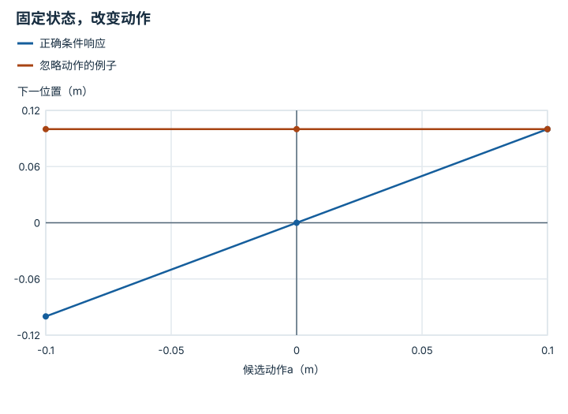

---
hide:
  - navigation
---

<!-- Generated by scripts/build_knowledge_atlas.py; edit knowledge/atlas/*.json. -->

<nav class="study-breadcrumb" aria-label="学习位置" markdown="1">
[知识目录](../../index.md) / [世界模型与预测 rollout](../index.md)
</nav>

L3 · 本章第 2 / 8 节

# 没有动作条件，就不能可靠比较行动后果

**Action-conditioned prediction**

只会续播常见视频的模型，未必能回答“如果我改成向左推会怎样”。

先确认：这些前置知识我懂了吗？

条件概率、位移

[MDP、POMDP、奖励与信念](../../planning-mdp-pomdp/index.md) · [神经网络与优化循环](../../learning-neural-networks/index.md) · [数据质量、覆盖与无泄漏切分](../../data-quality-splits/index.md)

<section class="study-section " markdown="1">

## 1 · 原理拆开看

1. 转移模型输入当前状态z与候选动作a，输出下一状态分布。
2. 固定z只改变a，才能比较模型给不同动作预测的后果；训练数据还需覆盖相关动作。
3. 观测中的相关性不是已验证的干预规律，分布外动作仍需真实环境检验。

</section>

<section class="study-section " markdown="1">

## 2 · 跟着例子算一遍

1. 教学例：一维滑块x=0，理想转移x下一步=x+a，a单位m。
2. 候选a为−0.1、0、+0.1，对应预测位置−0.1、0、+0.1 m。
3. 若模型三次都输出+0.1，它可能忽略动作条件，不能据此做候选动作筛选。

</section>

<section class="study-section " markdown="1">

## 3 · 对照图，解释变化

<figure class="atlas-visual" tabindex="0" aria-label="固定状态，改变动作；窄屏可在图内横向滚动">
<picture>
<source media="(max-width: 600px)" srcset="../../../assets/knowledge-atlas/world-action-conditioning-mobile.svg">

</picture>
<figcaption>教学理想滑块，直线来自x下一步=x+a。</figcaption>
</figure>

- 倾斜线表示动作改变会改变预测，水平线在此测试中不响应动作。
- 线形只对题设转移成立，接触任务可能分段或不连续。

查看作图数据，自己复算

图上数值可能为便于阅读而取近似值，以下保留作图输入。线段的含义以本图图注和读图说明为准，不应自行解释为实测连续轨迹。

| 曲线 | 候选动作a（m） | 下一位置（m） |
| --- | --- | --- |
| 正确条件响应 | -0.1 | -0.1 |
| 正确条件响应 | 0 | 0 |
| 正确条件响应 | 0.1 | 0.1 |
| 忽略动作的例子 | -0.1 | 0.1 |
| 忽略动作的例子 | 0 | 0.1 |
| 忽略动作的例子 | 0.1 | 0.1 |

</section>

<section class="study-section study-misconception" markdown="1">

## 4 · 避开一个误区

**容易误以为：**视频预测得像，就能当任意动作模拟器。

**为什么不成立：**逼真外观没有证明动作条件真正控制预测。

**正确理解：**做固定观测、改变动作的对照测试。

</section>

<section class="study-section study-check" markdown="1">

## 5 · 先独立回答

同一观测下两个相反动作预测相同，是否一定是bug？

我已作答，查看推理

不一定；卡死或动作幅度过小也可能后果相同，要先选已知可区分后果的测试状态。

</section>

继续查阅原始资料

- [Ha 与 Schmidhuber：World Models](https://worldmodels.github.io/)

<nav class="study-pagination" aria-label="相邻小节" markdown="1">

[← 预测状态要保留与动作后果有关的信息](../world-state-representation/index.md)

[一步误差很小，也可能多步漂移 →](../world-one-step-rollout/index.md)

</nav>

[返回本章目录](../index.md) · [整章连续阅读](../complete/index.md)

本章最后需要提交什么？

按时域报告 rollout 误差与下游规划任务成功。

回到[原课程](../../../15-world-model-zero-to-one.md)完成实践。阅读位置或查看答案不计为通过验收。

