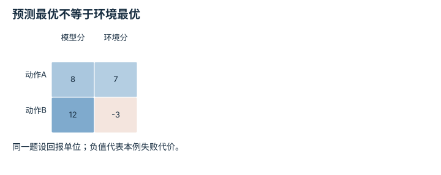

---
hide:
  - navigation
---

<!-- Generated by scripts/build_knowledge_atlas.py; edit knowledge/atlas/*.json. -->

<nav class="study-breadcrumb" aria-label="学习位置" markdown="1">
[知识目录](../../index.md) / [世界模型与预测 rollout](../index.md)
</nav>

L3 · 本章第 6 / 8 节

# 优化器会利用模型的错误

**Model exploitation**

规划越努力，有时越会找到模拟器里虚假的捷径。

先确认：这些前置知识我懂了吗？

奖励、优化

[MDP、POMDP、奖励与信念](../../planning-mdp-pomdp/index.md) · [神经网络与优化循环](../../learning-neural-networks/index.md) · [数据质量、覆盖与无泄漏切分](../../data-quality-splits/index.md)

<section class="study-section " markdown="1">

## 1 · 原理拆开看

1. 规划器优化的是预测回报，不是尚未观测到的真实回报。
2. 若某些分布外动作被模型过度乐观估值，搜索可能主动选择这些模型弱点。
3. 限制候选域、惩罚不确定性并在环境中验证，可降低风险但不能保证模型无漏洞。

</section>

<section class="study-section " markdown="1">

## 2 · 跟着例子算一遍

1. 教学例：A在模型中得8分、环境中得7分；B在模型中得12分、环境中得−3分。
2. 按模型最大值会选B；它的预测偏差为12−(−3)=15分。
3. 环境结果表明B不是进步；必须保留这种反例，用于模型与规划器联合诊断。

</section>

<section class="study-section " markdown="1">

## 3 · 对照图，解释变化

<figure class="atlas-visual" tabindex="0" aria-label="预测最优不等于环境最优；窄屏可在图内横向滚动">
<picture>
<source media="(max-width: 600px)" srcset="../../../assets/knowledge-atlas/world-model-exploitation-mobile.svg">

</picture>
<figcaption>教学回报错配表。</figcaption>
</figure>

- B在模型列最高，却在环境列最低，列间反转是关键信号。
- 只有两个动作不能刻画整体模型质量，更不是真机安全验证。

查看作图数据，自己复算

图上数值可能为便于阅读而取近似值，以下保留作图输入。

| 行 / 列 | 模型分 | 环境分 |
| --- | --- | --- |
| 动作A | 8 | 7 |
| 动作B | 12 | -3 |

</section>

<section class="study-section study-misconception" markdown="1">

## 4 · 避开一个误区

**容易误以为：**模型内回报越来越高就说明策略越来越好。

**为什么不成立：**模型误差可能被策略选择性利用。

**正确理解：**同时跟踪模型回报与独立环境回报，检查差距。

</section>

<section class="study-section study-check" markdown="1">

## 5 · 先独立回答

直接增大搜索预算一定更好吗？

我已作答，查看推理

不一定；错误模型下更充分搜索可能更稳定地找到虚假高分动作。

</section>

继续查阅原始资料

- [Ha 与 Schmidhuber：World Models](https://worldmodels.github.io/)

<nav class="study-pagination" aria-label="相邻小节" markdown="1">

[← 区分环境随机性与模型不知道](../world-uncertainty-types/index.md)

[MPC只执行当前一步，再用新状态重算 →](../world-mpc/index.md)

</nav>

[返回本章目录](../index.md) · [整章连续阅读](../complete/index.md)

本章最后需要提交什么？

按时域报告 rollout 误差与下游规划任务成功。

回到[原课程](../../../15-world-model-zero-to-one.md)完成实践。阅读位置或查看答案不计为通过验收。

