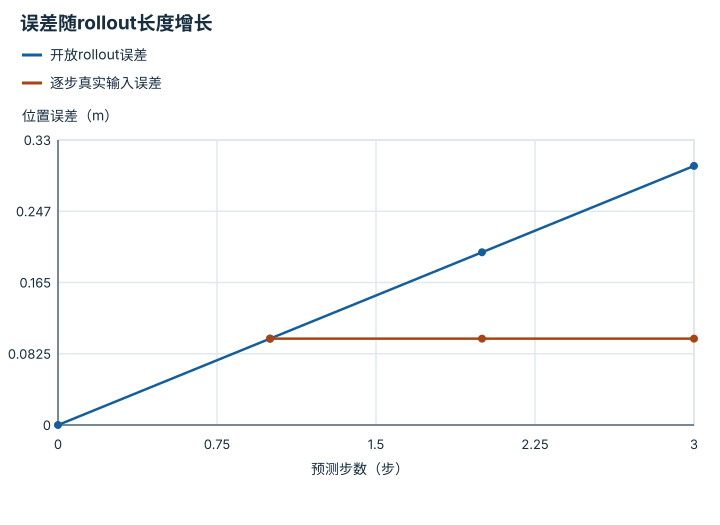

---
hide:
  - navigation
---

<!-- Generated by scripts/build_knowledge_atlas.py; edit knowledge/atlas/*.json. -->

<nav class="study-breadcrumb" aria-label="学习位置" markdown="1">
[知识目录](../../index.md) / [世界模型与预测 rollout](../index.md)
</nav>

L3 · 本章第 3 / 8 节

# 一步误差很小，也可能多步漂移

**One-step error versus rollout error**

每次预测都偏一点，反复把预测当输入会把偏差带进未来。

先确认：这些前置知识我懂了吗？

递推、误差

[MDP、POMDP、奖励与信念](../../planning-mdp-pomdp/index.md) · [神经网络与优化循环](../../learning-neural-networks/index.md) · [数据质量、覆盖与无泄漏切分](../../data-quality-splits/index.md)

<section class="study-section " markdown="1">

## 1 · 原理拆开看

1. 单步评测每次输入真实状态，测的是局部转移误差。
2. 开放多步rollout把上一预测送回模型，误差同时来自本步预测与错误输入。
3. 应按预测步数报告误差曲线，而不只报告一个单步平均数。

</section>

<section class="study-section " markdown="1">

## 2 · 跟着例子算一遍

1. 教学例：真实系统每步x增加1，模型每步增加1.1，初始x=0。
2. 真实三步为1、2、3，模型为1.1、2.2、3.3。
3. 单步局部偏差0.1，第三步累计偏差0.3；本例线性累计并非所有系统的上界。

</section>

<section class="study-section " markdown="1">

## 3 · 对照图，解释变化

<figure class="atlas-visual" tabindex="0" aria-label="误差随rollout长度增长；窄屏可在图内横向滚动">
<picture>
<source media="(max-width: 600px)" srcset="../../../assets/knowledge-atlas/world-one-step-rollout-mobile.svg">

</picture>
<figcaption>教学恒定偏差递推，不是模型实测。</figcaption>
</figure>

- 开放预测的误差曲线增长，逐步真实输入把历史误差重置。
- 真实系统误差不一定平滑；这里连线只对应教学递推。

查看作图数据，自己复算

图上数值可能为便于阅读而取近似值，以下保留作图输入。线段的含义以本图图注和读图说明为准，不应自行解释为实测连续轨迹。

| 曲线 | 预测步数（步） | 位置误差（m） |
| --- | --- | --- |
| 开放rollout误差 | 0 | 0 |
| 开放rollout误差 | 1 | 0.1 |
| 开放rollout误差 | 2 | 0.2 |
| 开放rollout误差 | 3 | 0.3 |
| 逐步真实输入误差 | 1 | 0.1 |
| 逐步真实输入误差 | 2 | 0.1 |
| 逐步真实输入误差 | 3 | 0.1 |

</section>

<section class="study-section study-misconception" markdown="1">

## 4 · 避开一个误区

**容易误以为：**单步误差1厘米，十步误差也约1厘米。

**为什么不成立：**预测被反馈为下一步输入，误差会传播。

**正确理解：**独立检查多步长度与稳定区域。

</section>

<section class="study-section study-check" markdown="1">

## 5 · 先独立回答

误差一定按步数线性增长吗？

我已作答，查看推理

不是；转移动力学可能放大或压缩误差，接触切换还可能产生突变。

</section>

继续查阅原始资料

- [Ha 与 Schmidhuber：World Models](https://worldmodels.github.io/)
- [DreamerV3 作者项目](https://danijar.com/project/dreamerv3/)

<nav class="study-pagination" aria-label="相邻小节" markdown="1">

[← 没有动作条件，就不能可靠比较行动后果](../world-action-conditioning/index.md)

[开放预测与真实闭环评测回答不同问题 →](../world-open-closed-evaluation/index.md)

</nav>

[返回本章目录](../index.md) · [整章连续阅读](../complete/index.md)

本章最后需要提交什么？

按时域报告 rollout 误差与下游规划任务成功。

回到[原课程](../../../15-world-model-zero-to-one.md)完成实践。阅读位置或查看答案不计为通过验收。

