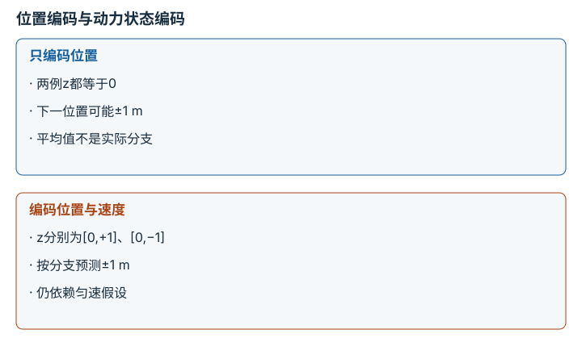

---
hide:
  - navigation
---

<!-- Generated by scripts/build_knowledge_atlas.py; edit knowledge/atlas/*.json. -->

<nav class="study-breadcrumb" aria-label="学习位置" markdown="1">
[知识目录](../../index.md) / [世界模型与预测 rollout](../index.md)
</nav>

L3 · 本章第 1 / 8 节

# 预测状态要保留与动作后果有关的信息

**Predictive state representation**

压缩图像不是目的，压缩后仍能推断动作会造成什么变化才有用。

先确认：这些前置知识我懂了吗？

状态、观测

[MDP、POMDP、奖励与信念](../../planning-mdp-pomdp/index.md) · [神经网络与优化循环](../../learning-neural-networks/index.md) · [数据质量、覆盖与无泄漏切分](../../data-quality-splits/index.md)

<section class="study-section " markdown="1">

## 1 · 原理拆开看

1. 编码器把观测o压成潜变量z，降低后续预测的维度。
2. 若z丢掉速度或接触状态，同一z可能对应不同未来，转移模型只能平均或表示不确定性。
3. 用下游预测和控制任务检查表征；重建图像清晰不等于保留所有决策信息。

</section>

<section class="study-section " markdown="1">

## 2 · 跟着例子算一遍

1. 教学例：两个画面都显示小球位置x=0 m，历史估计速度分别+1和−1 m/s。
2. 只存z=x时，1 s后的候选位置为+1和−1，均值预测为0 m。
3. 增加速度后z=[x,v]，匀速模型能分别预测+1和−1 m；均值0并非任何真实分支。

</section>

<section class="study-section " markdown="1">

## 3 · 对照图，解释变化

<figure class="atlas-visual" tabindex="0" aria-label="位置编码与动力状态编码；窄屏可在图内横向滚动">
<picture>
<source media="(max-width: 600px)" srcset="../../../assets/knowledge-atlas/world-state-representation-mobile.svg">

</picture>
<figcaption>教学信息丢失比较。</figcaption>
</figure>

- 差别在于状态是否区分分支，而不是向量越长越好。
- 这个例子不证明某个神经编码器实际学到了速度。

</section>

<section class="study-section study-misconception" markdown="1">

## 4 · 避开一个误区

**容易误以为：**重建损失小，状态表征就一定适合控制。

**为什么不成立：**视觉上不显眼的速度或接触差异也可能决定下一动作。

**正确理解：**评估表征对状态预测和任务决策的充分性。

</section>

<section class="study-section study-check" markdown="1">

## 5 · 先独立回答

仅增加潜变量维度能保证保留速度吗？

我已作答，查看推理

不能；输入历史和训练目标也必须提供速度相关的信息与学习压力。

</section>

继续查阅原始资料

- [Ha 与 Schmidhuber：World Models](https://worldmodels.github.io/)
- [DreamerV3 作者项目](https://danijar.com/project/dreamerv3/)

<nav class="study-pagination" aria-label="相邻小节" markdown="1">

[← 本章学习顺序](../index.md)

[没有动作条件，就不能可靠比较行动后果 →](../world-action-conditioning/index.md)

</nav>

[返回本章目录](../index.md) · [整章连续阅读](../complete/index.md)

本章最后需要提交什么？

按时域报告 rollout 误差与下游规划任务成功。

回到[原课程](../../../15-world-model-zero-to-one.md)完成实践。阅读位置或查看答案不计为通过验收。

