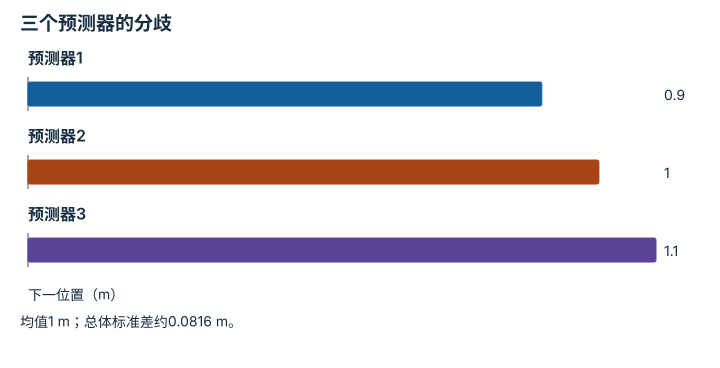

---
hide:
  - navigation
---

<!-- Generated by scripts/build_knowledge_atlas.py; edit knowledge/atlas/*.json. -->

<nav class="study-breadcrumb" aria-label="学习位置" markdown="1">
[知识目录](../../index.md) / [世界模型与预测 rollout](../index.md)
</nav>

L3 · 本章第 5 / 8 节

# 区分环境随机性与模型不知道

**Aleatoric and epistemic uncertainty**

有些不确定性来自掷硬币般的环境，有些来自模型没见过这种情况。

先确认：这些前置知识我懂了吗？

均值、方差

[MDP、POMDP、奖励与信念](../../planning-mdp-pomdp/index.md) · [神经网络与优化循环](../../learning-neural-networks/index.md) · [数据质量、覆盖与无泄漏切分](../../data-quality-splits/index.md)

<section class="study-section " markdown="1">

## 1 · 原理拆开看

1. 随机性不确定性来自在相同已知条件下结果仍变化；更完整状态有时能解释其中一部分。
2. 模型不确定性来自数据有限和模型选择，多个训练模型的分歧可作为代理。
3. 分歧不是自动校准的风险概率；要在留出数据上检查覆盖与失败关联。

</section>

<section class="study-section " markdown="1">

## 2 · 跟着例子算一遍

1. 教学例：三个预测器给下一位置[0.9,1.0,1.1] m，均值1 m。
2. 按本例总体方差定义，方差=(0.01+0+0.01)/3≈0.00667 m²，标准差≈0.0816 m。
3. 若另一状态三者都给1 m，它们可能一致正确，也可能共享同一偏差；零分歧不等于零风险。

</section>

<section class="study-section " markdown="1">

## 3 · 对照图，解释变化

<figure class="atlas-visual" tabindex="0" aria-label="三个预测器的分歧；窄屏可在图内横向滚动">
<picture>
<source media="(max-width: 600px)" srcset="../../../assets/knowledge-atlas/world-uncertainty-types-mobile.svg">

</picture>
<figcaption>教学集成输出，不是置信区间。</figcaption>
</figure>

- 柱间距离显示模型之间的差异，而非环境重复试验的随机波动。
- 没有真实标签时，无法从分歧直接判断绝对预测误差。

查看作图数据，自己复算

图上数值可能为便于阅读而取近似值，以下保留作图输入。

| 项目 | 下一位置（m） |
| --- | --- |
| 预测器1 | 0.9 |
| 预测器2 | 1 |
| 预测器3 | 1.1 |

</section>

<section class="study-section study-misconception" markdown="1">

## 4 · 避开一个误区

**容易误以为：**模型集成意见一致，就没有不确定性。

**为什么不成立：**模型可能训练于相同缺失数据并犯相同错误。

**正确理解：**把集成分歧当代理，并结合分布检测与留出校准。

</section>

<section class="study-section study-check" markdown="1">

## 5 · 先独立回答

增加同一时刻100份相同图像能消除模型不确定性吗？

我已作答，查看推理

通常不能；复制没有提供新的状态、动作或独立结果信息。

</section>

继续查阅原始资料

- [Ha 与 Schmidhuber：World Models](https://worldmodels.github.io/)
- [Kendall 与 Gal：What Uncertainties Do We Need in Bayesian Deep Learning for Computer Vision?](https://arxiv.org/abs/1703.04977)
- [Lakshminarayanan 等：Simple and Scalable Predictive Uncertainty Estimation using Deep Ensembles](https://arxiv.org/abs/1612.01474)

<nav class="study-pagination" aria-label="相邻小节" markdown="1">

[← 开放预测与真实闭环评测回答不同问题](../world-open-closed-evaluation/index.md)

[优化器会利用模型的错误 →](../world-model-exploitation/index.md)

</nav>

[返回本章目录](../index.md) · [整章连续阅读](../complete/index.md)

本章最后需要提交什么？

按时域报告 rollout 误差与下游规划任务成功。

回到[原课程](../../../15-world-model-zero-to-one.md)完成实践。阅读位置或查看答案不计为通过验收。

