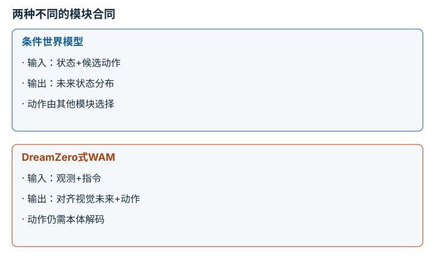

---
hide:
  - navigation
---

<!-- Generated by scripts/build_knowledge_atlas.py; edit knowledge/atlas/*.json. -->

<nav class="study-breadcrumb" aria-label="学习位置" markdown="1">
[知识目录](../../index.md) / [世界模型与预测 rollout](../index.md)
</nav>

L3 · 本章第 8 / 8 节

# 世界模型与WAM先看输入输出合同

**World model versus world-action model**

相似名称不代表相同能力：预测未来的模块未必会输出机器人动作。

先确认：这些前置知识我懂了吗？

条件预测、策略

[MDP、POMDP、奖励与信念](../../planning-mdp-pomdp/index.md) · [神经网络与优化循环](../../learning-neural-networks/index.md) · [数据质量、覆盖与无泄漏切分](../../data-quality-splits/index.md)

<section class="study-section " markdown="1">

## 1 · 原理拆开看

1. 一般世界模型可建模给定状态与动作后的未来，动作可能由外部规划器或策略提供。
2. 以DreamZero论文的WAM用法为例，模型联合生成对齐的未来视觉状态与动作，具备动作输出通道。
3. 名称不是接口标准；仍要核对动作维度、单位、频率、训练本体与闭环验证范围。

</section>

<section class="study-section " markdown="1">

## 2 · 跟着例子算一遍

1. 教学接口例：模型A输入状态和候选动作[0.1,0.1] m，输出两个预测位置。
2. 模型B输入观测与指令，输出2帧未来图像及2个7维动作，共14个动作标量。
3. A不能仅凭未来图像直接发命令；B虽然有14个数，仍需解码与执行门禁。

</section>

<section class="study-section " markdown="1">

## 3 · 对照图，解释变化

<figure class="atlas-visual" tabindex="0" aria-label="两种不同的模块合同；窄屏可在图内横向滚动">
<picture>
<source media="(max-width: 600px)" srcset="../../../assets/knowledge-atlas/world-wam-contract-mobile.svg">

</picture>
<figcaption>教学接口，不表示所有WAM都采用同一架构。</figcaption>
</figure>

- 先读动作在哪一侧：作为输入还是作为生成输出。
- 图不能推导性能排名；联合生成也不自动保证物理一致性。

</section>

<section class="study-section study-misconception" markdown="1">

## 4 · 避开一个误区

**容易误以为：**所有world model都能零样本控制任何机器人。

**为什么不成立：**预测功能、动作生成和跨本体适配是不同能力，且都有证据边界。

**正确理解：**按具体论文和代码的合同定义能力，不从名称推断。

</section>

<section class="study-section study-check" markdown="1">

## 5 · 先独立回答

模型生成手部运动视频，却没有动作通道，可直接控制关节吗？

我已作答，查看推理

不能；还缺少把视觉目标映射为可执行动作的求解与验证层。

</section>

继续查阅原始资料

- [Ha 与 Schmidhuber：World Models](https://worldmodels.github.io/)
- [DreamZero：World Action Models are Zero-shot Policies](https://arxiv.org/abs/2602.15922)

<nav class="study-pagination" aria-label="相邻小节" markdown="1">

[← MPC只执行当前一步，再用新状态重算](../world-mpc/index.md)

[回原课程动手验证 →](../../../15-world-model-zero-to-one.md)

</nav>

[返回本章目录](../index.md) · [整章连续阅读](../complete/index.md)

本章最后需要提交什么？

按时域报告 rollout 误差与下游规划任务成功。

回到[原课程](../../../15-world-model-zero-to-one.md)完成实践。阅读位置或查看答案不计为通过验收。

