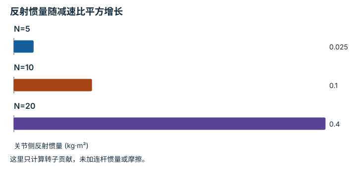

---
hide:
  - navigation
---

<!-- Generated by scripts/build_knowledge_atlas.py; edit knowledge/atlas/*.json. -->

<nav class="study-breadcrumb" aria-label="学习位置" markdown="1">
[知识目录](../../index.md) / [驱动、传动与限制](../index.md)
</nav>

L2 · 本章第 2 / 4 节

# 高减速比还会放大电机反射惯量

**Reflected rotor inertia**

输出力矩更大，不代表关节更容易被外界推动；电机转子惯量会通过传动反映到关节。

先确认：这些前置知识我懂了吗？

减速比、转动动能

[刚体动力学与积分](../../robot-rigid-body-dynamics/index.md)

<section class="study-section " markdown="1">

## 1 · 原理拆开看

1. 理想刚性传动满足 ωm=Nωj；转子的动能为 0.5 Imωm²。
2. 改用关节速度表达，动能为 0.5(N²Im)ωj²，所以反射惯量为 N²Im。
3. 平方关系意味着高减速比可能显著提高关节侧等效惯性；实际回驱还受摩擦等影响。

</section>

<section class="study-section " markdown="1">

## 2 · 跟着例子算一遍

1. 教学电机转子惯量 Im=0.001 kg·m²。
2. N=10 时反射惯量为 100×0.001=0.1 kg·m²。
3. N=20 时变成 400×0.001=0.4 kg·m²，是前者 4 倍；还未加连杆自身惯量。

</section>

<section class="study-section " markdown="1">

## 3 · 对照图，解释变化

<figure class="atlas-visual" tabindex="0" aria-label="反射惯量随减速比平方增长；窄屏可在图内横向滚动">
<picture>
<source media="(max-width: 600px)" srcset="../../../assets/knowledge-atlas/actuation-reflected-inertia-mobile.svg">

</picture>
<figcaption>教学示意，非实测；使用同一转子惯量。</figcaption>
</figure>

- N 翻倍时柱高变为 4 倍，而不是 2 倍。
- 惯量不是回驱性能的全部，图不能单独评价真实传动透明度。

查看作图数据，自己复算

图上数值可能为便于阅读而取近似值，以下保留作图输入。

| 项目 | 关节侧反射惯量 (kg·m²) |
| --- | --- |
| N=5 | 0.025 |
| N=10 | 0.1 |
| N=20 | 0.4 |

</section>

<section class="study-section study-misconception" markdown="1">

## 4 · 避开一个误区

**容易误以为：**等效惯量只随减速比线性增加。

**为什么不成立：**惯量从动能推导，而速度以平方进入动能。

**正确理解：**明确惯量反射到哪一侧，再用速度比例平方换算。

</section>

<section class="study-section study-check" markdown="1">

## 5 · 先独立回答

N 从 10 改成 5，反射惯量是多少？

我已作答，查看推理

为 25×0.001=0.025 kg·m²，是 N=10 时的四分之一。

</section>

继续查阅原始资料

- [Modern Robotics: gearing and reflected inertia](https://modernrobotics.northwestern.edu/nu-gm-book-resource/8-9-actuation-gearing-and-friction/)

<nav class="study-pagination" aria-label="相邻小节" markdown="1">

[← 减速器放大力矩，同时降低转速](../actuation-gear-power/index.md)

[一根腱绳可能同时驱动多个关节 →](../actuation-tendon-moment-arm/index.md)

</nav>

[返回本章目录](../index.md) · [整章连续阅读](../complete/index.md)

本章最后需要提交什么？

追踪一条命令从策略输出到可执行驱动坐标。

回到[原课程](../../../00-concepts-encyclopedia.md)完成实践。阅读位置或查看答案不计为通过验收。

