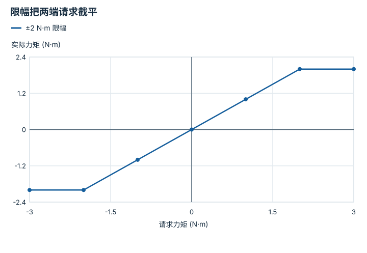

---
hide:
  - navigation
---

<!-- Generated by scripts/build_knowledge_atlas.py; edit knowledge/atlas/*.json. -->

<nav class="study-breadcrumb" aria-label="学习位置" markdown="1">
[知识目录](../../index.md) / [驱动、传动与限制](../index.md)
</nav>

L2 · 本章第 4 / 4 节

# 请求力矩与实际可提供力矩分开记

**Actuator saturation**

策略请求 3 N·m，电机只允许 2 N·m；后续轨迹按 3 N·m 预测就会系统性偏离。

先确认：这些前置知识我懂了吗？

执行器限制、动力学

[刚体动力学与积分](../../robot-rigid-body-dynamics/index.md)

<section class="study-section " markdown="1">

## 1 · 原理拆开看

1. 本教学接口采用对称限幅 τ实际=clip(τ请求,-2,2) N·m。
2. 超过上限的请求被截断，实际动力学由截断后的力矩驱动；线性控制推导中的输入不再完全实现。
3. 记录请求、限幅量、持续时间和故障状态；幅值限制还不能代替速度、温度和变化率限制。

</section>

<section class="study-section " markdown="1">

## 2 · 跟着例子算一遍

1. 教学请求依次为 [-3,-1,0,1,3] N·m。
2. 限幅后得到 [-2,-1,0,1,2] N·m，中间范围不改变。
3. 若惯量为 1 kg·m²且无其他力矩，最后请求对应实际加速度 2 rad/s²，而不是 3 rad/s²。

</section>

<section class="study-section " markdown="1">

## 3 · 对照图，解释变化

<figure class="atlas-visual" tabindex="0" aria-label="限幅把两端请求截平；窄屏可在图内横向滚动">
<picture>
<source media="(max-width: 600px)" srcset="../../../assets/knowledge-atlas/actuation-saturation-contract-mobile.svg">

</picture>
<figcaption>教学示意，非实测；折线精确表示本例 clip 函数。</figcaption>
</figure>

- 中间斜率为 1，两端斜率为 0，继续增加请求不再增加实际输出。
- 这是一张静态输入输出图，不含电机达到该力矩的时间动态。

查看作图数据，自己复算

图上数值可能为便于阅读而取近似值，以下保留作图输入。线段的含义以本图图注和读图说明为准，不应自行解释为实测连续轨迹。

| 曲线 | 请求力矩 (N·m) | 实际力矩 (N·m) |
| --- | --- | --- |
| ±2 N·m 限幅 | -3 | -2 |
| ±2 N·m 限幅 | -2 | -2 |
| ±2 N·m 限幅 | -1 | -1 |
| ±2 N·m 限幅 | 0 | 0 |
| ±2 N·m 限幅 | 1 | 1 |
| ±2 N·m 限幅 | 2 | 2 |
| ±2 N·m 限幅 | 3 | 2 |

</section>

<section class="study-section study-misconception" markdown="1">

## 4 · 避开一个误区

**容易误以为：**指令被限制在额定范围内就必然安全。

**为什么不成立：**瞬间反向、长时间发热、碰撞与通信故障仍可能发生。

**正确理解：**把幅值、速率、热限制和独立故障处理分别检查。

</section>

<section class="study-section study-check" markdown="1">

## 5 · 先独立回答

从 +2 跳到 -2 N·m，周期 0.01 s，对应力矩变化率大小是多少？

我已作答，查看推理

为 4/0.01=400 N·m/s；即使两端幅值合法，也可能违反独立变化率限制。

</section>

继续查阅原始资料

- [MuJoCo actuation model and clamping](https://mujoco.readthedocs.io/en/stable/computation/index.html#actuation-model)

<nav class="study-pagination" aria-label="相邻小节" markdown="1">

[← 一根腱绳可能同时驱动多个关节](../actuation-tendon-moment-arm/index.md)

[回原课程动手验证 →](../../../00-concepts-encyclopedia.md)

</nav>

[返回本章目录](../index.md) · [整章连续阅读](../complete/index.md)

本章最后需要提交什么？

追踪一条命令从策略输出到可执行驱动坐标。

回到[原课程](../../../00-concepts-encyclopedia.md)完成实践。阅读位置或查看答案不计为通过验收。

