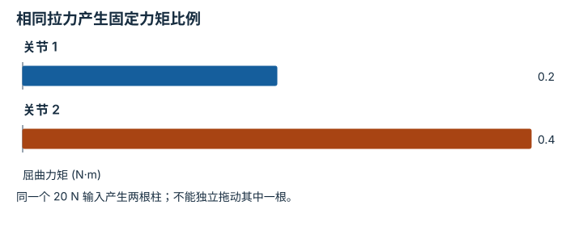

---
hide:
  - navigation
---

<!-- Generated by scripts/build_knowledge_atlas.py; edit knowledge/atlas/*.json. -->

<nav class="study-breadcrumb" aria-label="学习位置" markdown="1">
[知识目录](../../index.md) / [驱动、传动与限制](../index.md)
</nav>

L2 · 本章第 3 / 4 节

# 一根腱绳可能同时驱动多个关节

**Tendon moment arms and underactuation**

两个关节会动，不代表你能独立指定它们的力矩；同一根腱绳把它们耦合起来。

先确认：这些前置知识我懂了吗？

力矩、虚功直觉

[刚体动力学与积分](../../robot-rigid-body-dynamics/index.md)

<section class="study-section " markdown="1">

## 1 · 原理拆开看

1. 本例正关节角表示屈曲，腱长 ℓ=ℓ0-r1q1-r2q2，r 为常数有效力臂，单位 m。
2. 正拉力 F 倾向缩短腱长，虚功给出关节力矩 τi=F ri，符号取决于明确的绕线约定。
3. 只有一个独立 F 时，可生成的两关节力矩只沿固定比例变化，无法覆盖任意力矩组合。

</section>

<section class="study-section " markdown="1">

## 2 · 跟着例子算一遍

1. 教学 r1=0.01 m、r2=0.02 m，腱绳拉力 F=20 N。
2. 得到 τ1=0.2 N·m、τ2=0.4 N·m。
3. 要求 τ1=0.2 而 τ2=0，不能仅靠改变这一个 F 实现；需要其他驱动或约束作用。

</section>

<section class="study-section " markdown="1">

## 3 · 对照图，解释变化

<figure class="atlas-visual" tabindex="0" aria-label="相同拉力产生固定力矩比例；窄屏可在图内横向滚动">
<picture>
<source media="(max-width: 600px)" srcset="../../../assets/knowledge-atlas/actuation-tendon-moment-arm-mobile.svg">

</picture>
<figcaption>教学示意，非实测；两个力臂与正方向已明确。</figcaption>
</figure>

- 2:1 的力矩比来自力臂比，不来自算法偏好。
- 真实腱路可能随姿态改变力臂，还可能存在松弛和摩擦。

查看作图数据，自己复算

图上数值可能为便于阅读而取近似值，以下保留作图输入。

| 项目 | 屈曲力矩 (N·m) |
| --- | --- |
| 关节 1 | 0.2 |
| 关节 2 | 0.4 |

</section>

<section class="study-section study-misconception" markdown="1">

## 4 · 避开一个误区

**容易误以为：**两个运动关节就意味着两个独立电机输入。

**为什么不成立：**机构自由度与独立驱动数可以不同，传动会耦合力矩。

**正确理解：**分别记录运动自由度、驱动数、传动映射和接触约束。

</section>

<section class="study-section study-check" markdown="1">

## 5 · 先独立回答

F 翻倍到 40 N 时，能否只让 τ1 翻倍？

我已作答，查看推理

不能；在本常力臂模型下两者都翻倍，变成 (0.4,0.8) N·m。

</section>

继续查阅原始资料

- [MuJoCo actuator transmission model](https://mujoco.readthedocs.io/en/stable/computation/index.html#actuation-model)

<nav class="study-pagination" aria-label="相邻小节" markdown="1">

[← 高减速比还会放大电机反射惯量](../actuation-reflected-inertia/index.md)

[请求力矩与实际可提供力矩分开记 →](../actuation-saturation-contract/index.md)

</nav>

[返回本章目录](../index.md) · [整章连续阅读](../complete/index.md)

本章最后需要提交什么？

追踪一条命令从策略输出到可执行驱动坐标。

回到[原课程](../../../00-concepts-encyclopedia.md)完成实践。阅读位置或查看答案不计为通过验收。

