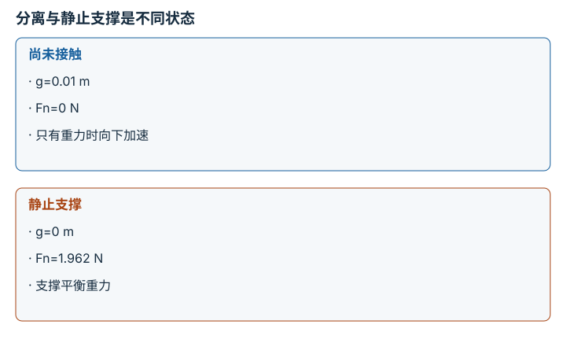

---
search:
  exclude: true
---

# 接触、摩擦与抓取稳定性：逐点细解

<!-- Generated by scripts/build_knowledge_atlas.py; edit knowledge/atlas/*.json. -->

[按小节学习](../index.md) · [全部知识点](../../index.md) · [返回原课程](../../../pipelines/11-dexterous-manipulation.md)

Contact, friction, and grasp stability · 本页拆成 **4 个小知识点**。

先阅读直觉和原理，再独立完成算例、自测；图是解释工具，不是已掌握或真机验证的证明。

## 前置知识

[刚体动力学与积分](../../robot-rigid-body-dynamics/index.md)

## 本页知识点

1. [普通接触可以推，不能凭空拉](#contact-unilateral-constraint)
2. [静摩擦上限不是每时每刻的摩擦力](#contact-friction-cone)
3. [夹住与能托住重量是两项条件](#contact-pinch-force-balance)
4. [接触、抬升、保持必须分别记录](#contact-retention-evidence)

## 1. 普通接触可以推，不能凭空拉

**Unilateral contact and complementarity**

**需要先懂：**净力、不等式

### 一句话直觉

物体离地时地面不能隔空支撑；贴着地面时也不需要由地面把它向下拉。

### 原理拆开看

1. 在理想刚性、无黏附模型中，间隙 g≥0，法向支撑力 Fn≥0。
2. 互补关系 g×Fn=0：有正间隙时接触力为零，有正接触力时表面间隙为零。
3. 接触建立后 Fn 由运动和约束共同求出，不等于一检测到碰撞就固定给某个力。

### 手算或追踪一个例子

1. 教学物体质量 0.2 kg，地面水平，重力 9.81 m/s²。
2. 底部离地 g=0.01 m 时，Fn=0，物体在无其他力时会向下加速。
3. 落地后若处于静止支撑状态，g=0 且 Fn=1.962 N；这两个状态满足同一互补规则。

### 用图理解

<figure class="atlas-visual" tabindex="0" aria-label="分离与静止支撑是不同状态；窄屏可在图内横向滚动">
<picture>
<source media="(max-width: 600px)" srcset="../../../assets/knowledge-atlas/contact-unilateral-constraint-mobile.svg">

</picture>
<figcaption>教学示意，非实测；省略落地冲击过程。</figcaption>
</figure>

- 有间隙时没有支撑力，零间隙时才可能出现正支撑。
- 图省略冲击与变形，不能预测落地瞬间的力峰值。

### 容易混淆的地方

**常见误解：**碰撞检测和接触力求解是一回事。

**为什么不成立：**前者判断几何关系，后者还需要质量、速度、约束与接触模型。

**正确理解：**分别记录几何接触、法向力与运动状态，注明是否采用软接触近似。

### 自测

此模型能否令 g=0.01 m、Fn=2 N？

展开答案与推理

不能；两者乘积非零，意味着地面跨越间隙提供支撑，违反无黏附刚性接触模型。

**原始资料：**[Modern Robotics: single-contact analysis](https://modernrobotics.northwestern.edu/nu-gm-book-resource/12-1-1-first-order-analysis-of-a-single-contact/)

## 2. 静摩擦上限不是每时每刻的摩擦力

**Coulomb friction cone**

**需要先懂：**法向力、不等式

### 一句话直觉

轻推桌上的物体时它不动，并不是摩擦力永远取最大值，而是它在能力范围内抵消推力。

### 原理拆开看

1. 理想静摩擦满足切向力大小 |Ft|≤μs Fn；μs 无量纲，Fn 单位 N。
2. 接触面不滑时，实际 Ft 由切向平衡需求决定，只要没有超过上限即可。
3. 需求超出上限时不能保持静止；滑动后的力还需动摩擦模型，不能直接沿用静摩擦上限。

### 手算或追踪一个例子

1. 教学 Fn=10 N、μs=0.5，最大静摩擦大小为 5 N。
2. 外部向右推 3 N 时，静止条件下摩擦向左 3 N，而不是 5 N。
3. 若向右推 6 N，需求超过 5 N，理想静止平衡不再可行。

### 用图理解

<figure class="atlas-visual" tabindex="0" aria-label="二维摩擦锥截面；窄屏可在图内横向滚动">
<picture>
<source media="(max-width: 600px)" srcset="../../../assets/knowledge-atlas/contact-friction-cone-mobile.svg">

</picture>
<figcaption>教学示意，非实测；直线来自固定 μs=0.5 的理想模型。</figcaption>
</figure>

- Fn=10 N 处允许 Ft 位于 -5 到 5 N 之间，而非必须在边界线上。
- μ 随材料、状态和模型变化；此图不是某个真实夹爪的测量。

查看作图数据，自己复算

图上数值可能为便于阅读而取近似值，以下保留作图输入。线段的含义以本图图注和读图说明为准，不应自行解释为实测连续轨迹。

| 曲线 | 法向力 Fn (N) | 允许切向力 Ft (N) |
| --- | --- | --- |
| 正边界 | 0 | 0 |
| 正边界 | 5 | 2.5 |
| 正边界 | 10 | 5 |
| 正边界 | 15 | 7.5 |
| 负边界 | 0 | 0 |
| 负边界 | 5 | -2.5 |
| 负边界 | 10 | -5 |
| 负边界 | 15 | -7.5 |

### 容易混淆的地方

**常见误解：**摩擦力永远等于 μFn。

**为什么不成立：**等号描述边界或某些滑动模型，不是所有静止接触的实际值。

**正确理解：**先判断粘着或滑动，再按相应约束和运动状态求力。

### 自测

Fn 减少到 4 N，3 N 切向需求还能靠静摩擦保持吗？

展开答案与推理

不能；上限只有 0.5×4=2 N，低于所需 3 N。

**原始资料：**[Modern Robotics: friction](https://modernrobotics.northwestern.edu/nu-gm-book-resource/12-2-1-friction/)

## 3. 夹住与能托住重量是两项条件

**Grasp force balance**

**需要先懂：**摩擦约束、重力

### 一句话直觉

两指已经碰到物体，仍可能因为向上的摩擦能力不足而滑落。

### 原理拆开看

1. 本例两指水平对称夹持，法向力互相抵消，重力需由向上的切向摩擦支撑。
2. 每指法向力 N=3 N、静摩擦系数 μ=0.5，所以每指向上摩擦能力最多 1.5 N。
3. 两指合计上限 3 N；这只是特定载荷方向的必要力平衡检查，不是完整六维 force closure 证明。

### 手算或追踪一个例子

1. 教学物体质量 0.2 kg，重量为 0.2×9.81=1.962 N。
2. 两指均分重量时，每指所需摩擦为 0.981 N，小于 1.5 N。
3. 理想总力余量为 3-1.962=1.038 N；若质量增至 0.4 kg，重量 3.924 N 则超出上限。

### 用图理解

<figure class="atlas-visual" tabindex="0" aria-label="理想摩擦能力与重量；窄屏可在图内横向滚动">
<picture>
<source media="(max-width: 600px)" srcset="../../../assets/knowledge-atlas/contact-pinch-force-balance-mobile.svg">

</picture>
<figcaption>教学示意，非实测；能力值是模型上限，不是实测接触力。</figcaption>
</figure>

- 0.2 kg 重量低于总上限，而 0.4 kg 高于上限，说明模型下后者无法静止支撑。
- 有正余量也不能推出真实安全抓取，需要验证材料、动态扰动和传感器误差。

查看作图数据，自己复算

图上数值可能为便于阅读而取近似值，以下保留作图输入。

| 项目 | 竖直力的大小 (N) |
| --- | --- |
| 单指摩擦上限 | 1.5 |
| 双指总上限 | 3 |
| 0.2 kg 重量 | 1.962 |
| 0.4 kg 重量 | 3.924 |

### 容易混淆的地方

**常见误解：**法向力很大就一定是稳定抓取。

**为什么不成立：**摩擦方向、力矩平衡、接触位置和物体变形同样决定保持能力。

**正确理解：**分别核对法向力、摩擦锥、净 wrench 与受扰保持。

### 自测

两指法向力互相抵消后，是否仍能向上支撑？

展开答案与推理

可以；向上支撑来自两接触点的切向摩擦，水平法向力抵消不意味着所有接触力为零。

**原始资料：**[Modern Robotics: force closure](https://modernrobotics.northwestern.edu/nu-gm-book-resource/12-2-3-force-closure/)

## 4. 接触、抬升、保持必须分别记录

**Contact, lift and retention evidence**

**需要先懂：**时间序列、任务成功条件

### 一句话直觉

一帧物体离地的截图，无法说明它在下一秒没有滑落。

### 原理拆开看

1. 先定义事件：接触表示接触信号成立，抬升表示物体高度达到阈值。
2. 再定义保持窗口，本例要求 0.5 到 1.5 s 期间高度持续位于 [0.09,0.11] m。
3. 检查整个窗口的状态和缺测情况；某一帧达到高度不能替代持续保持。

### 手算或追踪一个例子

1. 教学假想轨迹在 t=0 高度 0，t=0.5 s 达到 0.10 m。
2. 之后 t=1.0 s 降到 0.08 m，t=1.5 s 降到 0.04 m。
3. 它完成了抬升，却在保持窗口内低于 0.09 m，不能判为保持成功。

### 用图理解

<figure class="atlas-visual" tabindex="0" aria-label="达到高度后仍可能滑落；窄屏可在图内横向滚动">
<picture>
<source media="(max-width: 600px)" srcset="../../../assets/knowledge-atlas/contact-retention-evidence-mobile.svg">

</picture>
<figcaption>教学示意，非实测；稀疏点间连线只示意变化。</figcaption>
</figure>

- 0.5 s 时已经抬升，但 1.0 s 的采样明确违反保持下限。
- 连线不能代替未采样时刻的证据；实际评估需要足够采样率和缺测策略。

查看作图数据，自己复算

图上数值可能为便于阅读而取近似值，以下保留作图输入。线段的含义以本图图注和读图说明为准，不应自行解释为实测连续轨迹。

| 曲线 | 时间 (s) | 物体高度 (m) |
| --- | --- | --- |
| 假想物体高度 | 0 | 0 |
| 假想物体高度 | 0.5 | 0.1 |
| 假想物体高度 | 1 | 0.08 |
| 假想物体高度 | 1.5 | 0.04 |
| 保持下限 | 0.5 | 0.09 |
| 保持下限 | 1.5 | 0.09 |

### 容易混淆的地方

**常见误解：**看到 contact=True 或一次抬升，就可以记录 grasp success。

**为什么不成立：**接触存在不等于物体被稳定约束，抬升也可能只是短暂状态。

**正确理解：**为接触、滑移、抬升和保持分别定义阈值及时间窗口，保留失败轨迹。

### 自测

窗口中间有 0.4 s 没有观测，能否只用首尾都达标宣布持续保持？

展开答案与推理

不能；中间状态未被验证，应报告缺测或按明确缺测规则处理，而不是补成成功。

**原始资料：**[MuJoCo computation: contacts and constraints](https://mujoco.readthedocs.io/en/stable/computation/index.html#contact)

## 从理解走向证据

本节点原有验收要求：分别报告接触、滑移、保持与抬升证据。

完成图解自测后，回到[原课程](../../../pipelines/11-dexterous-manipulation.md)运行对应示例并保留证据；浏览页面和查看答案不会自动获得课程晋级。
