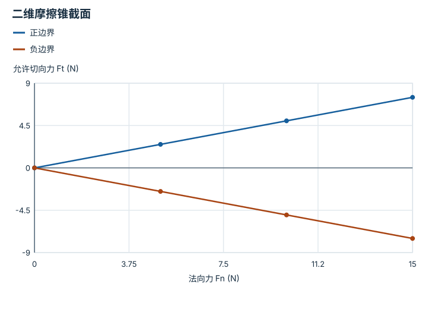

---
hide:
  - navigation
---

<!-- Generated by scripts/build_knowledge_atlas.py; edit knowledge/atlas/*.json. -->

<nav class="study-breadcrumb" aria-label="学习位置" markdown="1">
[知识目录](../../index.md) / [接触、摩擦与抓取稳定性](../index.md)
</nav>

L2 · 本章第 2 / 4 节

# 静摩擦上限不是每时每刻的摩擦力

**Coulomb friction cone**

轻推桌上的物体时它不动，并不是摩擦力永远取最大值，而是它在能力范围内抵消推力。

先确认：这些前置知识我懂了吗？

法向力、不等式

[刚体动力学与积分](../../robot-rigid-body-dynamics/index.md)

<section class="study-section " markdown="1">

## 1 · 原理拆开看

1. 理想静摩擦满足切向力大小 |Ft|≤μs Fn；μs 无量纲，Fn 单位 N。
2. 接触面不滑时，实际 Ft 由切向平衡需求决定，只要没有超过上限即可。
3. 需求超出上限时不能保持静止；滑动后的力还需动摩擦模型，不能直接沿用静摩擦上限。

</section>

<section class="study-section " markdown="1">

## 2 · 跟着例子算一遍

1. 教学 Fn=10 N、μs=0.5，最大静摩擦大小为 5 N。
2. 外部向右推 3 N 时，静止条件下摩擦向左 3 N，而不是 5 N。
3. 若向右推 6 N，需求超过 5 N，理想静止平衡不再可行。

</section>

<section class="study-section " markdown="1">

## 3 · 对照图，解释变化

<figure class="atlas-visual" tabindex="0" aria-label="二维摩擦锥截面；窄屏可在图内横向滚动">
<picture>
<source media="(max-width: 600px)" srcset="../../../assets/knowledge-atlas/contact-friction-cone-mobile.svg">

</picture>
<figcaption>教学示意，非实测；直线来自固定 μs=0.5 的理想模型。</figcaption>
</figure>

- Fn=10 N 处允许 Ft 位于 -5 到 5 N 之间，而非必须在边界线上。
- μ 随材料、状态和模型变化；此图不是某个真实夹爪的测量。

查看作图数据，自己复算

图上数值可能为便于阅读而取近似值，以下保留作图输入。线段的含义以本图图注和读图说明为准，不应自行解释为实测连续轨迹。

| 曲线 | 法向力 Fn (N) | 允许切向力 Ft (N) |
| --- | --- | --- |
| 正边界 | 0 | 0 |
| 正边界 | 5 | 2.5 |
| 正边界 | 10 | 5 |
| 正边界 | 15 | 7.5 |
| 负边界 | 0 | 0 |
| 负边界 | 5 | -2.5 |
| 负边界 | 10 | -5 |
| 负边界 | 15 | -7.5 |

</section>

<section class="study-section study-misconception" markdown="1">

## 4 · 避开一个误区

**容易误以为：**摩擦力永远等于 μFn。

**为什么不成立：**等号描述边界或某些滑动模型，不是所有静止接触的实际值。

**正确理解：**先判断粘着或滑动，再按相应约束和运动状态求力。

</section>

<section class="study-section study-check" markdown="1">

## 5 · 先独立回答

Fn 减少到 4 N，3 N 切向需求还能靠静摩擦保持吗？

我已作答，查看推理

不能；上限只有 0.5×4=2 N，低于所需 3 N。

</section>

继续查阅原始资料

- [Modern Robotics: friction](https://modernrobotics.northwestern.edu/nu-gm-book-resource/12-2-1-friction/)

<nav class="study-pagination" aria-label="相邻小节" markdown="1">

[← 普通接触可以推，不能凭空拉](../contact-unilateral-constraint/index.md)

[夹住与能托住重量是两项条件 →](../contact-pinch-force-balance/index.md)

</nav>

[返回本章目录](../index.md) · [整章连续阅读](../complete/index.md)

本章最后需要提交什么？

分别报告接触、滑移、保持与抬升证据。

回到[原课程](../../../pipelines/11-dexterous-manipulation.md)完成实践。阅读位置或查看答案不计为通过验收。

