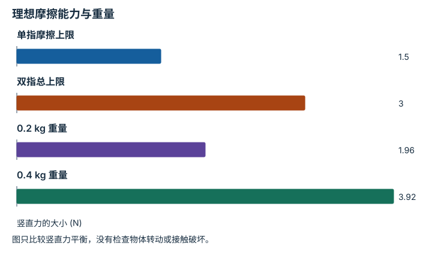

---
hide:
  - navigation
---

<!-- Generated by scripts/build_knowledge_atlas.py; edit knowledge/atlas/*.json. -->

<nav class="study-breadcrumb" aria-label="学习位置" markdown="1">
[知识目录](../../index.md) / [接触、摩擦与抓取稳定性](../index.md)
</nav>

L2 · 本章第 3 / 4 节

# 夹住与能托住重量是两项条件

**Grasp force balance**

两指已经碰到物体，仍可能因为向上的摩擦能力不足而滑落。

先确认：这些前置知识我懂了吗？

摩擦约束、重力

[刚体动力学与积分](../../robot-rigid-body-dynamics/index.md)

<section class="study-section " markdown="1">

## 1 · 原理拆开看

1. 本例两指水平对称夹持，法向力互相抵消，重力需由向上的切向摩擦支撑。
2. 每指法向力 N=3 N、静摩擦系数 μ=0.5，所以每指向上摩擦能力最多 1.5 N。
3. 两指合计上限 3 N；这只是特定载荷方向的必要力平衡检查，不是完整六维 force closure 证明。

</section>

<section class="study-section " markdown="1">

## 2 · 跟着例子算一遍

1. 教学物体质量 0.2 kg，重量为 0.2×9.81=1.962 N。
2. 两指均分重量时，每指所需摩擦为 0.981 N，小于 1.5 N。
3. 理想总力余量为 3-1.962=1.038 N；若质量增至 0.4 kg，重量 3.924 N 则超出上限。

</section>

<section class="study-section " markdown="1">

## 3 · 对照图，解释变化

<figure class="atlas-visual" tabindex="0" aria-label="理想摩擦能力与重量；窄屏可在图内横向滚动">
<picture>
<source media="(max-width: 600px)" srcset="../../../assets/knowledge-atlas/contact-pinch-force-balance-mobile.svg">

</picture>
<figcaption>教学示意，非实测；能力值是模型上限，不是实测接触力。</figcaption>
</figure>

- 0.2 kg 重量低于总上限，而 0.4 kg 高于上限，说明模型下后者无法静止支撑。
- 有正余量也不能推出真实安全抓取，需要验证材料、动态扰动和传感器误差。

查看作图数据，自己复算

图上数值可能为便于阅读而取近似值，以下保留作图输入。

| 项目 | 竖直力的大小 (N) |
| --- | --- |
| 单指摩擦上限 | 1.5 |
| 双指总上限 | 3 |
| 0.2 kg 重量 | 1.962 |
| 0.4 kg 重量 | 3.924 |

</section>

<section class="study-section study-misconception" markdown="1">

## 4 · 避开一个误区

**容易误以为：**法向力很大就一定是稳定抓取。

**为什么不成立：**摩擦方向、力矩平衡、接触位置和物体变形同样决定保持能力。

**正确理解：**分别核对法向力、摩擦锥、净 wrench 与受扰保持。

</section>

<section class="study-section study-check" markdown="1">

## 5 · 先独立回答

两指法向力互相抵消后，是否仍能向上支撑？

我已作答，查看推理

可以；向上支撑来自两接触点的切向摩擦，水平法向力抵消不意味着所有接触力为零。

</section>

继续查阅原始资料

- [Modern Robotics: force closure](https://modernrobotics.northwestern.edu/nu-gm-book-resource/12-2-3-force-closure/)

<nav class="study-pagination" aria-label="相邻小节" markdown="1">

[← 静摩擦上限不是每时每刻的摩擦力](../contact-friction-cone/index.md)

[接触、抬升、保持必须分别记录 →](../contact-retention-evidence/index.md)

</nav>

[返回本章目录](../index.md) · [整章连续阅读](../complete/index.md)

本章最后需要提交什么？

分别报告接触、滑移、保持与抬升证据。

回到[原课程](../../../pipelines/11-dexterous-manipulation.md)完成实践。阅读位置或查看答案不计为通过验收。

