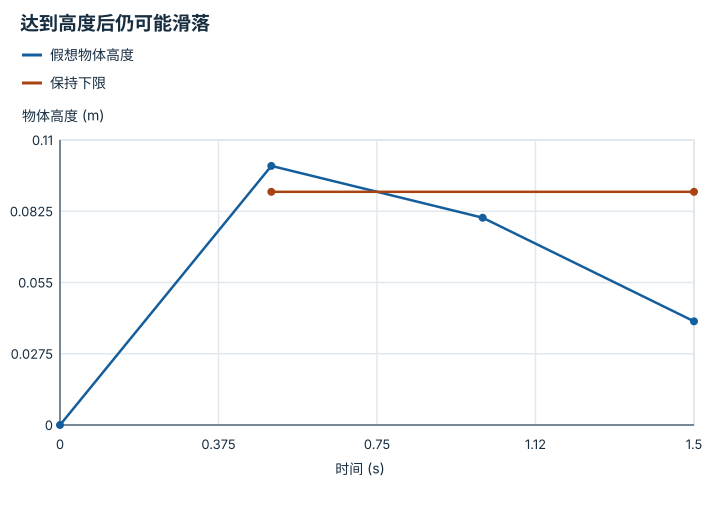

---
hide:
  - navigation
---

<!-- Generated by scripts/build_knowledge_atlas.py; edit knowledge/atlas/*.json. -->

<nav class="study-breadcrumb" aria-label="学习位置" markdown="1">
[知识目录](../../index.md) / [接触、摩擦与抓取稳定性](../index.md)
</nav>

L2 · 本章第 4 / 4 节

# 接触、抬升、保持必须分别记录

**Contact, lift and retention evidence**

一帧物体离地的截图，无法说明它在下一秒没有滑落。

先确认：这些前置知识我懂了吗？

时间序列、任务成功条件

[刚体动力学与积分](../../robot-rigid-body-dynamics/index.md)

<section class="study-section " markdown="1">

## 1 · 原理拆开看

1. 先定义事件：接触表示接触信号成立，抬升表示物体高度达到阈值。
2. 再定义保持窗口，本例要求 0.5 到 1.5 s 期间高度持续位于 [0.09,0.11] m。
3. 检查整个窗口的状态和缺测情况；某一帧达到高度不能替代持续保持。

</section>

<section class="study-section " markdown="1">

## 2 · 跟着例子算一遍

1. 教学假想轨迹在 t=0 高度 0，t=0.5 s 达到 0.10 m。
2. 之后 t=1.0 s 降到 0.08 m，t=1.5 s 降到 0.04 m。
3. 它完成了抬升，却在保持窗口内低于 0.09 m，不能判为保持成功。

</section>

<section class="study-section " markdown="1">

## 3 · 对照图，解释变化

<figure class="atlas-visual" tabindex="0" aria-label="达到高度后仍可能滑落；窄屏可在图内横向滚动">
<picture>
<source media="(max-width: 600px)" srcset="../../../assets/knowledge-atlas/contact-retention-evidence-mobile.svg">

</picture>
<figcaption>教学示意，非实测；稀疏点间连线只示意变化。</figcaption>
</figure>

- 0.5 s 时已经抬升，但 1.0 s 的采样明确违反保持下限。
- 连线不能代替未采样时刻的证据；实际评估需要足够采样率和缺测策略。

查看作图数据，自己复算

图上数值可能为便于阅读而取近似值，以下保留作图输入。线段的含义以本图图注和读图说明为准，不应自行解释为实测连续轨迹。

| 曲线 | 时间 (s) | 物体高度 (m) |
| --- | --- | --- |
| 假想物体高度 | 0 | 0 |
| 假想物体高度 | 0.5 | 0.1 |
| 假想物体高度 | 1 | 0.08 |
| 假想物体高度 | 1.5 | 0.04 |
| 保持下限 | 0.5 | 0.09 |
| 保持下限 | 1.5 | 0.09 |

</section>

<section class="study-section study-misconception" markdown="1">

## 4 · 避开一个误区

**容易误以为：**看到 contact=True 或一次抬升，就可以记录 grasp success。

**为什么不成立：**接触存在不等于物体被稳定约束，抬升也可能只是短暂状态。

**正确理解：**为接触、滑移、抬升和保持分别定义阈值及时间窗口，保留失败轨迹。

</section>

<section class="study-section study-check" markdown="1">

## 5 · 先独立回答

窗口中间有 0.4 s 没有观测，能否只用首尾都达标宣布持续保持？

我已作答，查看推理

不能；中间状态未被验证，应报告缺测或按明确缺测规则处理，而不是补成成功。

</section>

继续查阅原始资料

- [MuJoCo computation: contacts and constraints](https://mujoco.readthedocs.io/en/stable/computation/index.html#contact)

<nav class="study-pagination" aria-label="相邻小节" markdown="1">

[← 夹住与能托住重量是两项条件](../contact-pinch-force-balance/index.md)

[回原课程动手验证 →](../../../pipelines/11-dexterous-manipulation.md)

</nav>

[返回本章目录](../index.md) · [整章连续阅读](../complete/index.md)

本章最后需要提交什么？

分别报告接触、滑移、保持与抬升证据。

回到[原课程](../../../pipelines/11-dexterous-manipulation.md)完成实践。阅读位置或查看答案不计为通过验收。

