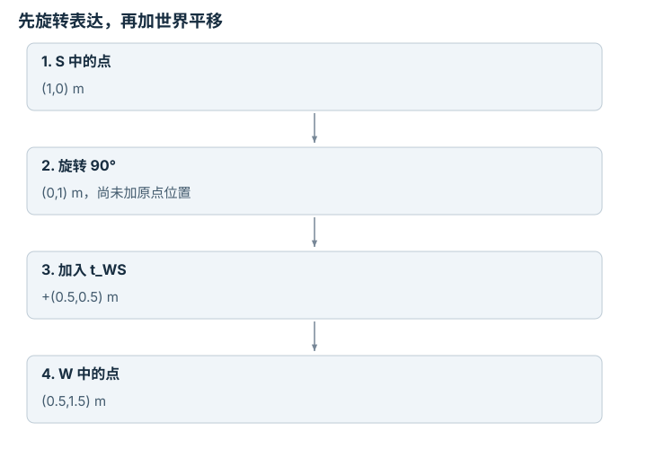
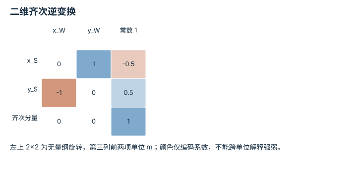
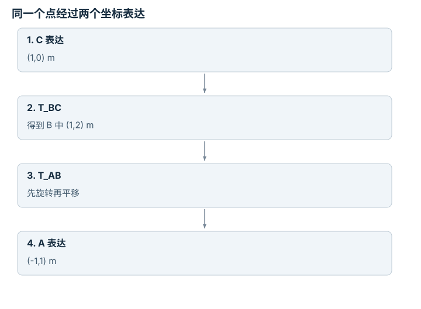

---
search:
  exclude: true
---

# 坐标系与变换链：逐点细解

<!-- Generated by scripts/build_knowledge_atlas.py; edit knowledge/atlas/*.json. -->

[按小节学习](../index.md) · [全部知识点](../../index.md) · [返回原课程](../../../foundations/05-coordinate-transform.md)

Coordinate frames and transform chains · 本页拆成 **4 个小知识点**。

先阅读直觉和原理，再独立完成算例、自测；图是解释工具，不是已掌握或真机验证的证明。

## 前置知识

[线性代数与最小二乘](../../math-linear-algebra/index.md)

## 改一个参数试试看

固定局部点，只改变平移，再单独改变角度。预测世界坐标如何改变。

[打开对应交互实验](../../../learning-lab-cn.md#frames)。滑块在文档站运行，GitHub 文件预览提供静态推导；不连接机器人。

## 本页知识点

1. [下标要说明坐标从哪里变到哪里](#frames-direction-contract)
2. [逆变换要先减平移，再转回去](#frames-inverse-translation)
3. [变换链的中间 frame 必须接得上](#frames-chain-order)
4. [点要加平移，自由向量不加](#frames-point-versus-vector)

## 1. 下标要说明坐标从哪里变到哪里

**Transform direction**

**需要先懂：**旋转的平面直觉、向量加法

### 一句话直觉

相机说目标在右边，机器人却往另一侧走，可能因为同一个点在两个坐标系里有不同数值。

### 原理拆开看

1. 本例 T_WS 将传感器 S 中坐标表达为世界 W 中坐标；R_WS 的列是 S 的轴在 W 中的方向。
2. 先用 R_WS 旋转局部点，再加 S 原点在 W 中的位置 t_WS，得到 p_W=R_WS p_S+t_WS。
3. 变换固定时，这是对同一个物理点换坐标表达；改变变换参数则意味着传感器摆放改变。

### 手算或追踪一个例子

1. 教学 p_S=(1,0) m，S 相对 W 逆时针转 90°，t_WS=(0.5,0.5) m。
2. 旋转后 R_WS p_S=(0,1) m。
3. 加平移得到 p_W=(0.5,1.5) m；不能只把局部 x 数字当世界 x。

### 用图理解

<figure class="atlas-visual" tabindex="0" aria-label="先旋转表达，再加世界平移；窄屏可在图内横向滚动">
<picture>
<source media="(max-width: 600px)" srcset="../../../assets/knowledge-atlas/frames-direction-contract-mobile.svg">

</picture>
<figcaption>教学示意，非实测；这里用步骤图避免把平移画成同原点向量旋转。</figcaption>
</figure>

- 第二步只完成方向表达变化，第三步才处理两个原点的偏移。
- 图不是目标点走过的路径，也没有加入相机投影。

### 容易混淆的地方

**常见误解：**T_WS 与 T_SW 只是命名喜好。

**为什么不成立：**本合同中二者映射方向相反，数值一般为彼此逆变换。

**正确理解：**每次写清来源与目标 frame，并用已知点验证方向。

### 自测

S 原点 p_S=(0,0) 在 W 中应是什么？

展开答案与推理

应为 t_WS=(0.5,0.5) m；这是核对变换平移列的直接测试。

**原始资料：**[Modern Robotics: homogeneous transformation matrices](https://modernrobotics.northwestern.edu/nu-gm-book-resource/3-3-1-homogeneous-transformation-matrices/)

## 2. 逆变换要先减平移，再转回去

**Inverse rigid transform**

**需要先懂：**变换方向、矩阵转置

### 一句话直觉

把平移直接取负并不总是逆变换，因为这个负向量还要换到另一个坐标系。

### 原理拆开看

1. 正向关系 p_W=R p_S+t 中，t 用 W 表达，所以先从 p_W 减去 t。
2. 纯旋转满足 R⁻¹=Rᵀ；再左乘 Rᵀ，得到 p_S=Rᵀ(p_W-t)。
3. 因此逆变换平移项为 -Rᵀt，不是 -t；往返应恢复原局部点，而非返回零点。

### 手算或追踪一个例子

1. 教学沿用 R=90°，t=(0.5,0.5) m，已知 p_W=(0.5,1.5) m。
2. 先相减得到 (0,1) m，再顺时针旋转 90°得到 (1,0) m。
3. 若先旋转 p_W 再减原 t，会得到 (1,-1) m，正是混用平移 frame 的错误。

### 用图理解

<figure class="atlas-visual" tabindex="0" aria-label="二维齐次逆变换；窄屏可在图内横向滚动">
<picture>
<source media="(max-width: 600px)" srcset="../../../assets/knowledge-atlas/frames-inverse-translation-mobile.svg">

</picture>
<figcaption>教学示意，非实测；矩阵作用于 [x_W,y_W,1]。</figcaption>
</figure>

- 平移列为 (-0.5,0.5)，不是直接把两项都变成 -0.5。
- 底行是齐次表示规则，不是一个新的物理空间维度。

查看作图数据，自己复算

图上数值可能为便于阅读而取近似值，以下保留作图输入。

| 行 / 列 | x_W | y_W | 常数 1 |
| --- | --- | --- | --- |
| x_S | 0 | 1 | -0.5 |
| y_S | -1 | 0 | 0.5 |
| 齐次分量 | 0 | 0 | 1 |

### 容易混淆的地方

**常见误解：**逆平移永远是原平移的负号。

**为什么不成立：**逆向映射的输出坐标系不同，平移必须先按逆旋转换基。

**正确理解：**使用 -Rᵀt，并对非零旋转、非零平移一起做往返测试。

### 自测

本例逆变换的平移向量是多少？

展开答案与推理

Rᵀt=(0.5,-0.5) m，因此逆平移为 (-0.5,0.5) m。

**原始资料：**[Modern Robotics: homogeneous transformation matrices](https://modernrobotics.northwestern.edu/nu-gm-book-resource/3-3-1-homogeneous-transformation-matrices/)

## 3. 变换链的中间 frame 必须接得上

**Transform composition**

**需要先懂：**变换方向、矩阵乘法

### 一句话直觉

手眼标定常把相机、夹爪、机械臂基座串起来；乘法顺序错误会改变平移的方向。

### 原理拆开看

1. T_AB 把 B 坐标映到 A，T_BC 把 C 映到 B，所以 T_AC=T_AB T_BC。
2. 点列向量先受到最右边的 T_BC 作用；中间 B 标签应抵消。
3. 复合平移为 R_AB t_BC+t_AB，第二段平移要先转换到 A，不能直接逐项相加。

### 手算或追踪一个例子

1. 教学 T_AB 为逆时针 90°加平移 (1,0) m；T_BC 为零旋转加平移 (0,2) m。
2. 对 p_C=(1,0) m，先得到 p_B=(1,2) m。
3. 再转到 A 得到 R_AB(1,2)+(1,0)=(-1,1) m；复合平移本身为 (-1,0) m。

### 用图理解

<figure class="atlas-visual" tabindex="0" aria-label="同一个点经过两个坐标表达；窄屏可在图内横向滚动">
<picture>
<source media="(max-width: 600px)" srcset="../../../assets/knowledge-atlas/frames-chain-order-mobile.svg">

</picture>
<figcaption>教学示意，非实测；箭头表示换坐标，不表示空间运动。</figcaption>
</figure>

- 从左到右处理点，对应矩阵乘积从右向左作用。
- 图未包含时间变化；移动机器人时，还要使用匹配时间戳的变换。

### 容易混淆的地方

**常见误解：**两段平移相加成 (1,2) m 就是复合平移。

**为什么不成立：**(0,2) 用 B 表达，必须先旋转为 A 中的 (-2,0)。

**正确理解：**对每段平移标注 frame，按矩阵乘积推导复合项。

### 自测

若 p_C=(0,0)，最终坐标应是多少？

展开答案与推理

为 (-1,0) m，恰好是复合变换的平移列，可用于单独检查链。

**原始资料：**[Modern Robotics: transform composition](https://modernrobotics.northwestern.edu/nu-gm-book-resource/3-3-1-homogeneous-transformation-matrices/)

## 4. 点要加平移，自由向量不加

**Points and free vectors**

**需要先懂：**齐次坐标、位移

### 一句话直觉

把相机位置转换给机器人时需要原点偏移；把风向或两点之间的位移换坐标时，原点不该改变向量。

### 原理拆开看

1. 点坐标依赖坐标系原点，刚体变换为 p新=Rp旧+t。
2. 位移 d=p2-p1 中，两点的平移相消，所以 d新=Rd旧。
3. 齐次表示用末项 1 表示点、0 表示自由向量；这让同一矩阵正确选择是否加入平移。

### 手算或追踪一个例子

1. 教学 R 为平面 90°旋转，t=(2,1) m，点 p=(1,0) m。
2. 点变为 (2,2) m；同数值的位移 d=(1,0) m 则变为 (0,1) m。
3. 若给位移也加 t，会错误得到 (2,2) m，长度从 1 m 变成 √8 m。

### 用图理解

<figure class="atlas-visual" tabindex="0" aria-label="相同两个数字，不同几何语义；窄屏可在图内横向滚动">
<picture>
<source media="(max-width: 600px)" srcset="../../../assets/knowledge-atlas/frames-point-versus-vector-mobile.svg">

</picture>
<figcaption>教学示意，非实测；R 与 t 在两栏完全相同。</figcaption>
</figure>

- 差异不是浮点误差，而是齐次末项与对象语义不同。
- 这里讨论刚体坐标变换，非刚性缩放下的法向变换不能直接照搬。

### 容易混淆的地方

**常见误解：**只要数组长度一样，就用同一种位姿变换。

**为什么不成立：**点与方向的物理语义不同，速度和法向还需各自明确变换规则。

**正确理解：**区分位置、自由位移、速度和法向，不把通用数组当作通用几何对象。

### 自测

同一个 t 同时加到两个点后，它们间距离改变吗？

展开答案与推理

不改变；相减时 t 消掉，再由旋转保持位移范数。

**原始资料：**[Modern Robotics: homogeneous coordinates](https://modernrobotics.northwestern.edu/nu-gm-book-resource/3-3-1-homogeneous-transformation-matrices/)

## 从理解走向证据

本节点原有验收要求：验证变换往返一致性，并发现一个坐标约定错误。

完成图解自测后，回到[原课程](../../../foundations/05-coordinate-transform.md)运行对应示例并保留证据；浏览页面和查看答案不会自动获得课程晋级。
