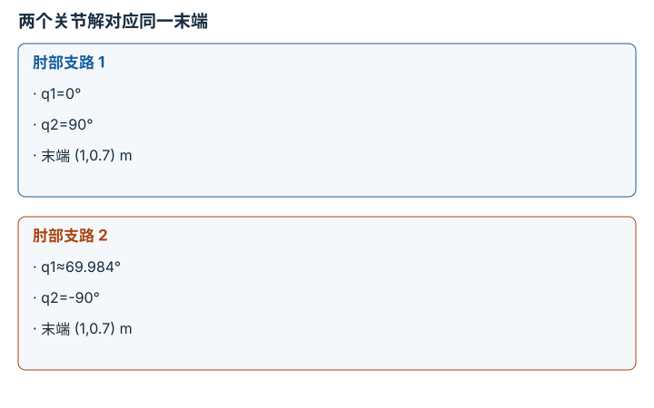

---
hide:
  - navigation
---

<!-- Generated by scripts/build_knowledge_atlas.py; edit knowledge/atlas/*.json. -->

<nav class="study-breadcrumb" aria-label="学习位置" markdown="1">
[知识目录](../../index.md) / [正运动学、Jacobian 与 IK](../index.md)
</nav>

L2 · 本章第 3 / 4 节

# IK 先问可达，再问选择哪一个解

**Inverse kinematics and reachability**

一个目标可能有两个肘部构型，也可能在机械臂内侧空洞中，任何迭代都碰不到。

先确认：这些前置知识我懂了吗？

两连杆正运动学、余弦定理

[SO(3)、SE(3) 与旋转表示](../../robot-so3-se3/index.md) · [目标、约束与优化](../../math-optimization/index.md)

<section class="study-section " markdown="1">

## 1 · 原理拆开看

1. 无关节限位、无碰撞的平面两连杆，目标半径 r 必须满足 |l1-l2|≤r≤l1+l2。
2. 余弦定理给 cosq2=(r²-l1²-l2²)/(2l1l2)；超过 [-1,1] 表示没有几何解。
3. 区间内部通常存在 q2 的正负两支，再通过目标方向求 q1；还需按限位、碰撞和连续性筛选。

</section>

<section class="study-section " markdown="1">

## 2 · 跟着例子算一遍

1. 教学 l1=1 m、l2=0.7 m，目标 (1,0.7) m，r²=1.49 m²。
2. cosq2=(1.49-1-0.49)/1.4=0，所以 q2 可取 ±90°。
3. 一支为 q1=0°、q2=90°；另一支约为 q1=69.984°、q2=-90°，两者 FK 都返回同一目标。

</section>

<section class="study-section " markdown="1">

## 3 · 对照图，解释变化

<figure class="atlas-visual" tabindex="0" aria-label="两个关节解对应同一末端；窄屏可在图内横向滚动">
<picture>
<source media="(max-width: 600px)" srcset="../../../assets/knowledge-atlas/kinematics-ik-reachability-mobile.svg">

</picture>
<figcaption>教学示意，非实测；第二支角度为近似值。</figcaption>
</figure>

- 末端位置相同不能说明关节状态相同，解的分支需要明确选择。
- 图只针对位置任务，若额外指定末端朝向，解集可能缩小或消失。

</section>

<section class="study-section study-misconception" markdown="1">

## 4 · 避开一个误区

**容易误以为：**解析可达就代表机器人能安全走过去。

**为什么不成立：**几何 IK 不包含路径碰撞、关节限位和动态可执行性。

**正确理解：**把位置可达、解选择、路径与执行约束分层验证。

</section>

<section class="study-section study-check" markdown="1">

## 5 · 先独立回答

目标 (0.2,0) m 为什么没有解？

我已作答，查看推理

r=0.2 m 小于最短可达半径 |1-0.7|=0.3 m，落在内侧空洞；增加迭代次数无济于事。

</section>

继续查阅原始资料

- [Modern Robotics: inverse kinematics](https://modernrobotics.northwestern.edu/nu-gm-book-resource/6-2-numerical-inverse-kinematics-part-1-of-2/)

<nav class="study-pagination" aria-label="相邻小节" markdown="1">

[← Jacobian 每列是一个关节的局部影响](../kinematics-jacobian-columns/index.md)

[奇异点丢失的是局部速度方向 →](../kinematics-singularity-local/index.md)

</nav>

[返回本章目录](../index.md) · [整章连续阅读](../complete/index.md)

本章最后需要提交什么？

到达目标，同时记录残差、关节限制与奇异处理。

回到[原课程](../../../foundations/07-fk-jacobian-ik.md)完成实践。阅读位置或查看答案不计为通过验收。

