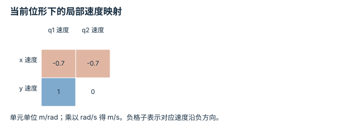

---
hide:
  - navigation
---

<!-- Generated by scripts/build_knowledge_atlas.py; edit knowledge/atlas/*.json. -->

<nav class="study-breadcrumb" aria-label="学习位置" markdown="1">
[知识目录](../../index.md) / [正运动学、Jacobian 与 IK](../index.md)
</nav>

L2 · 本章第 2 / 4 节

# Jacobian 每列是一个关节的局部影响

**Velocity Jacobian**

你想让末端向左一点，需要知道每个关节转一点会让末端朝哪边移动。

先确认：这些前置知识我懂了吗？

正运动学、偏导数

[SO(3)、SE(3) 与旋转表示](../../robot-so3-se3/index.md) · [目标、约束与优化](../../math-optimization/index.md)

<section class="study-section " markdown="1">

## 1 · 原理拆开看

1. 位置 Jacobian J 的第 i 列是末端位置对 qi 的偏导，关节角以 rad 计，单位 m/rad。
2. 小变化满足 Δp≈JΔq，瞬时速度满足 ṗ=Jq̇；近似位移不能直接用于任意大角度变化。
3. 多关节同时运动时，各列贡献按关节速度加权求和；符号表示方向，不表示算法错误。

</section>

<section class="study-section " markdown="1">

## 2 · 跟着例子算一遍

1. 教学 l1=1 m、l2=0.7 m，q1=0°、q2=90°，J=[[-0.7,-0.7],[1,0]] m/rad。
2. 输入 q̇=(0.1,0.2) rad/s，x 速度为 -0.7×0.1-0.7×0.2=-0.21 m/s。
3. y 速度为 1×0.1+0×0.2=0.1 m/s，因此末端瞬时向左上方移动。

</section>

<section class="study-section " markdown="1">

## 3 · 对照图，解释变化

<figure class="atlas-visual" tabindex="0" aria-label="当前位形下的局部速度映射；窄屏可在图内横向滚动">
<picture>
<source media="(max-width: 600px)" srcset="../../../assets/knowledge-atlas/kinematics-jacobian-columns-mobile.svg">

</picture>
<figcaption>教学示意，非实测；q1=0°、q2=90°。</figcaption>
</figure>

- 第二列的 y 项为零，因此本位形中第二关节瞬时不改变末端 y。
- 零项是局部结论，转过一段角度后一般会改变。

查看作图数据，自己复算

图上数值可能为便于阅读而取近似值，以下保留作图输入。

| 行 / 列 | q1 速度 | q2 速度 |
| --- | --- | --- |
| x 速度 | -0.7 | -0.7 |
| y 速度 | 1 | 0 |

</section>

<section class="study-section study-misconception" markdown="1">

## 4 · 避开一个误区

**容易误以为：**J 只与连杆长度有关，可以算一次后一直复用。

**为什么不成立：**关节姿态改变时，连杆方向和局部速度映射也改变。

**正确理解：**在当前状态计算或更新 J，并用小步差分核对。

</section>

<section class="study-section study-check" markdown="1">

## 5 · 先独立回答

只让第二关节以 0.2 rad/s 运动，末端速度是多少？

我已作答，查看推理

取第二列乘 0.2，得到 (-0.14,0) m/s；不能读取第一行当作一个关节。

</section>

继续查阅原始资料

- [Modern Robotics: space Jacobian](https://modernrobotics.northwestern.edu/nu-gm-book-resource/5-1-1-space-jacobian/)

<nav class="study-pagination" aria-label="相邻小节" markdown="1">

[← 正运动学要累加连杆的全局方向](../kinematics-planar-fk/index.md)

[IK 先问可达，再问选择哪一个解 →](../kinematics-ik-reachability/index.md)

</nav>

[返回本章目录](../index.md) · [整章连续阅读](../complete/index.md)

本章最后需要提交什么？

到达目标，同时记录残差、关节限制与奇异处理。

回到[原课程](../../../foundations/07-fk-jacobian-ik.md)完成实践。阅读位置或查看答案不计为通过验收。

