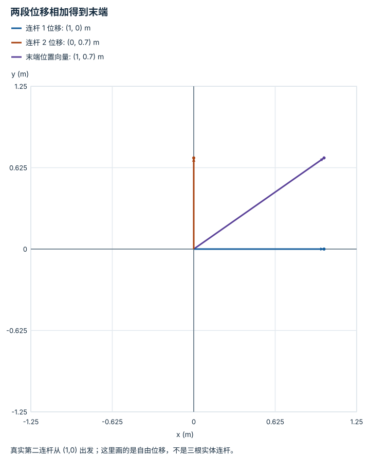

---
hide:
  - navigation
---

<!-- Generated by scripts/build_knowledge_atlas.py; edit knowledge/atlas/*.json. -->

<nav class="study-breadcrumb" aria-label="学习位置" markdown="1">
[知识目录](../../index.md) / [正运动学、Jacobian 与 IK](../index.md)
</nav>

L2 · 本章第 1 / 4 节

# 正运动学要累加连杆的全局方向

**Forward kinematics of a planar arm**

第二个关节角通常相对第一根连杆，不能把两根连杆都当成相对世界轴旋转。

先确认：这些前置知识我懂了吗？

三角函数、向量加法

[SO(3)、SE(3) 与旋转表示](../../robot-so3-se3/index.md) · [目标、约束与优化](../../math-optimization/index.md)

<section class="study-section " markdown="1">

## 1 · 原理拆开看

1. 本例平面两关节机械臂，l1=1 m、l2=0.7 m，q1 相对世界 x 轴，q2 相对第一连杆。
2. 第一连杆的全局方向是 q1，第二连杆是 q1+q2；计算时角度转为 rad。
3. 把两根连杆的全局位移相加，得到 x=l1 cosq1+l2 cos(q1+q2)，y 同理用 sin。

</section>

<section class="study-section " markdown="1">

## 2 · 跟着例子算一遍

1. 教学 q1=0°、q2=90°。
2. 第一连杆位移为 (1,0) m，第二为 (0,0.7) m。
3. 末端位置为 (1,0.7) m；若把 q1 改为 90°且 q2 保持 90°，末端变为 (-0.7,1) m。

</section>

<section class="study-section " markdown="1">

## 3 · 对照图，解释变化

<figure class="atlas-visual" tabindex="0" aria-label="两段位移相加得到末端；窄屏可在图内横向滚动">
<picture>
<source media="(max-width: 600px)" srcset="../../../assets/knowledge-atlas/kinematics-planar-fk-mobile.svg">

</picture>
<figcaption>教学示意，非实测；第二连杆位移平移到公共原点以便相加。</figcaption>
</figure>

- 末端向量等于两个连杆位移之和，可逐分量核对。
- 该模型忽略关节限位、碰撞和连杆变形，只描述几何位置。

查看作图数据，自己复算

图上数值可能为便于阅读而取近似值，以下保留作图输入。

| 向量 | x (m) | y (m) |
| --- | --- | --- |
| 连杆 1 位移 | 1 | 0 |
| 连杆 2 位移 | 0 | 0.7 |
| 末端位置向量 | 1 | 0.7 |

</section>

<section class="study-section study-misconception" markdown="1">

## 4 · 避开一个误区

**容易误以为：**第二连杆的全局角度就是 q2。

**为什么不成立：**q2 是相邻连杆的相对关节角，必须累加上游朝向。

**正确理解：**沿机器人拓扑逐节复合相对变换。

</section>

<section class="study-section study-check" markdown="1">

## 5 · 先独立回答

q1=0°、q2=0°时末端在哪里？

我已作答，查看推理

两根连杆都沿 x 正向，末端为 (1.7,0) m；这是检查零位配置的基准。

</section>

继续查阅原始资料

- [Modern Robotics: forward kinematics](https://modernrobotics.northwestern.edu/nu-gm-book-resource/4-1-1-product-of-exponentials-formula-in-the-space-frame/)

<nav class="study-pagination" aria-label="相邻小节" markdown="1">

[← 本章学习顺序](../index.md)

[Jacobian 每列是一个关节的局部影响 →](../kinematics-jacobian-columns/index.md)

</nav>

[返回本章目录](../index.md) · [整章连续阅读](../complete/index.md)

本章最后需要提交什么？

到达目标，同时记录残差、关节限制与奇异处理。

回到[原课程](../../../foundations/07-fk-jacobian-ik.md)完成实践。阅读位置或查看答案不计为通过验收。

