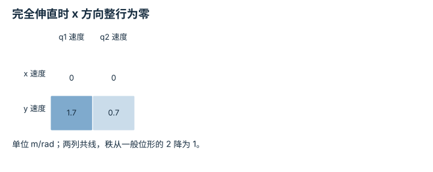

---
hide:
  - navigation
---

<!-- Generated by scripts/build_knowledge_atlas.py; edit knowledge/atlas/*.json. -->

<nav class="study-breadcrumb" aria-label="学习位置" markdown="1">
[知识目录](../../index.md) / [正运动学、Jacobian 与 IK](../index.md)
</nav>

L2 · 本章第 4 / 4 节

# 奇异点丢失的是局部速度方向

**Kinematic singularity**

机械臂完全伸直时，末端还能弯回来，但不能在那个瞬间产生任意方向的一阶速度。

先确认：这些前置知识我懂了吗？

Jacobian、秩与零空间

[SO(3)、SE(3) 与旋转表示](../../robot-so3-se3/index.md) · [目标、约束与优化](../../math-optimization/index.md)

<section class="study-section " markdown="1">

## 1 · 原理拆开看

1. 奇异性指当前 Jacobian 的秩低于该机构能够达到的最大秩，不是简单比较行数与关节数。
2. 两连杆完全沿 x 伸直时，两列都沿 y，位置速度空间只有一个独立方向。
3. 弯曲后 x 位移仍可出现，但最初是关节变化的二阶量；一阶方向缺失不等于永久位置不可达。

</section>

<section class="study-section " markdown="1">

## 2 · 跟着例子算一遍

1. 教学 l1=1 m、l2=0.7 m，q1=q2=0，J=[[0,0],[1.7,0.7]] m/rad。
2. 任意有限 q̇ 经过 J，都只能得到 x 速度为 0 的瞬时末端速度。
3. 取 q̇=(0.1,0.2) rad/s，得到 (0,0.31) m/s；而一般弯曲位形可有二维速度。

</section>

<section class="study-section " markdown="1">

## 3 · 对照图，解释变化

<figure class="atlas-visual" tabindex="0" aria-label="完全伸直时 x 方向整行为零；窄屏可在图内横向滚动">
<picture>
<source media="(max-width: 600px)" srcset="../../../assets/knowledge-atlas/kinematics-singularity-local-mobile.svg">

</picture>
<figcaption>教学示意，非实测；系数与两根连杆长度一致。</figcaption>
</figure>

- x 行全零说明所有有限关节速度都不能在此刻产生一阶 x 速度。
- 矩阵不能描述下一段有限角度运动，不能据此判定全部未来位置。

查看作图数据，自己复算

图上数值可能为便于阅读而取近似值，以下保留作图输入。

| 行 / 列 | q1 速度 | q2 速度 |
| --- | --- | --- |
| x 速度 | 0 | 0 |
| y 速度 | 1.7 | 0.7 |

</section>

<section class="study-section study-misconception" markdown="1">

## 4 · 避开一个误区

**容易误以为：**奇异处 x 速度为零，所以机械臂永远不能向内收。

**为什么不成立：**Jacobian 是当前位形的一阶模型；离开奇异位形后映射会改变。

**正确理解：**区分瞬时线性可控方向、有限位移和全局可达性。

</section>

<section class="study-section study-check" markdown="1">

## 5 · 先独立回答

6×4 Jacobian 的秩为 4，一定奇异吗？

我已作答，查看推理

不一定；若该机构最大可达秩就是 4，此时可为非奇异，只是不能完成任意六维速度任务。

</section>

继续查阅原始资料

- [Modern Robotics: singularities](https://modernrobotics.northwestern.edu/nu-gm-book-resource/5-3-singularities/)

<nav class="study-pagination" aria-label="相邻小节" markdown="1">

[← IK 先问可达，再问选择哪一个解](../kinematics-ik-reachability/index.md)

[回原课程动手验证 →](../../../foundations/07-fk-jacobian-ik.md)

</nav>

[返回本章目录](../index.md) · [整章连续阅读](../complete/index.md)

本章最后需要提交什么？

到达目标，同时记录残差、关节限制与奇异处理。

回到[原课程](../../../foundations/07-fk-jacobian-ik.md)完成实践。阅读位置或查看答案不计为通过验收。

