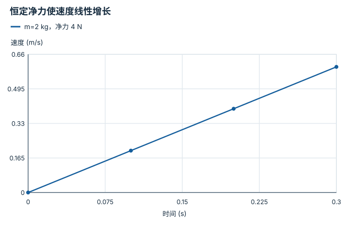
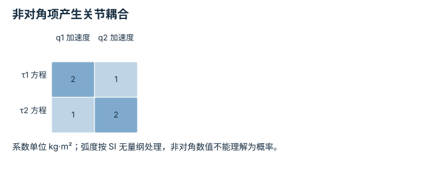
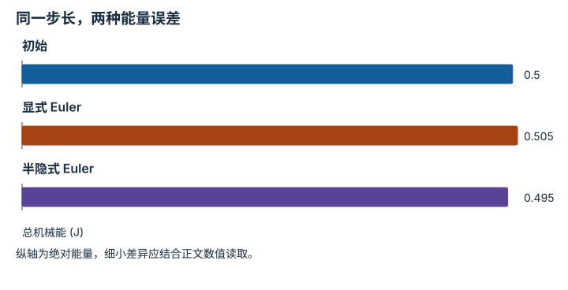
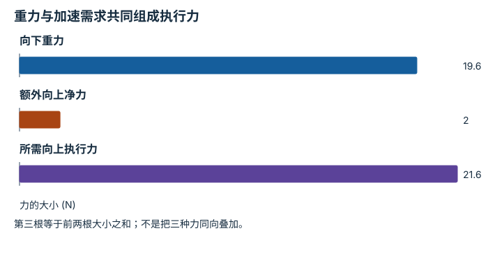

# 刚体动力学与积分：逐点细解

<!-- Generated by scripts/build_knowledge_atlas.py; edit knowledge/atlas/*.json. -->

[全部知识点](../index.md) · [返回原课程](../../foundations/08-control-basics.md)

Rigid-body dynamics and integration · 本页拆成 **4 个小知识点**。

先阅读直觉和原理，再独立完成算例、自测；图是解释工具，不是已掌握或真机验证的证明。

## 前置知识

[正运动学、Jacobian 与 IK](../robot-kinematics/index.md) → [数值稳定性与离散化](../math-numerical-stability/index.md)

## 改一个参数试试看

查看质量、力与加速度的闭环关系；这个单自由度模型不等于完整机器人。

[打开对应交互实验](../../learning-lab-cn.md#control)。滑块在文档站运行，GitHub 文件预览提供静态推导；不连接机器人。

## 本页知识点

1. [净力决定加速度，不直接决定位置](#dynamics-force-acceleration)
2. [质量矩阵说明关节加速为什么互相影响](#dynamics-mass-matrix-coupling)
3. [积分器会改变离散能量表现](#dynamics-integration-energy)
4. [逆动力学先问需要什么力，再核对能否提供](#dynamics-inverse-gravity)

## 1. 净力决定加速度，不直接决定位置

**Force, acceleration and state**

**需要先懂：**速度与时间、向量正方向

### 一句话直觉

给物体同样的力，重物加速更慢；已经有速度的物体，即使净力为零也不会自动停下。

### 原理拆开看

1. 在惯性参考系的一维模型中，净外力 F_net=m a，m 单位 kg，力单位 N。
2. 加速度改变速度，速度再改变位置，因此必须同时保留初始位置和速度。
3. 本例力保持恒定，可用 v=v0+at、x=x0+v0t+0.5at² 精确计算；变力系统需积分。

### 手算或追踪一个例子

1. 教学质量 m=2 kg，沿 x 正向力 6 N、反向恒力 2 N，初始 x=v=0。
2. 净力 4 N，所以 a=2 m/s²。
3. 0.1 s 后 v=0.2 m/s、x=0.01 m；0.3 s 后 v=0.6 m/s、x=0.09 m。

### 用图理解

<figure class="atlas-visual" tabindex="0" aria-label="恒定净力使速度线性增长；窄屏可在图内横向滚动">
<picture>
<source media="(max-width: 600px)" srcset="../../assets/knowledge-atlas/dynamics-force-acceleration-mobile.svg">

</picture>
<figcaption>教学示意，非实测；这里的直线是恒加速度模型的精确关系。</figcaption>
</figure>

- 斜率 2 m/s² 是加速度，不是位置。
- 图中反向力被假定恒定，不应读成真实空气阻力或库仑摩擦测量。

查看作图数据，自己复算

图上数值可能为便于阅读而取近似值，以下保留作图输入。线段的含义以本图图注和读图说明为准，不应自行解释为实测连续轨迹。

| 曲线 | 时间 (s) | 速度 (m/s) |
| --- | --- | --- |
| m=2 kg，净力 4 N | 0 | 0 |
| m=2 kg，净力 4 N | 0.1 | 0.2 |
| m=2 kg，净力 4 N | 0.2 | 0.4 |
| m=2 kg，净力 4 N | 0.3 | 0.6 |

### 容易混淆的地方

**常见误解：**净力为零就代表物体静止。

**为什么不成立：**零净力只说明加速度为零，已有速度仍会保持。

**正确理解：**同时记录力、速度和位置，并区分静止与匀速。

### 自测

质量增加到 4 kg 而净力不变，0.1 s 后速度是多少？

展开答案与推理

加速度降为 1 m/s²，若仍从静止开始，速度为 0.1 m/s。

**原始资料：**[Modern Robotics: forward dynamics](https://modernrobotics.northwestern.edu/nu-gm-book-resource/8-5-forward-dynamics-of-open-chains/)

## 2. 质量矩阵说明关节加速为什么互相影响

**Mass matrix coupling**

**需要先懂：**矩阵乘法、转动惯量

### 一句话直觉

只想加速一个关节，另一个电机也可能需要出力，因为连杆的运动是耦合的。

### 原理拆开看

1. 在固定当前位形，忽略重力与速度相关项时，关节动力学为 τ=M(q)q̈。
2. M 的对角项与自身加速相关，非对角项表达关节之间的惯性耦合；转动关节矩阵项具有惯量单位。
3. 因此力矩到加速度需解整个方程组，不能把每个 τi 分别除以 Mii 就结束。

### 手算或追踪一个例子

1. 教学 M=[[2,1],[1,2]] kg·m²，希望 q̈=(1,0) rad/s²。
2. 矩阵相乘得到 τ=(2,1) N·m，第二关节虽不加速也需要力矩。
3. 若只给 τ=(2,0) N·m，解出 q̈=(4/3,-2/3) rad/s²，第二关节反而会加速。

### 用图理解

<figure class="atlas-visual" tabindex="0" aria-label="非对角项产生关节耦合；窄屏可在图内横向滚动">
<picture>
<source media="(max-width: 600px)" srcset="../../assets/knowledge-atlas/dynamics-mass-matrix-coupling-mobile.svg">

</picture>
<figcaption>教学示意，非实测；只代表某一固定位形的简化惯量。</figcaption>
</figure>

- 第一列为 (2,1)，所以只要求 q1 加速也会贡献 τ2。
- 真实 M(q) 随姿态变化，这个常矩阵不能替代完整机器人模型。

查看作图数据，自己复算

图上数值可能为便于阅读而取近似值，以下保留作图输入。

| 行 / 列 | q1 加速度 | q2 加速度 |
| --- | --- | --- |
| τ1 方程 | 2 | 1 |
| τ2 方程 | 1 | 2 |

### 容易混淆的地方

**常见误解：**非对角项都是可忽略的小误差。

**为什么不成立：**它们可能代表真实且显著的惯性耦合，忽略后会改变加速度。

**正确理解：**根据模型和实验判断是否可简化，并记录重力、科氏项等被省略的条件。

### 自测

本例 M 是否正定？

展开答案与推理

是，特征值为 3 与 1，均为正；对任意非零关节速度，动能 0.5 q̇ᵀMq̇ 为正。

**原始资料：**[Modern Robotics: understanding the mass matrix](https://modernrobotics.northwestern.edu/nu-gm-book-resource/8-1-3-understanding-the-mass-matrix/)

## 3. 积分器会改变离散能量表现

**Integration and energy diagnostics**

**需要先懂：**加速度、显式 Euler

### 一句话直觉

没有摩擦的弹簧在仿真中越弹越高，可能是积分器在注入数值能量。

### 原理拆开看

1. 无阻尼弹簧模型 m=1 kg、k=1 N/m，a=-x；连续能量 E=0.5mv²+0.5kx² 守恒。
2. 显式 Euler 用旧速度更新位置，再用旧位置更新速度；半隐式 Euler 先更新速度，再用新速度更新位置。
3. 两者单步误差不同；检查能量随步长和时长变化，能帮助识别数值问题，但单步不能证明长期稳定。

### 手算或追踪一个例子

1. 教学 x0=1 m、v0=0、h=0.1 s，初始能量 0.5 J。
2. 显式 Euler 得 x1=1、v1=-0.1，能量 0.505 J。
3. 半隐式得 v1=-0.1、x1=0.99，能量 0.49505 J；两者都不在该步精确守恒。

### 用图理解

<figure class="atlas-visual" tabindex="0" aria-label="同一步长，两种能量误差；窄屏可在图内横向滚动">
<picture>
<source media="(max-width: 600px)" srcset="../../assets/knowledge-atlas/dynamics-integration-energy-mobile.svg">

</picture>
<figcaption>教学示意，非实测；各数值由一步更新计算。</figcaption>
</figure>

- 显式方法此步增加 0.005 J，半隐式此步减少 0.00495 J。
- 没有画后续时刻，所以不能依据三根柱宣称任一方法长期守恒。

查看作图数据，自己复算

图上数值可能为便于阅读而取近似值，以下保留作图输入。

| 项目 | 总机械能 (J) |
| --- | --- |
| 初始 | 0.5 |
| 显式 Euler | 0.505 |
| 半隐式 Euler | 0.49505 |

### 容易混淆的地方

**常见误解：**能量下降就证明积分器更准确。

**为什么不成立：**本模型本应守恒，人工耗散也是误差；不同任务需要考察长期误差结构。

**正确理解：**比较解析解、减半步长和长时间能量曲线，不仅比较单步方向。

### 自测

加入真实阻尼后，能量下降还一定是数值错误吗？

展开答案与推理

不一定；阻尼会物理耗散能量，必须先核对模型中的能量输入与损耗再判断。

**原始资料：**[MuJoCo computation: numerical integration](https://mujoco.readthedocs.io/en/stable/computation/index.html#numerical-integration)

## 4. 逆动力学先问需要什么力，再核对能否提供

**Inverse dynamics and gravity compensation**

**需要先懂：**净力、正方向

### 一句话直觉

向上加速的命令需要同时克服重力；只按质量乘目标加速度，会漏掉持续向下的载荷。

### 原理拆开看

1. 规定竖直 z 向上为正，质量 m 受到向上执行力 F 和向下重力 mg。
2. 前向动力学由 F 求 a=(F-mg)/m；逆动力学由目标 a 求 F=m(a+g)。
3. 算出所需力后仍需检查执行器限制和模型误差；逆动力学不是硬件必然达到该加速度的保证。

### 手算或追踪一个例子

1. 教学 m=2 kg、g=9.81 m/s²，希望向上加速度 1 m/s²。
2. 重力为 19.62 N，额外加速净力为 2 N。
3. 需要向上执行力 21.62 N；若只提供 19.62 N，加速度为 0，但已有速度不一定为 0。

### 用图理解

<figure class="atlas-visual" tabindex="0" aria-label="重力与加速需求共同组成执行力；窄屏可在图内横向滚动">
<picture>
<source media="(max-width: 600px)" srcset="../../assets/knowledge-atlas/dynamics-inverse-gravity-mobile.svg">

</picture>
<figcaption>教学示意，非实测；柱均表示力的大小，方向由标签和正文规定。</figcaption>
</figure>

- 21.62 N 中大部分用于平衡重力，只有 2 N 用于所需加速。
- 图未计入摩擦、接触和执行延迟，真实需求可能不同。

查看作图数据，自己复算

图上数值可能为便于阅读而取近似值，以下保留作图输入。

| 项目 | 力的大小 (N) |
| --- | --- |
| 向下重力 | 19.62 |
| 额外向上净力 | 2 |
| 所需向上执行力 | 21.62 |

### 容易混淆的地方

**常见误解：**重力补偿等于位置保持。

**为什么不成立：**补偿只消去重力，不能自动消除初始速度、外扰或位置误差。

**正确理解：**把模型前馈与反馈控制分开，并验证力限和状态响应。

### 自测

执行器最多向上提供 20 N，本例目标加速度能实现吗？

展开答案与推理

不能；最大净加速度为 (20-19.62)/2=0.19 m/s²，低于 1 m/s²。

**原始资料：**[Modern Robotics: Newton-Euler inverse dynamics](https://modernrobotics.northwestern.edu/nu-gm-book-resource/8-3-newton-euler-inverse-dynamics/)

## 从理解走向证据

本节点原有验收要求：解释状态更新，并在两种时间步下检查能量或跟踪表现。

完成图解自测后，回到[原课程](../../foundations/08-control-basics.md)运行对应示例并保留证据；浏览页面和查看答案不会自动获得课程晋级。
