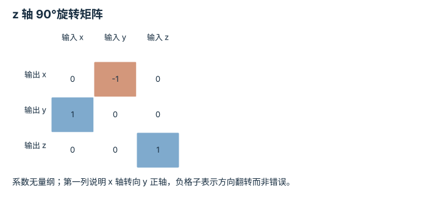
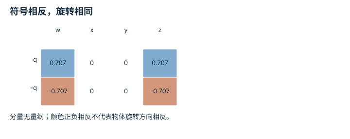

# SO(3)、SE(3) 与旋转表示：逐点细解

<!-- Generated by scripts/build_knowledge_atlas.py; edit knowledge/atlas/*.json. -->

[全部知识点](../index.md) · [返回原课程](../../foundations/06-se3-and-rotation.md)

SO(3), SE(3), and rotation representations · 本页拆成 **5 个小知识点**。

先阅读直觉和原理，再独立完成算例、自测；图是解释工具，不是已掌握或真机验证的证明。

## 前置知识

[坐标系与变换链](../robot-coordinate-frames/index.md)

## 改一个参数试试看

先用二维旋转核对正向与逆向变换；平面演示不能覆盖完整三维旋转。

[打开对应交互实验](../../learning-lab-cn.md#frames)。滑块在文档站运行，GitHub 文件预览提供静态推导；不连接机器人。

## 本页知识点

1. [旋转矩阵必须保长度并保持右手性](#rotation-so3-invariants)
2. [欧拉角必须同时声明旋转顺序](#rotation-euler-order)
3. [四元数先核对分量顺序，再处理正负等价](#rotation-quaternion-cover)
4. [小角度向量是局部近似，不是全局加法坐标](#rotation-axis-angle-local)
5. [姿态插值要沿旋转空间行走](#rotation-slerp-path)

## 1. 旋转矩阵必须保长度并保持右手性

**SO(3) invariants**

**需要先懂：**矩阵转置、点乘

### 一句话直觉

预测出九个数字并不自动得到旋转；一个略微缩放或镜像的矩阵可能破坏机器人几何。

### 原理拆开看

1. 三维旋转 R 的列是相互正交的单位轴，所以 RᵀR=I。
2. 还要求 det(R)=1；det=-1 的正交矩阵含镜像，不属于 SO(3)。
3. SE(3) 则把合法旋转和三维平移合成位姿，旋转与平移仍各有约束和单位。

### 手算或追踪一个例子

1. 教学绕 z 正轴按右手定则转 90°，R=[[0,-1,0],[1,0,0],[0,0,1]]。
2. R 把 p=(1,2,3) m 变为 (-2,1,3) m。
3. 前后长度平方都为 14 m²，列互相正交且行列式为 1，符合纯旋转。

### 用图理解

<figure class="atlas-visual" tabindex="0" aria-label="z 轴 90°旋转矩阵；窄屏可在图内横向滚动">
<picture>
<source media="(max-width: 600px)" srcset="../../assets/knowledge-atlas/rotation-so3-invariants-mobile.svg">

</picture>
<figcaption>教学示意，非实测；使用列向量与右手坐标约定。</figcaption>
</figure>

- 第三列不变表示绕 z 轴旋转时 z 方向保持。
- 合法旋转矩阵只说明几何一致性，不保证机械臂可达到该姿态。

查看作图数据，自己复算

图上数值可能为便于阅读而取近似值，以下保留作图输入。

| 行 / 列 | 输入 x | 输入 y | 输入 z |
| --- | --- | --- | --- |
| 输出 x | 0 | -1 | 0 |
| 输出 y | 1 | 0 | 0 |
| 输出 z | 0 | 0 | 1 |

### 容易混淆的地方

**常见误解：**RᵀR=I 已经足以证明是旋转。

**为什么不成立：**镜像矩阵也正交，但行列式为 -1，会改变左右手性。

**正确理解：**同时检查正交误差和行列式，并分别报告容差。

### 自测

diag(-1,1,1) 是否属于 SO(3)？

展开答案与推理

不是；它保持长度但 det=-1，是沿 x 方向镜像，而不是三维纯旋转。

**原始资料：**[Modern Robotics: rotation matrices](https://modernrobotics.northwestern.edu/nu-gm-book-resource/3-2-1-rotation-matrices-part-1-of-2/)

## 2. 欧拉角必须同时声明旋转顺序

**Euler angles and noncommutativity**

**需要先懂：**三维旋转矩阵、右手定则

### 一句话直觉

同样两个 90°，先绕 x 再绕 z，与反过来做，最终朝向不同。

### 原理拆开看

1. 本例使用固定世界轴上的主动旋转和列向量；最右矩阵先作用。
2. Rx 与 Rz 一般不交换，所以仅给出角度数值而不说明轴顺序是不完整表示。
3. 欧拉角还存在某些姿态下的万向锁；表示失去局部唯一性，不意味着物体少了物理自由度。

### 手算或追踪一个例子

1. 教学测试向量 p=(1,0,0) m，两次旋转都是正 90°。
2. 先 Rx 后 Rz：p 先不变，再变成 (0,1,0) m。
3. 先 Rz 后 Rx：p 先到 (0,1,0)，再到 (0,0,1) m，证明顺序改变结果。

### 用图理解

<figure class="atlas-visual" tabindex="0" aria-label="相同角度，不同次序；窄屏可在图内横向滚动">
<picture>
<source media="(max-width: 600px)" srcset="../../assets/knowledge-atlas/rotation-euler-order-mobile.svg">

</picture>
<figcaption>教学示意，非实测；全部绕固定世界轴主动旋转。</figcaption>
</figure>

- 最后一行不同，说明三维旋转不满足一般交换律。
- 两栏是两种不同操作，不是同一操作的两种等价坐标写法。

### 容易混淆的地方

**常见误解：**roll、pitch、yaw 三个名字已经足以交换数据。

**为什么不成立：**内禀/外禀、轴顺序、主动/被动和角度单位都可能不同。

**正确理解：**在接口写完整约定，并用三根基向量做转换测试。

### 自测

给定 RzRx，先作用哪个旋转？

展开答案与推理

在列向量约定下先 Rx，再 Rz；若使用行向量约定，必须重新推导顺序，不能机械照抄。

**原始资料：**[SciPy Rotation.from_euler](https://docs.scipy.org/doc/scipy/reference/generated/scipy.spatial.transform.Rotation.from_euler.html)

## 3. 四元数先核对分量顺序，再处理正负等价

**Quaternion conventions and double cover**

**需要先懂：**单位向量、轴角

### 一句话直觉

两个看起来差很大的四元数可能表示完全相同的姿态，直接求均值反而会制造非法旋转。

### 原理拆开看

1. 本例使用 scalar-first 顺序 (w,x,y,z)，单位四元数的平方和必须为 1。
2. 绕单位轴 n 转 θ 的分量为 w=cos(θ/2)、向量部分 n sin(θ/2)。
3. q 与 -q 表示同一旋转；跨库还必须核对是否改用 scalar-last 顺序 (x,y,z,w)。

### 手算或追踪一个例子

1. 教学绕 z 转 90°，scalar-first q≈(0.707107,0,0,0.707107)。
2. -q≈(-0.707107,0,0,-0.707107) 表示相同姿态。
3. 直接平均得到四个零，不能归一化为有效旋转；插值前应选择一致符号并使用旋转专用算法。

### 用图理解

<figure class="atlas-visual" tabindex="0" aria-label="符号相反，旋转相同；窄屏可在图内横向滚动">
<picture>
<source media="(max-width: 600px)" srcset="../../assets/knowledge-atlas/rotation-quaternion-cover-mobile.svg">

</picture>
<figcaption>教学示意，非实测；数值为 sqrt(1/2) 的近似。</figcaption>
</figure>

- 两行看起来完全反号，但经四元数旋转公式得到同一个 R。
- 小数截断使范数只能近似为 1，工程中仍需检查容差和零范数输入。

查看作图数据，自己复算

图上数值可能为便于阅读而取近似值，以下保留作图输入。

| 行 / 列 | w | x | y | z |
| --- | --- | --- | --- | --- |
| q | 0.707107 | 0 | 0 | 0.707107 |
| -q | -0.707107 | 0 | 0 | -0.707107 |

### 容易混淆的地方

**常见误解：**四元数差的欧氏范数就是姿态误差。

**为什么不成立：**q 与 -q 的分量距离为 2，但旋转误差为零。

**正确理解：**使用符号不变的旋转距离，并在接口明确分量顺序和归一化规则。

### 自测

scalar-last 的单位旋转是什么？

展开答案与推理

是 (0,0,0,1)；把 scalar-first 的 (1,0,0,0) 直接传入会被解释为另一旋转。

**原始资料：**[SciPy quaternion conventions](https://docs.scipy.org/doc/scipy/reference/generated/scipy.spatial.transform.Rotation.from_quat.html)

## 4. 小角度向量是局部近似，不是全局加法坐标

**Rotation vectors and small-angle approximation**

**需要先懂：**轴角、三角函数与弧度

### 一句话直觉

用三个小数描述姿态修正很方便，但把大角度一直直接相加，会忽略旋转的非线性。

### 原理拆开看

1. 旋转向量 φ=θn，以单位轴 n 指明方向、以弧度 θ 指明转角；它不是空间位移。
2. 绕 z 的精确旋转使用 cosθ、sinθ；小角度时才可近似 cosθ≈1、sinθ≈θ。
3. 一阶矩阵 I+[φ]× 只是局部近似，一般不严格正交；累积后应使用指数映射等合法旋转更新。

### 手算或追踪一个例子

1. 教学 φ=(0,0,0.1) rad，旋转 p=(1,0) m。
2. 精确结果为 (cos0.1,sin0.1)≈(0.995004,0.0998334) m。
3. 一阶近似为 (1,0.1) m，长度 √1.01≈1.00499 m；它轻微拉长了向量。

### 用图理解

<figure class="atlas-visual" tabindex="0" aria-label="精确旋转与一阶近似；窄屏可在图内横向滚动">
<picture>
<source media="(max-width: 600px)" srcset="../../assets/knowledge-atlas/rotation-axis-angle-local-mobile.svg">

</picture>
<figcaption>教学示意，非实测；相同输入和 0.1 rad 转角。</figcaption>
</figure>

- 两栏数值接近，但是否严格保长度是不同的问题。
- 这里没有展示三维不同轴旋转的组合误差，不能推广为任意大姿态更新。

### 容易混淆的地方

**常见误解：**把 cosθ 永远替换为 1，也能保留合法旋转。

**为什么不成立：**近似矩阵不严格保长度，误差随角度和累积次数扩大。

**正确理解：**为小角度近似声明范围，并用合法旋转表示更新姿态。

### 自测

θ=90° 时能否直接把 sinθ≈θ 代入 θ=90？

展开答案与推理

不能：三角函数近似要求小弧度；90° 为约 1.571 rad，本来就不在小角度范围。

**原始资料：**[Modern Robotics: exponential coordinates of rotation](https://modernrobotics.northwestern.edu/nu-gm-book-resource/3-2-3-exponential-coordinates-of-rotation-part-1-of-2/)

## 5. 姿态插值要沿旋转空间行走

**Spherical linear interpolation**

**需要先懂：**四元数、旋转矩阵约束

### 一句话直觉

两端都是合法姿态，把矩阵每格取平均，途中也可能把物体压小，而不是旋转。

### 原理拆开看

1. 旋转矩阵集合不是普通线性空间，两个 R 的算术平均一般不再满足 RᵀR=I。
2. Slerp 在选定相邻姿态之间沿最短旋转路径，以恒定角速度插值；还需处理四元数符号等价。
3. 几何插值只决定姿态路径，不自动满足机器人的速度、加速度和碰撞限制。

### 手算或追踪一个例子

1. 教学起点绕 z 为 0°、终点为 90°，时间从 0 到 1 s。
2. 中点 t=0.5 s 的旋转角为 45°，单位长测试向量变为 (0.707107,0.707107) m。
3. 若对两端矩阵直接平均，同一向量变成 (0.5,0.5) m，长度约 0.707107 m，不是纯旋转。

### 用图理解

<figure class="atlas-visual" tabindex="0" aria-label="三时刻的单位长测试向量；窄屏可在图内横向滚动">
<picture>
<source media="(max-width: 600px)" srcset="../../assets/knowledge-atlas/rotation-slerp-path-mobile.svg">

</picture>
<figcaption>教学示意，非实测；箭头表示姿态作用后的方向，不是末端移动路径。</figcaption>
</figure>

- 中间箭头没有缩短，体现姿态插值保持旋转的长度性质。
- 图只展示 z 轴旋转的一例，未展示接近 180°时路径选择的歧义。

查看作图数据，自己复算

图上数值可能为便于阅读而取近似值，以下保留作图输入。

| 向量 | x (m) | y (m) |
| --- | --- | --- |
| 0 s / 0° | 1 | 0 |
| 0.5 s / 45° | 0.707107 | 0.707107 |
| 1 s / 90° | 0 | 1 |

### 容易混淆的地方

**常见误解：**在 9 个矩阵元素间线性插值即可得到平滑姿态。

**为什么不成立：**元素平滑不等于满足旋转几何约束。

**正确理解：**使用旋转专用插值，再独立设计时间参数和动态限制。

### 自测

1 s 内转 90°时角速度是多少？

展开答案与推理

此例为 90°/s，即 π/2 rad/s；改变总时长会改变角速度，即使姿态路径相同。

**原始资料：**[SciPy Slerp](https://docs.scipy.org/doc/scipy/reference/generated/scipy.spatial.transform.Slerp.html)

## 从理解走向证据

本节点原有验收要求：让位姿经过两种表示往返，并报告数值误差。

完成图解自测后，回到[原课程](../../foundations/06-se3-and-rotation.md)运行对应示例并保留证据；浏览页面和查看答案不会自动获得课程晋级。
