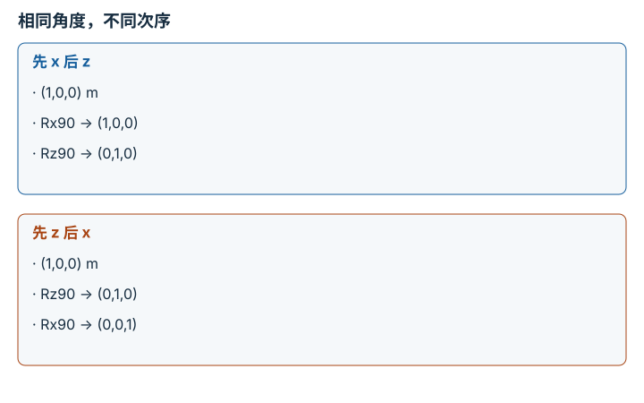

---
hide:
  - navigation
---

<!-- Generated by scripts/build_knowledge_atlas.py; edit knowledge/atlas/*.json. -->

<nav class="study-breadcrumb" aria-label="学习位置" markdown="1">
[知识目录](../../index.md) / [SO(3)、SE(3) 与旋转表示](../index.md)
</nav>

L1 · 本章第 2 / 5 节

# 欧拉角必须同时声明旋转顺序

**Euler angles and noncommutativity**

同样两个 90°，先绕 x 再绕 z，与反过来做，最终朝向不同。

先确认：这些前置知识我懂了吗？

三维旋转矩阵、右手定则

[坐标系与变换链](../../robot-coordinate-frames/index.md)

<section class="study-section " markdown="1">

## 1 · 原理拆开看

1. 本例使用固定世界轴上的主动旋转和列向量；最右矩阵先作用。
2. Rx 与 Rz 一般不交换，所以仅给出角度数值而不说明轴顺序是不完整表示。
3. 欧拉角还存在某些姿态下的万向锁；表示失去局部唯一性，不意味着物体少了物理自由度。

</section>

<section class="study-section " markdown="1">

## 2 · 跟着例子算一遍

1. 教学测试向量 p=(1,0,0) m，两次旋转都是正 90°。
2. 先 Rx 后 Rz：p 先不变，再变成 (0,1,0) m。
3. 先 Rz 后 Rx：p 先到 (0,1,0)，再到 (0,0,1) m，证明顺序改变结果。

</section>

<section class="study-section " markdown="1">

## 3 · 对照图，解释变化

<figure class="atlas-visual" tabindex="0" aria-label="相同角度，不同次序；窄屏可在图内横向滚动">
<picture>
<source media="(max-width: 600px)" srcset="../../../assets/knowledge-atlas/rotation-euler-order-mobile.svg">

</picture>
<figcaption>教学示意，非实测；全部绕固定世界轴主动旋转。</figcaption>
</figure>

- 最后一行不同，说明三维旋转不满足一般交换律。
- 两栏是两种不同操作，不是同一操作的两种等价坐标写法。

</section>

<section class="study-section study-misconception" markdown="1">

## 4 · 避开一个误区

**容易误以为：**roll、pitch、yaw 三个名字已经足以交换数据。

**为什么不成立：**内禀/外禀、轴顺序、主动/被动和角度单位都可能不同。

**正确理解：**在接口写完整约定，并用三根基向量做转换测试。

</section>

<section class="study-section study-check" markdown="1">

## 5 · 先独立回答

给定 RzRx，先作用哪个旋转？

我已作答，查看推理

在列向量约定下先 Rx，再 Rz；若使用行向量约定，必须重新推导顺序，不能机械照抄。

</section>

继续查阅原始资料

- [SciPy Rotation.from_euler](https://docs.scipy.org/doc/scipy/reference/generated/scipy.spatial.transform.Rotation.from_euler.html)

<nav class="study-pagination" aria-label="相邻小节" markdown="1">

[← 旋转矩阵必须保长度并保持右手性](../rotation-so3-invariants/index.md)

[四元数先核对分量顺序，再处理正负等价 →](../rotation-quaternion-cover/index.md)

</nav>

[返回本章目录](../index.md) · [整章连续阅读](../complete/index.md)

本章最后需要提交什么？

让位姿经过两种表示往返，并报告数值误差。

回到[原课程](../../../foundations/06-se3-and-rotation.md)完成实践。阅读位置或查看答案不计为通过验收。

