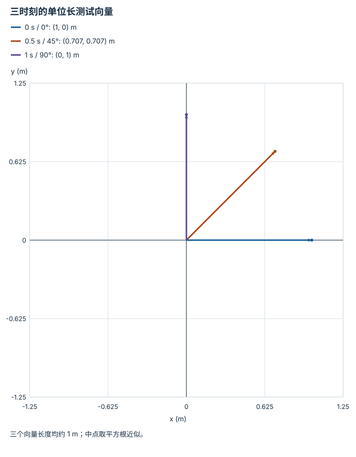

---
hide:
  - navigation
---

<!-- Generated by scripts/build_knowledge_atlas.py; edit knowledge/atlas/*.json. -->

<nav class="study-breadcrumb" aria-label="学习位置" markdown="1">
[知识目录](../../index.md) / [SO(3)、SE(3) 与旋转表示](../index.md)
</nav>

L1 · 本章第 5 / 5 节

# 姿态插值要沿旋转空间行走

**Spherical linear interpolation**

两端都是合法姿态，把矩阵每格取平均，途中也可能把物体压小，而不是旋转。

先确认：这些前置知识我懂了吗？

四元数、旋转矩阵约束

[坐标系与变换链](../../robot-coordinate-frames/index.md)

<section class="study-section " markdown="1">

## 1 · 原理拆开看

1. 旋转矩阵集合不是普通线性空间，两个 R 的算术平均一般不再满足 RᵀR=I。
2. Slerp 在选定相邻姿态之间沿最短旋转路径，以恒定角速度插值；还需处理四元数符号等价。
3. 几何插值只决定姿态路径，不自动满足机器人的速度、加速度和碰撞限制。

</section>

<section class="study-section " markdown="1">

## 2 · 跟着例子算一遍

1. 教学起点绕 z 为 0°、终点为 90°，时间从 0 到 1 s。
2. 中点 t=0.5 s 的旋转角为 45°，单位长测试向量变为 (0.707107,0.707107) m。
3. 若对两端矩阵直接平均，同一向量变成 (0.5,0.5) m，长度约 0.707107 m，不是纯旋转。

</section>

<section class="study-section " markdown="1">

## 3 · 对照图，解释变化

<figure class="atlas-visual" tabindex="0" aria-label="三时刻的单位长测试向量；窄屏可在图内横向滚动">
<picture>
<source media="(max-width: 600px)" srcset="../../../assets/knowledge-atlas/rotation-slerp-path-mobile.svg">

</picture>
<figcaption>教学示意，非实测；箭头表示姿态作用后的方向，不是末端移动路径。</figcaption>
</figure>

- 中间箭头没有缩短，体现姿态插值保持旋转的长度性质。
- 图只展示 z 轴旋转的一例，未展示接近 180°时路径选择的歧义。

查看作图数据，自己复算

图上数值可能为便于阅读而取近似值，以下保留作图输入。

| 向量 | x (m) | y (m) |
| --- | --- | --- |
| 0 s / 0° | 1 | 0 |
| 0.5 s / 45° | 0.707107 | 0.707107 |
| 1 s / 90° | 0 | 1 |

</section>

<section class="study-section study-misconception" markdown="1">

## 4 · 避开一个误区

**容易误以为：**在 9 个矩阵元素间线性插值即可得到平滑姿态。

**为什么不成立：**元素平滑不等于满足旋转几何约束。

**正确理解：**使用旋转专用插值，再独立设计时间参数和动态限制。

</section>

<section class="study-section study-check" markdown="1">

## 5 · 先独立回答

1 s 内转 90°时角速度是多少？

我已作答，查看推理

此例为 90°/s，即 π/2 rad/s；改变总时长会改变角速度，即使姿态路径相同。

</section>

继续查阅原始资料

- [SciPy Slerp](https://docs.scipy.org/doc/scipy/reference/generated/scipy.spatial.transform.Slerp.html)

<nav class="study-pagination" aria-label="相邻小节" markdown="1">

[← 小角度向量是局部近似，不是全局加法坐标](../rotation-axis-angle-local/index.md)

[回原课程动手验证 →](../../../foundations/06-se3-and-rotation.md)

</nav>

[返回本章目录](../index.md) · [整章连续阅读](../complete/index.md)

本章最后需要提交什么？

让位姿经过两种表示往返，并报告数值误差。

回到[原课程](../../../foundations/06-se3-and-rotation.md)完成实践。阅读位置或查看答案不计为通过验收。

