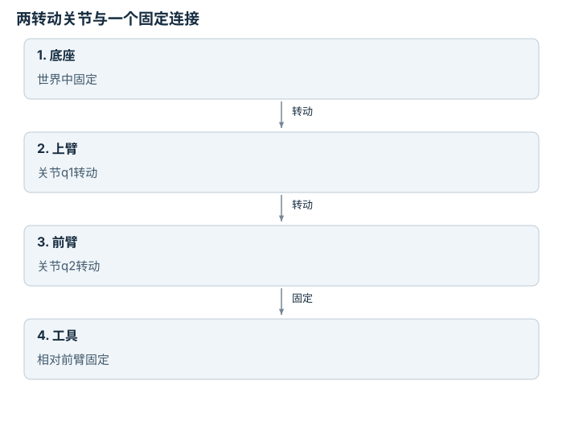
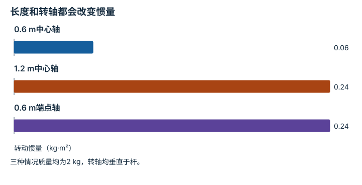
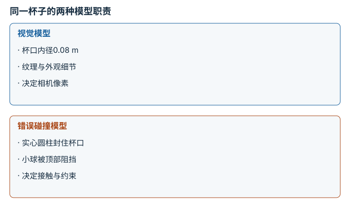
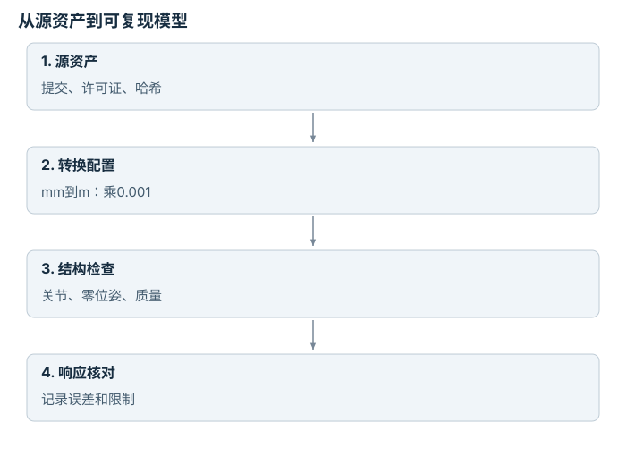

# URDF、MJCF、资源与模型溯源：逐点细解

<!-- Generated by scripts/build_knowledge_atlas.py; edit knowledge/atlas/*.json. -->

[全部知识点](../index.md) · [返回原课程](../../tutorials/mujoco-scene-building.md)

URDF, MJCF, assets, and model provenance · 本页拆成 **4 个小知识点**。

先阅读直觉和原理，再独立完成算例、自测；图是解释工具，不是已掌握或真机验证的证明。

## 前置知识

[坐标系与变换链](../robot-coordinate-frames/index.md) → [驱动、传动与限制](../robot-actuation-transmission/index.md)

## 本页知识点

1. [连杆与关节：模型首先是一张结构图](#model-body-joint-tree)
2. [质量与惯量：外观相同不代表动力学相同](#model-inertial-properties)
3. [视觉网格与碰撞几何：两个不同接口](#model-visual-collision)
4. [资源溯源：场景文件不等于完整模型](#model-assets-provenance)

## 1. 连杆与关节：模型首先是一张结构图

**Bodies, links and joints**

**需要先懂：**坐标系、自由度

### 一句话直觉

看起来像机械臂的网格不一定能正确运动；运动关系来自刚体和关节，而不是外观。

### 原理拆开看

1. link/body表示刚体，joint规定相邻刚体的相对运动约束。
2. 固定关节不增加可动自由度；一个独立转动关节通常增加一个角度变量。
3. 沿父子关系组合变换得到子刚体位置；URDF与MJCF语法和表达能力不同，转换需检查语义。

### 手算或追踪一个例子

1. 教学树包含底座、上臂、前臂、工具四个刚体。
2. 底座到上臂、上臂到前臂各为一个转动关节，前臂到工具为固定连接。
3. 此开链有两个可动自由度而非四个；工具仍会随前两个关节运动。

### 用图理解

<figure class="atlas-visual" tabindex="0" aria-label="两转动关节与一个固定连接；窄屏可在图内横向滚动">
<picture>
<source media="(max-width: 600px)" srcset="../../assets/knowledge-atlas/model-body-joint-tree-mobile.svg">

</picture>
<figcaption>教学开链结构；箭头表示父子连接而非控制数据。</figcaption>
</figure>

- 可动关节有两个，刚体节点有四个。
- 图不包含闭链、mimic或柔性约束，不能用于任意机构直接计数。

### 容易混淆的地方

**常见误解：**四个模型文件意味着四个自由度。

**为什么不成立：**文件拆分与运动约束不是同一个概念。

**正确理解：**依据关节类型、约束及耦合关系统计独立坐标。

### 自测

把工具固定连接换成独立滑动关节，开链自由度变多少？

展开答案与推理

在没有额外约束时变成3，其中新增变量是以m表示的平移，而非角度。

**原始资料：**[MuJoCo Modeling: Kinematic Tree](https://mujoco.readthedocs.io/en/stable/modeling.html)

## 2. 质量与惯量：外观相同不代表动力学相同

**Mass and rotational inertia**

**需要先懂：**质量、力矩

### 一句话直觉

相同形状可以很轻或很重，转动难度还取决于质量离转轴多远。

### 原理拆开看

1. 质量m单位kg，转动惯量I单位kg·m²；惯量必须注明参考点与坐标方向。
2. 本例匀质细杆绕中心垂直杆轴转动，I=mL²/12。
3. 外观缩放后，质量和惯量不能保持任意旧值；求解器需要物理有效的惯性参数。

### 手算或追踪一个例子

1. 教学细杆m=2 kg、L=0.6 m。
2. 绕中心的惯量为2×0.6²/12=0.06 kg·m²。
3. 若长度翻倍而质量仍为2 kg，惯量变为0.24 kg·m²，是原来的四倍。

### 用图理解

<figure class="atlas-visual" tabindex="0" aria-label="长度和转轴都会改变惯量；窄屏可在图内横向滚动">
<picture>
<source media="(max-width: 600px)" srcset="../../assets/knowledge-atlas/model-inertial-properties-mobile.svg">

</picture>
<figcaption>匀质细杆教学计算。</figcaption>
</figure>

- 第一、二柱比较长度平方的影响。
- 第二、三柱数值相等是本例巧合，并不表示模型或转轴相同。

查看作图数据，自己复算

图上数值可能为便于阅读而取近似值，以下保留作图输入。

| 项目 | 转动惯量（kg·m²） |
| --- | --- |
| 0.6 m中心轴 | 0.06 |
| 1.2 m中心轴 | 0.24 |
| 0.6 m端点轴 | 0.24 |

### 容易混淆的地方

**常见误解：**惯量可以填质量数值，反正都是重量。

**为什么不成立：**两者单位和物理作用不同，错误值会改变加速度与接触响应。

**正确理解：**检查质量、质心、惯量张量与几何尺度是否一致。

### 自测

同一细杆改绕端点转动，惯量仍是0.06吗？

展开答案与推理

不是；平行轴定理给0.06+2×0.3²=0.24 kg·m²。

**原始资料：**[MuJoCo XML Reference: Inertial Elements](https://mujoco.readthedocs.io/en/stable/XMLreference.html#body-inertial)

## 3. 视觉网格与碰撞几何：两个不同接口

**Visual and collision geometry**

**需要先懂：**刚体、几何尺度

### 一句话直觉

渲染图像由视觉形状决定，接触求解由碰撞形状决定；二者不一致会出现看不见的墙或穿透。

### 原理拆开看

1. 视觉网格可以包含精细纹理和大量三角形；碰撞模型可采用简化几何降低求解负担。
2. 两者仍需共享一致的单位、局部原点和相对位姿。
3. 分别开启可视化碰撞几何与传感器图像检查，不能只凭漂亮画面验收物理模型。

### 手算或追踪一个例子

1. 教学杯口视觉内径为0.08 m，简化碰撞模型却把杯子做成实心圆柱。
2. 直径0.03 m的小球在视觉上能进入杯口，但碰撞求解会在顶部阻挡它。
3. 修正碰撞拓扑后再测试投放任务；更换策略网络并不能修复错误的几何接口。

### 用图理解

<figure class="atlas-visual" tabindex="0" aria-label="同一杯子的两种模型职责；窄屏可在图内横向滚动">
<picture>
<source media="(max-width: 600px)" srcset="../../assets/knowledge-atlas/model-visual-collision-mobile.svg">

</picture>
<figcaption>教学接口比较，不是某仿真器的性能结果。</figcaption>
</figure>

- 比较杯口是否在碰撞模型中真正存在。
- 表中没有复杂度测量，不能推断简化模型一定更快或足够准确。

### 容易混淆的地方

**常见误解：**渲染没有穿模，就证明碰撞模型正确。

**为什么不成立：**视觉与碰撞可以使用不同资源和偏移。

**正确理解：**直接检查碰撞形状及接触点，再验证任务相关几何。

### 自测

仅把视觉网格缩小一半，会怎样影响碰撞？

展开答案与推理

若碰撞几何独立定义，它不会自动变小，可能产生可见物体之外的接触。

**原始资料：**[MuJoCo Modeling: Geometric Elements](https://mujoco.readthedocs.io/en/stable/modeling.html)

## 4. 资源溯源：场景文件不等于完整模型

**Asset provenance and model conversion**

**需要先懂：**文件路径、版本控制

### 一句话直觉

只复制一个XML可能丢失网格、材质或缩放参数；模型需要完整资源与来源才能被复现。

### 原理拆开看

1. 记录模型格式、源仓库提交、许可证和网格等依赖，使用可解析的相对资源路径。
2. 导入或格式转换可能改变关节默认值、接触参数、单位与执行器语义。
3. 转换后比较关节数量、零位姿、质量与简单响应；能打开文件只证明解析成功。

### 手算或追踪一个例子

1. 教学模型A声明网格尺寸100 mm，目标环境要求m。
2. 导入时施加0.001缩放得到0.1 m，并记录原始文件哈希与转换参数。
3. 若漏掉缩放会得到100 m几何；文件仍可能合法，但场景尺度已经错了1000倍。

### 用图理解

<figure class="atlas-visual" tabindex="0" aria-label="从源资产到可复现模型；窄屏可在图内横向滚动">
<picture>
<source media="(max-width: 600px)" srcset="../../assets/knowledge-atlas/model-assets-provenance-mobile.svg">

</picture>
<figcaption>教学模型交付链，不涉及运行硬件。</figcaption>
</figure>

- 单位换算是显式转换步骤，不应隐藏在脚本默认值里。
- 链条通过仍不证明仿真与真实机器人完全一致。

### 容易混淆的地方

**常见误解：**转换器返回成功，就能把转换后模型当原模型等价物。

**为什么不成立：**解析成功不覆盖动力学和接触语义。

**正确理解：**保留原始资产并逐项核对关键物理属性。

### 自测

只记录下载链接而不记录版本，有什么缺陷？

展开答案与推理

链接指向的资源可能更新，后续运行未必获得同一模型；需要版本或哈希与许可证记录。

**原始资料：**[MuJoCo Modeling: Model Compilation](https://mujoco.readthedocs.io/en/stable/modeling.html)

## 从理解走向证据

本节点原有验收要求：加载、检查、步进并导出模型，不依赖隐式默认值。

完成图解自测后，回到[原课程](../../tutorials/mujoco-scene-building.md)运行对应示例并保留证据；浏览页面和查看答案不会自动获得课程晋级。
