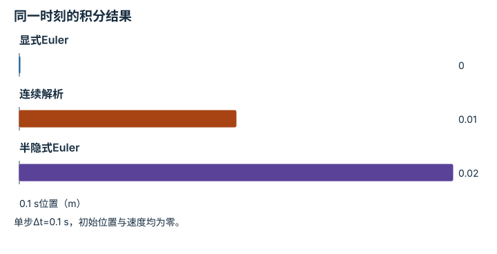
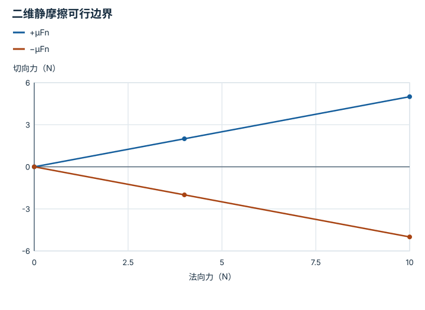
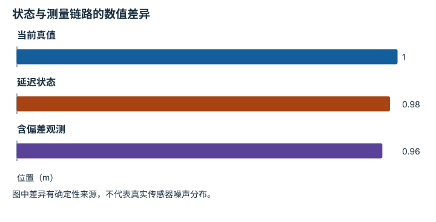
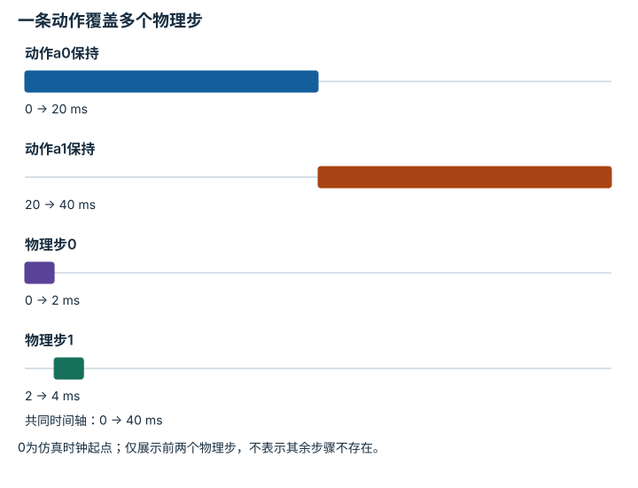

# 场景动力学、接触与可观测性：逐点细解

<!-- Generated by scripts/build_knowledge_atlas.py; edit knowledge/atlas/*.json. -->

[全部知识点](../index.md) · [返回原课程](../../foundations/09-mujoco-basics.md)

Scene dynamics, contacts, and observability · 本页拆成 **4 个小知识点**。

先阅读直觉和原理，再独立完成算例、自测；图是解释工具，不是已掌握或真机验证的证明。

## 前置知识

[URDF、MJCF、资源与模型溯源](../sim-model-formats/index.md) → [接触、摩擦与抓取稳定性](../robot-contact-friction/index.md)

## 本页知识点

1. [积分步长：连续动力学如何变成下一帧](#sim-integration-step)
2. [接触与摩擦：不是任意方向都能施力](#sim-contact-friction-cone)
3. [真值与观测：策略究竟看见了什么](#sim-ground-truth-observation)
4. [物理步与策略步：一条动作保持多久](#sim-substeps-control-rate)

## 1. 积分步长：连续动力学如何变成下一帧

**Numerical integration**

**需要先懂：**位置速度加速度、时间离散化

### 一句话直觉

仿真不是每帧重新猜位置，而是用当前状态和动力学推进；推进方法会产生数值误差。

### 原理拆开看

1. 教学恒加速度模型a用m/s²，步长Δt用s。
2. 显式Euler先用旧速度更新x，再更新v；半隐式Euler先更新v，再用新速度更新x。
3. 二者都近似连续过程，步长减小应进行收敛检查；具体仿真器还包含约束与求解器。

### 手算或追踪一个例子

1. 教学输入x=0、v=0、a=2 m/s²、Δt=0.1 s。
2. 显式Euler得到x=0、v=0.2；半隐式Euler得到x=0.02 m、v=0.2。
3. 连续解析位置是0.5×2×0.1²=0.01 m；两种离散方法分别落在两侧。

### 用图理解

<figure class="atlas-visual" tabindex="0" aria-label="同一时刻的积分结果；窄屏可在图内横向滚动">
<picture>
<source media="(max-width: 600px)" srcset="../../assets/knowledge-atlas/sim-integration-step-mobile.svg">

</picture>
<figcaption>恒加速度教学算例，不是MuJoCo精度基准。</figcaption>
</figure>

- 相同动力学与步长，不同更新顺序得到不同位置。
- 单个算例不能决定所有接触系统应该使用哪种积分器。

查看作图数据，自己复算

图上数值可能为便于阅读而取近似值，以下保留作图输入。

| 项目 | 0.1 s位置（m） |
| --- | --- |
| 显式Euler | 0 |
| 连续解析 | 0.01 |
| 半隐式Euler | 0.02 |

### 容易混淆的地方

**常见误解：**仿真结果有很多小数位就代表物理精确。

**为什么不成立：**输出精度与离散误差是两回事。

**正确理解：**减小步长并比较关心的量，区分数值误差与模型误差。

### 自测

上述半隐式方法把步长减半，用两步推进到0.1 s，位置是多少？

展开答案与推理

先到0.005 m，再到0.015 m，比单步0.02 m更接近解析0.01 m。

**原始资料：**[MuJoCo Computation: Numerical Integration](https://mujoco.readthedocs.io/en/stable/computation/index.html#numerical-integration)

## 2. 接触与摩擦：不是任意方向都能施力

**Contact and friction constraints**

**需要先懂：**法向与切向、力

### 一句话直觉

物体不滑动依赖接触法向支撑和摩擦能力，不能把表面接触当成胶水。

### 原理拆开看

1. 教学库仑静摩擦近似使用法向力Fn≥0 N、切向力Ft N和无量纲系数μ。
2. 不滑动的可行范围为|Ft|≤μFn；法向支撑变小会缩小切向力范围。
3. 超出范围表示静态不滑动假设不成立；动态滑动还需速度、接触和求解器模型。

### 手算或追踪一个例子

1. 教学输入μ=0.5、Fn=10 N。
2. 最大静摩擦幅值为5 N；请求Ft=3 N在范围内，Ft=6 N超出。
3. 若Fn降到4 N，可行幅值变为2 N，原来的3 N也不再可行。

### 用图理解

<figure class="atlas-visual" tabindex="0" aria-label="二维静摩擦可行边界；窄屏可在图内横向滚动">
<picture>
<source media="(max-width: 600px)" srcset="../../assets/knowledge-atlas/sim-contact-friction-cone-mobile.svg">

</picture>
<figcaption>库仑摩擦教学近似；两边界之间才是可行切向力。</figcaption>
</figure>

- 法向力增大时，可用切向力区间张开。
- 处于界内只满足一个简化约束，不证明抓取整体稳定。

查看作图数据，自己复算

图上数值可能为便于阅读而取近似值，以下保留作图输入。线段的含义以本图图注和读图说明为准，不应自行解释为实测连续轨迹。

| 曲线 | 法向力（N） | 切向力（N） |
| --- | --- | --- |
| +μFn | 0 | 0 |
| +μFn | 4 | 2 |
| +μFn | 10 | 5 |
| −μFn | 0 | 0 |
| −μFn | 4 | -2 |
| −μFn | 10 | -5 |

### 容易混淆的地方

**常见误解：**摩擦系数0.5意味着摩擦力永远0.5 N。

**为什么不成立：**系数无量纲，力上界还乘法向力。

**正确理解：**一起检查接触方向、法向支撑和摩擦模型。

### 自测

Fn=0时，还能在此模型里维持3 N切向力吗？

展开答案与推理

不能；摩擦界限为零，模型不包括黏附或吸附机制。

**原始资料：**[MuJoCo Computation: Contact Model](https://mujoco.readthedocs.io/en/stable/computation/index.html#contact)

## 3. 真值与观测：策略究竟看见了什么

**Simulator state versus observations**

**需要先懂：**状态估计、传感器噪声

### 一句话直觉

仿真器知道物体精确位置，真实相机通常不知道；把真值喂给策略会改变任务难度。

### 原理拆开看

1. 仿真状态包含位置、速度等内部量，观测应按策略接口从状态生成。
2. 相机遮挡、噪声和延迟会使观测不同于当前真值；必须明确是否使用特权信息。
3. 训练critic可使用额外状态是某些方法的设计，但部署actor能否获得同样信息需单独核对。

### 手算或追踪一个例子

1. 教学真实位置为1 m，相机估计偏差−0.02 m，通信延迟0.1 s。
2. 若物体以0.2 m/s移动，旧状态相对当前少0.02 m；加入测量偏差得到观测0.96 m。
3. 直接使用1 m真值会隐藏0.04 m的观测链路差异。

### 用图理解

<figure class="atlas-visual" tabindex="0" aria-label="状态与测量链路的数值差异；窄屏可在图内横向滚动">
<picture>
<source media="(max-width: 600px)" srcset="../../assets/knowledge-atlas/sim-ground-truth-observation-mobile.svg">

</picture>
<figcaption>匀速与固定偏差的教学算例。</figcaption>
</figure>

- 先看延迟造成的差，再看测量偏差造成的差。
- 不能从这三根柱推断真实相机的精度指标。

查看作图数据，自己复算

图上数值可能为便于阅读而取近似值，以下保留作图输入。

| 项目 | 位置（m） |
| --- | --- |
| 当前真值 | 1 |
| 延迟状态 | 0.98 |
| 含偏差观测 | 0.96 |

### 容易混淆的地方

**常见误解：**在仿真成功就说明相机策略已经学会感知。

**为什么不成立：**策略可能实际接收了物体真值状态。

**正确理解：**检查输入键、来源、时间戳与部署可获得性。

### 自测

日志同时存真值和图像有问题吗？

展开答案与推理

可以用于诊断；关键是明确哪些字段进入策略，避免评估时偷偷使用部署没有的真值。

**原始资料：**[MuJoCo Computation: State and Control](https://mujoco.readthedocs.io/en/stable/computation/index.html#state-and-control)

## 4. 物理步与策略步：一条动作保持多久

**Physics steps and control decimation**

**需要先懂：**积分步长、动作接口

### 一句话直觉

仿真器可能每毫秒推进，策略却每几十毫秒才输出动作；两种频率不能混为一谈。

### 原理拆开看

1. 物理步长Δt_phys用s，每条策略动作保持n个物理步。
2. 策略周期T=nΔt_phys，频率为1/T；中间物理状态持续变化，动作是否保持由接口定义。
3. 改变n会改变闭环反馈间隔、episode步数与奖励累计方式，而不只是加速代码。

### 手算或追踪一个例子

1. 教学输入物理步长0.002 s，每条动作保持10步。
2. 策略周期为0.02 s，即50 Hz；物理推进频率为500 Hz。
3. 一段1 s运动包含500物理步但仅50策略动作。

### 用图理解

<figure class="atlas-visual" tabindex="0" aria-label="一条动作覆盖多个物理步；窄屏可在图内横向滚动">
<picture>
<source media="(max-width: 600px)" srcset="../../assets/knowledge-atlas/sim-substeps-control-rate-mobile.svg">

</picture>
<figcaption>教学50 Hz策略与500 Hz物理推进。</figcaption>
</figure>

- 一个20 ms动作窗口容纳十个2 ms物理步。
- 仿真时间轴不等于计算机实际耗费的墙钟时间。

查看作图数据，自己复算

图上数值可能为便于阅读而取近似值，以下保留作图输入。

| 事件 | 开始 (ms) | 结束 (ms) |
| --- | --- | --- |
| 动作a0保持 | 0 | 20 |
| 动作a1保持 | 20 | 40 |
| 物理步0 | 0 | 2 |
| 物理步1 | 2 | 4 |

### 容易混淆的地方

**常见误解：**仿真500 Hz，所以策略也是500 Hz。

**为什么不成立：**策略可能跨多个物理步保持同一命令。

**正确理解：**分别记录physics rate、control rate和实际推理时序。

### 自测

保持0.002 s物理步长，把n改成20，策略频率是多少？

展开答案与推理

25 Hz；动作保持更久，需要重新检查反馈和任务定义。

**原始资料：**[MuJoCo Programming: Simulation Loop](https://mujoco.readthedocs.io/en/stable/programming/simulation.html)

## 从理解走向证据

本节点原有验收要求：运行确定性场景，并检查接触与传感器证据。

完成图解自测后，回到[原课程](../../foundations/09-mujoco-basics.md)运行对应示例并保留证据；浏览页面和查看答案不会自动获得课程晋级。
