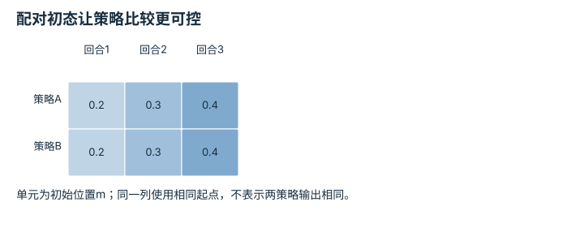

# 任务定义、复位、扰动与随机化：逐点细解

<!-- Generated by scripts/build_knowledge_atlas.py; edit knowledge/atlas/*.json. -->

[全部知识点](../index.md) · [返回原课程](../../pipelines/01-simulation-data.md)

Task definition, reset, perturbation, and randomization · 本页拆成 **4 个小知识点**。

先阅读直觉和原理，再独立完成算例、自测；图是解释工具，不是已掌握或真机验证的证明。

## 前置知识

[场景动力学、接触与可观测性](../sim-scene-dynamics/index.md) → [实验流程与溯源](../computing-experiment-workflow/index.md)

## 本页知识点

1. [复位：每回合从哪个分布开始](#task-reset-distribution)
2. [成功条件：把看起来完成变成可检查规则](#task-success-predicate)
3. [域随机化：覆盖可能变化的因素](#task-domain-randomization)
4. [种子：复现采样不等于复现整个系统](#task-seed-reproducibility)

## 1. 复位：每回合从哪个分布开始

**Reset distribution**

**需要先懂：**episode、随机变量

### 一句话直觉

只会从一个熟悉初态开始的策略，未必能处理稍有变化的摆放。

### 原理拆开看

1. reset定义初始机器人、物体、速度及其他任务状态，不只是把计数器清零。
2. 教学物体x从指定区间均匀采样，单位m；采样后还要验证几何与约束是否可行。
3. 评估时固定并记录初态集合，才能区分策略变化与初态难度变化。

### 手算或追踪一个例子

1. 教学区间为[0.2,0.4] m，均匀随机数u取0、0.5、1。
2. 映射x=0.2+0.2u，得到0.2、0.3、0.4 m；端点仅用于解释映射。
3. 若工具只能到0.35 m，区间上部不可达，需要修改任务或明确标为失败条件。

### 用图理解

<figure class="atlas-visual" tabindex="0" aria-label="从单位随机数映射到初始位置；窄屏可在图内横向滚动">
<picture>
<source media="(max-width: 600px)" srcset="../../assets/knowledge-atlas/task-reset-distribution-mobile.svg">

</picture>
<figcaption>教学均匀采样变换，不是实际初态样本频率。</figcaption>
</figure>

- 映射的斜率决定位置区间宽度。
- 这条线没有验证碰撞、可达性或任务公平性。

查看作图数据，自己复算

图上数值可能为便于阅读而取近似值，以下保留作图输入。线段的含义以本图图注和读图说明为准，不应自行解释为实测连续轨迹。

| 曲线 | u（无量纲） | 初始x（m） |
| --- | --- | --- |
| x=0.2+0.2u | 0 | 0.2 |
| x=0.2+0.2u | 0.5 | 0.3 |
| x=0.2+0.2u | 1 | 0.4 |

### 容易混淆的地方

**常见误解：**随机得越广，训练就一定越有价值。

**为什么不成立：**不可达或不符合任务的状态可能只引入无意义失败。

**正确理解：**明确初态分布、可行性规则与评估目标。

### 自测

更换策略后同时缩小复位范围，还能把成功率上升归因于策略吗？

展开答案与推理

不能；初态难度也变了，需要在相同测试初态上比较。

**原始资料：**[Gymnasium Env: reset](https://gymnasium.farama.org/api/env/#gymnasium.Env.reset)

## 2. 成功条件：把看起来完成变成可检查规则

**Success predicates**

**需要先懂：**布尔逻辑、单位与阈值

### 一句话直觉

物体短暂经过目标上方和稳定放入容器不同，视频印象不适合充当唯一成功标准。

### 原理拆开看

1. 定义需要同时满足的几何、速度或保持时长条件，并明确边界是否包含等号。
2. 教学规则要求位置误差≤0.02 m且速度≤0.01 m/s，连续满足0.5 s。
3. 逐步更新保持计时，条件失效则按协议复位；奖励值与成功标签分别记录。

### 手算或追踪一个例子

1. 教学控制周期0.1 s，某回合连续4步满足条件，第5步速度超限。
2. 前4步累计0.4 s，尚未成功；第5步保持计时清零。
3. 之后连续5个完整采样间隔满足才达到0.5 s，需同时注明采样计时约定。

### 用图理解

<figure class="atlas-visual" tabindex="0" aria-label="短暂满足与持续满足；窄屏可在图内横向滚动">
<picture>
<source media="(max-width: 600px)" srcset="../../assets/knowledge-atlas/task-success-predicate-mobile.svg">

</picture>
<figcaption>教学成功判据，时间按完整采样区间累计。</figcaption>
</figure>

- 前一段累计不能跨过失败间隔直接拼接。
- 时间轴只解释规则，不构成某模型已经完成任务的证据。

查看作图数据，自己复算

图上数值可能为便于阅读而取近似值，以下保留作图输入。

| 事件 | 开始 (s) | 结束 (s) |
| --- | --- | --- |
| 满足但仅0.4 s | 0 | 0.4 |
| 条件失效 | 0.4 | 0.5 |
| 重新保持0.5 s | 0.5 | 1 |

### 容易混淆的地方

**常见误解：**奖励高就等于任务成功。

**为什么不成立：**奖励可能鼓励接近目标或探索，而成功条件要求完成事件。

**正确理解：**单独定义并记录success predicate及验证样例。

### 自测

位置误差0.01 m但速度0.05 m/s，本规则是否成功？

展开答案与推理

不满足速度条件；即使位置正确，也必须重新满足连续保持要求。

**原始资料：**[Gymnasium: Environment Step Contract](https://gymnasium.farama.org/api/env/#gymnasium.Env.step)

## 3. 域随机化：覆盖可能变化的因素

**Domain randomization**

**需要先懂：**训练分布、物理参数

### 一句话直觉

训练时只见一种质量或光照，策略可能依赖偶然细节；随机化让它接触多种设定。

### 原理拆开看

1. 先列出可能变化且有物理意义的因素，如质量、摩擦、相机或照明。
2. 为每个因素定义范围、采样频率和相关性；每回合固定的参数不应每步无意义跳变。
3. 使用独立评估因素组合检验鲁棒性；随机化本身不证明sim-to-real成功。

### 手算或追踪一个例子

1. 教学质量采样0.8、1、1.2 kg，保持同一净力1 N。
2. 由a=F/m得到加速度1.25、1、0.833 m/s²。
3. 如果策略只适配1 kg响应，其他质量会改变同一动作的结果。

### 用图理解

<figure class="atlas-visual" tabindex="0" aria-label="质量改变同一力的响应；窄屏可在图内横向滚动">
<picture>
<source media="(max-width: 600px)" srcset="../../assets/knowledge-atlas/task-domain-randomization-mobile.svg">

</picture>
<figcaption>F=1 N的无摩擦教学模型。</figcaption>
</figure>

- 轻物体在同样净力下加速更大。
- 三个模型响应不说明学到的策略是否真的适应这些变化。

查看作图数据，自己复算

图上数值可能为便于阅读而取近似值，以下保留作图输入。

| 项目 | 加速度（m/s²） |
| --- | --- |
| 0.8 kg | 1.25 |
| 1 kg | 1 |
| 1.2 kg | 0.833333 |

### 容易混淆的地方

**常见误解：**加入随机化之后就可以跳过真实系统辨识。

**为什么不成立：**随机范围可能遗漏真实因素或包含不合理组合。

**正确理解：**依据测量设置范围，并分别验证模拟与真实迁移边界。

### 自测

把质量每2 ms从0.8跳到1.2 kg，是否总是合理的随机化？

展开答案与推理

通常不合理；恒定物体质量应按回合或对象采样，除非任务真实包含相应变化。

**原始资料：**[Tobin et al.: Domain Randomization for Transferring Deep Neural Networks](https://arxiv.org/abs/1703.06907)

## 4. 种子：复现采样不等于复现整个系统

**Seeds and reproducibility**

**需要先懂：**随机采样、实验配置

### 一句话直觉

相同seed有助于重用相同初态，但不同库、线程和环境版本仍可能改变运行。

### 原理拆开看

1. 伪随机数生成器由初始状态和算法产生序列；seed只固定其中的初始化。
2. 环境、数据加载器和框架可能使用不同生成器，应分别记录与初始化。
3. 保存实际初态及软件版本可进一步验证复现；确定性开关不能消除所有跨平台差异。

### 手算或追踪一个例子

1. 教学实验A和B都保存初态列表[0.2,0.3,0.4] m，策略不同。
2. 逐项在相同三个初态评估，避免某个策略碰巧分到更容易的起点。
3. 若实验C仅保存seed却更换采样顺序，应核对实际初态，不能假定列表相同。

### 用图理解

<figure class="atlas-visual" tabindex="0" aria-label="配对初态让策略比较更可控；窄屏可在图内横向滚动">
<picture>
<source media="(max-width: 600px)" srcset="../../assets/knowledge-atlas/task-seed-reproducibility-mobile.svg">

</picture>
<figcaption>教学评估索引，不是成功率表。</figcaption>
</figure>

- 先按列比较初态是否一致，再比较策略结果。
- 相同初态控制了一个因素，不能控制全部计算与物理随机性。

查看作图数据，自己复算

图上数值可能为便于阅读而取近似值，以下保留作图输入。

| 行 / 列 | 回合1 | 回合2 | 回合3 |
| --- | --- | --- | --- |
| 策略A | 0.2 | 0.3 | 0.4 |
| 策略B | 0.2 | 0.3 | 0.4 |

### 容易混淆的地方

**常见误解：**报告一个seed就足够让所有GPU和版本得到完全相同结果。

**为什么不成立：**生成器、浮点运算、并发与内核实现都可能变化。

**正确理解：**记录版本、配置、初态和重复实验差异。

### 自测

同一seed但多调用一次随机数，后续初态序列可能变化吗？

展开答案与推理

可能；生成器状态已向前推进，说明实际采样轨迹比seed字符串更具体。

**原始资料：**[PyTorch: Reproducibility](https://docs.pytorch.org/docs/stable/notes/randomness.html)

## 从理解走向证据

本节点原有验收要求：展示确定性回放与独立随机种子的鲁棒性扫描。

完成图解自测后，回到[原课程](../../pipelines/01-simulation-data.md)运行对应示例并保留证据；浏览页面和查看答案不会自动获得课程晋级。
