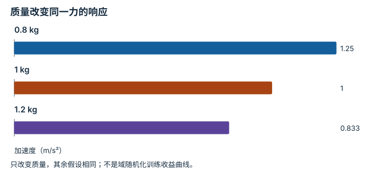

---
hide:
  - navigation
---

<!-- Generated by scripts/build_knowledge_atlas.py; edit knowledge/atlas/*.json. -->

<nav class="study-breadcrumb" aria-label="学习位置" markdown="1">
[知识目录](../../index.md) / [任务定义、复位、扰动与随机化](../index.md)
</nav>

L3 · 本章第 3 / 4 节

# 域随机化：覆盖可能变化的因素

**Domain randomization**

训练时只见一种质量或光照，策略可能依赖偶然细节；随机化让它接触多种设定。

先确认：这些前置知识我懂了吗？

训练分布、物理参数

[场景动力学、接触与可观测性](../../sim-scene-dynamics/index.md) · [实验流程与溯源](../../computing-experiment-workflow/index.md)

<section class="study-section " markdown="1">

## 1 · 原理拆开看

1. 先列出可能变化且有物理意义的因素，如质量、摩擦、相机或照明。
2. 为每个因素定义范围、采样频率和相关性；每回合固定的参数不应每步无意义跳变。
3. 使用独立评估因素组合检验鲁棒性；随机化本身不证明sim-to-real成功。

</section>

<section class="study-section " markdown="1">

## 2 · 跟着例子算一遍

1. 教学质量采样0.8、1、1.2 kg，保持同一净力1 N。
2. 由a=F/m得到加速度1.25、1、0.833 m/s²。
3. 如果策略只适配1 kg响应，其他质量会改变同一动作的结果。

</section>

<section class="study-section " markdown="1">

## 3 · 对照图，解释变化

<figure class="atlas-visual" tabindex="0" aria-label="质量改变同一力的响应；窄屏可在图内横向滚动">
<picture>
<source media="(max-width: 600px)" srcset="../../../assets/knowledge-atlas/task-domain-randomization-mobile.svg">

</picture>
<figcaption>F=1 N的无摩擦教学模型。</figcaption>
</figure>

- 轻物体在同样净力下加速更大。
- 三个模型响应不说明学到的策略是否真的适应这些变化。

查看作图数据，自己复算

图上数值可能为便于阅读而取近似值，以下保留作图输入。

| 项目 | 加速度（m/s²） |
| --- | --- |
| 0.8 kg | 1.25 |
| 1 kg | 1 |
| 1.2 kg | 0.833333 |

</section>

<section class="study-section study-misconception" markdown="1">

## 4 · 避开一个误区

**容易误以为：**加入随机化之后就可以跳过真实系统辨识。

**为什么不成立：**随机范围可能遗漏真实因素或包含不合理组合。

**正确理解：**依据测量设置范围，并分别验证模拟与真实迁移边界。

</section>

<section class="study-section study-check" markdown="1">

## 5 · 先独立回答

把质量每2 ms从0.8跳到1.2 kg，是否总是合理的随机化？

我已作答，查看推理

通常不合理；恒定物体质量应按回合或对象采样，除非任务真实包含相应变化。

</section>

继续查阅原始资料

- [Tobin et al.: Domain Randomization for Transferring Deep Neural Networks](https://arxiv.org/abs/1703.06907)

<nav class="study-pagination" aria-label="相邻小节" markdown="1">

[← 成功条件：把看起来完成变成可检查规则](../task-success-predicate/index.md)

[种子：复现采样不等于复现整个系统 →](../task-seed-reproducibility/index.md)

</nav>

[返回本章目录](../index.md) · [整章连续阅读](../complete/index.md)

本章最后需要提交什么？

展示确定性回放与独立随机种子的鲁棒性扫描。

回到[原课程](../../../pipelines/01-simulation-data.md)完成实践。阅读位置或查看答案不计为通过验收。

