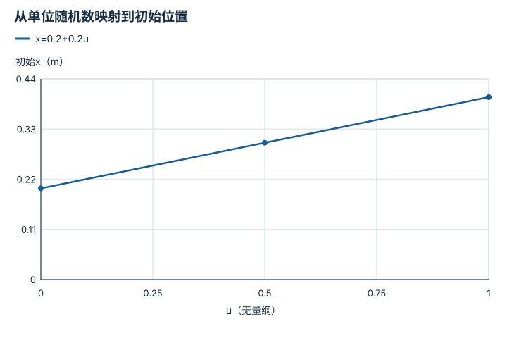

---
hide:
  - navigation
---

<!-- Generated by scripts/build_knowledge_atlas.py; edit knowledge/atlas/*.json. -->

<nav class="study-breadcrumb" aria-label="学习位置" markdown="1">
[知识目录](../../index.md) / [任务定义、复位、扰动与随机化](../index.md)
</nav>

L3 · 本章第 1 / 4 节

# 复位：每回合从哪个分布开始

**Reset distribution**

只会从一个熟悉初态开始的策略，未必能处理稍有变化的摆放。

先确认：这些前置知识我懂了吗？

episode、随机变量

[场景动力学、接触与可观测性](../../sim-scene-dynamics/index.md) · [实验流程与溯源](../../computing-experiment-workflow/index.md)

<section class="study-section " markdown="1">

## 1 · 原理拆开看

1. reset定义初始机器人、物体、速度及其他任务状态，不只是把计数器清零。
2. 教学物体x从指定区间均匀采样，单位m；采样后还要验证几何与约束是否可行。
3. 评估时固定并记录初态集合，才能区分策略变化与初态难度变化。

</section>

<section class="study-section " markdown="1">

## 2 · 跟着例子算一遍

1. 教学区间为[0.2,0.4] m，均匀随机数u取0、0.5、1。
2. 映射x=0.2+0.2u，得到0.2、0.3、0.4 m；端点仅用于解释映射。
3. 若工具只能到0.35 m，区间上部不可达，需要修改任务或明确标为失败条件。

</section>

<section class="study-section " markdown="1">

## 3 · 对照图，解释变化

<figure class="atlas-visual" tabindex="0" aria-label="从单位随机数映射到初始位置；窄屏可在图内横向滚动">
<picture>
<source media="(max-width: 600px)" srcset="../../../assets/knowledge-atlas/task-reset-distribution-mobile.svg">

</picture>
<figcaption>教学均匀采样变换，不是实际初态样本频率。</figcaption>
</figure>

- 映射的斜率决定位置区间宽度。
- 这条线没有验证碰撞、可达性或任务公平性。

查看作图数据，自己复算

图上数值可能为便于阅读而取近似值，以下保留作图输入。线段的含义以本图图注和读图说明为准，不应自行解释为实测连续轨迹。

| 曲线 | u（无量纲） | 初始x（m） |
| --- | --- | --- |
| x=0.2+0.2u | 0 | 0.2 |
| x=0.2+0.2u | 0.5 | 0.3 |
| x=0.2+0.2u | 1 | 0.4 |

</section>

<section class="study-section study-misconception" markdown="1">

## 4 · 避开一个误区

**容易误以为：**随机得越广，训练就一定越有价值。

**为什么不成立：**不可达或不符合任务的状态可能只引入无意义失败。

**正确理解：**明确初态分布、可行性规则与评估目标。

</section>

<section class="study-section study-check" markdown="1">

## 5 · 先独立回答

更换策略后同时缩小复位范围，还能把成功率上升归因于策略吗？

我已作答，查看推理

不能；初态难度也变了，需要在相同测试初态上比较。

</section>

继续查阅原始资料

- [Gymnasium Env: reset](https://gymnasium.farama.org/api/env/#gymnasium.Env.reset)

<nav class="study-pagination" aria-label="相邻小节" markdown="1">

[← 本章学习顺序](../index.md)

[成功条件：把看起来完成变成可检查规则 →](../task-success-predicate/index.md)

</nav>

[返回本章目录](../index.md) · [整章连续阅读](../complete/index.md)

本章最后需要提交什么？

展示确定性回放与独立随机种子的鲁棒性扫描。

回到[原课程](../../../pipelines/01-simulation-data.md)完成实践。阅读位置或查看答案不计为通过验收。

